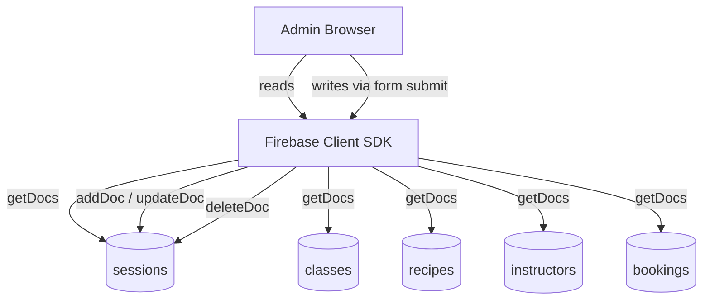
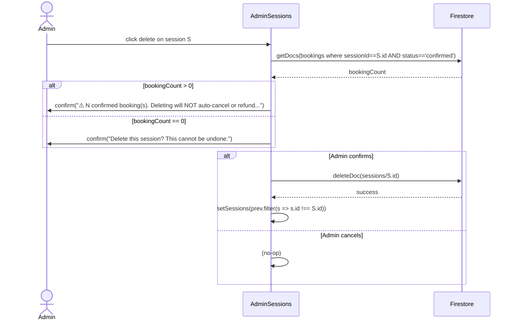

# Design Document — Admin Session Management

## Overview

The Admin Session Management page (`/admin/sessions`) is a fully client-side Next.js App Router page that lets admin users create, read, update, and delete individual cooking-class session dates. Sessions are instances of a parent `BTClass` document. At write time, the page _denormalises_ multiple fields from the parent class onto the `Session` document so that downstream readers (booking wizard, public session browser, homepage map) never need to join across collections.

This design documents the existing implementation in `src/app/admin/sessions/page.tsx` for the purposes of retroactively specifying, testing, and maintaining the feature.

---

## Architecture



All reads and writes on this page use the Firebase **client SDK** (`db` from `@/lib/firebase`). Firestore security rules restrict `sessions` create, update, and delete operations to users with the `admin` role.

---

## Components and Interfaces

### `AdminSessions` (default export — `'use client'`)

Single-component page. No sub-components are extracted; all state and logic live inline.

#### State

| State variable | Type | Purpose |
|---|---|---|
| `sessions` | `Session[]` | Master list rendered in the table |
| `classes` | `BTClass[]` | Loaded once; used to populate the class selector and to derive denormalised fields |
| `recipes` | `Recipe[]` | Loaded once; used to populate the recipe selector and derive `recipeName` |
| `instructors` | `Instructor[]` | Loaded once; used to populate the instructor selector and derive `instructorName` |
| `loading` | `boolean` | True until all four initial fetches resolve |
| `showModal` | `boolean` | Controls Add/Edit modal visibility |
| `editingSession` | `Session \| null` | `null` → create mode; non-null → edit mode |
| `formData` | `FormData` | Controlled form state (6 admin-editable fields only) |

#### `FormData` shape (admin inputs only)

```ts
interface FormData {
  classId: string;        // FK to classes collection
  date: string;           // YYYY-MM-DD
  recipeId: string;       // FK to recipes (empty string = none)
  instructorId: string;   // FK to instructors (empty string = none)
  status: 'open' | 'closed' | 'cancelled';
  spotsAvailable: number;
}
```

All other `Session` fields (`className`, `classType`, `venueId`, `venueName`, `price`, `startTime`, `endTime`, `spotsTotal`, `ageMin`, `ageMax`, `recipeName`, `instructorName`) are _never_ in the form — they are derived at submit time.

---

## Data Models

### Denormalisation Data Flow

When an admin submits the session form (create or edit), `handleSubmit` performs the following lookup-and-copy operations before writing to Firestore:

```
formData.classId
  → parentClass = classes.find(c => c.id === formData.classId)

Derived fields:
  className      = parentClass.type === 'kidsAfterSchool'
                     ? 'Kids After School Club'
                     : 'Weekend Workshop'
  classType      = parentClass.type                      (fallback: 'kidsAfterSchool')
  venueId        = parentClass.venueId                   (fallback: '')
  venueName      = parentClass.venueName                 (fallback: '')
  price          = parentClass.price                     (fallback: 1500)
  startTime      = parentClass.startTime                 (fallback: '')
  endTime        = parentClass.endTime                   (fallback: '')
  spotsTotal     = parentClass.maxSize                   (fallback: 15)
  ageMin         = parentClass.ageMin                    (fallback: 5)
  ageMax         = parentClass.ageMax                    (fallback: 12)

formData.recipeId
  → recipe = recipes.find(r => r.id === formData.recipeId)
  recipeName = recipe?.name ?? ''

formData.instructorId
  → instructor = instructors.find(i => i.id === formData.instructorId)
  instructorName = instructor?.name ?? ''
```

The final Firestore payload is `{ ...formData, ...derivedFields, updatedAt: serverTimestamp() }`.

### `className` Derivation Logic

`className` is **always** computed from `BTClass.type`. The mapping is a closed enumeration:

| `BTClass.type` | `Session.className` |
|---|---|
| `'kidsAfterSchool'` | `'Kids After School Club'` |
| `'youngAdultWeekend'` | `'Weekend Workshop'` |

No other `className` value should ever appear on a session document created through this admin page. This invariant is critical because `className` is displayed to end-users in booking confirmations, portal pages, and emails.

### Delete Safety Check Flow



### Session Status Values

| Value | Selectable in form? | Set by |
|---|---|---|
| `'open'` | Yes | Admin |
| `'closed'` | Yes | Admin |
| `'cancelled'` | Yes | Admin |
| `'full'` | **No** | Stripe webhook (programmatic) |

`'full'` is part of the `Session.status` TypeScript type but is intentionally excluded from the admin form's select options to prevent manual misuse.

---

## Correctness Properties

*A property is a characteristic or behavior that should hold true across all valid executions of a system — essentially, a formal statement about what the system should do. Properties serve as the bridge between human-readable specifications and machine-verifiable correctness guarantees.*

### Property 1: `className` is always derived from `classType`, never free-text

*For any* `BTClass` object passed to `handleSubmit`, the resulting `Session.className` must equal `'Kids After School Club'` when `BTClass.type` is `'kidsAfterSchool'`, and `'Weekend Workshop'` when `BTClass.type` is `'youngAdultWeekend'`. No other value of `className` is valid.

**Validates: Requirements 2.1**

---

### Property 2: All inherited fields come from `BTClass`, not from form input

*For any* `BTClass` object with arbitrary `venueId`, `venueName`, `price`, `startTime`, `endTime`, `maxSize`, `ageMin`, and `ageMax` values, the session document produced by `handleSubmit` must carry `Session.venueId == BTClass.venueId`, `Session.venueName == BTClass.venueName`, `Session.price == BTClass.price`, `Session.startTime == BTClass.startTime`, `Session.endTime == BTClass.endTime`, `Session.spotsTotal == BTClass.maxSize`, `Session.ageMin == BTClass.ageMin`, and `Session.ageMax == BTClass.ageMax`.

**Validates: Requirements 2.3, 2.4, 2.5, 2.6, 2.7**

---

### Property 3: Default fallbacks are applied when `BTClass` fields are absent

*For any* partially-populated `BTClass` where `price`, `maxSize`, `ageMin`, or `ageMax` are `undefined`, the resulting session must use the default values `price = 1500`, `spotsTotal = 15`, `ageMin = 5`, `ageMax = 12`.

**Validates: Requirements 2.4, 2.6, 2.7**

---

### Property 4: Recipe and instructor names are faithfully denormalised

*For any* `Recipe` object with an arbitrary `name`, if that recipe is selected during session creation or edit, the resulting `Session.recipeName` must equal `recipe.name`. Similarly, *for any* `Instructor` object, `Session.instructorName` must equal `instructor.name`.

**Validates: Requirements 2.8, 2.9**

---

### Property 5: `spotsAvailable` never exceeds `spotsTotal` at creation

*For any* session creation where the admin supplies a `spotsAvailable` value and the selected `BTClass` has a `maxSize`, the constraint `session.spotsAvailable <= session.spotsTotal` must hold in the data written to Firestore.

**Validates: Requirements 6.2**

---

### Property 6: Delete warning message includes the confirmed booking count

*For any* positive integer N representing the number of confirmed bookings on a session, the confirmation dialog shown to the admin must include the exact count N and must state that deletion will not automatically cancel or refund those bookings.

**Validates: Requirements 4.2**

---

### Property 7: Session table rows display all required fields

*For any* `Session` object with arbitrary `date`, `className`, `venueName`, `spotsAvailable`, and `status` values, the rendered table row must contain all five of those values in the DOM.

**Validates: Requirements 1.2**

---

### Property 8: Edit form pre-populates from the session being edited

*For any* `Session` object, clicking the edit button must result in the form's controlled state containing the session's `classId`, `date`, `recipeId`, `instructorId`, `status`, and `spotsAvailable`.

**Validates: Requirements 3.1**

---

## Error Handling

| Scenario | Trigger | Response |
|---|---|---|
| Initial data fetch fails | `getDocs` throws during page mount | Error logged to console; `loading` set to `false`; empty table rendered |
| Session save fails (create or edit) | `addDoc`/`updateDoc` throws | `alert('Error saving session.')` |
| Session delete fails — permission denied | Firestore returns `permission-denied` error code | `alert('Permission denied...')` |
| Session delete fails — other error | Any other exception from `deleteDoc` | `alert('Failed to delete session: <message>...')` |
| Admin cancels delete confirmation | `confirm()` returns `false` | Early return; no Firestore write |

---

## Testing Strategy

### Context

There are currently **zero tests** for `src/app/admin/sessions/page.tsx`. All tasks in the accompanying task list are therefore about adding test coverage from scratch.

### Dual Testing Approach

**Unit / example tests** — Verify specific scenarios, error branches, and UI states using `@testing-library/react` + `vitest`. These tests mock Firestore using `vi.mock` and `vi.stubGlobal`.

**Property-based tests** — Verify universal invariants across arbitrary inputs using **fast-check** (the standard PBT library for TypeScript/JavaScript ecosystems). Each property test runs a minimum of **100 iterations**.

### Property-Based Testing Library

Use **`fast-check`** (`npm install --save-dev fast-check`). It is idiomatically TypeScript-first, integrates cleanly with Vitest via `fc.assert(fc.property(...))`, and is well-suited to generating arbitrary objects matching the `BTClass`, `Session`, `Recipe`, and `Instructor` interfaces.

### Property Test Tag Format

Each property test must be annotated with a comment in the following format:

```
// Feature: admin-session-management, Property N: <property_text>
```

### Property Test Mapping

| Property | Test description | `fast-check` arbitraries |
|---|---|---|
| P1 — className derivation | For any `BTClass`, `buildSessionData(cls)` returns correct `className` | `fc.record({ type: fc.constantFrom('kidsAfterSchool', 'youngAdultWeekend'), ... })` |
| P2 — denormalisation completeness | For any `BTClass`, all inherited fields on the session match exactly | `fc.record({ venueId, venueName, price, startTime, endTime, maxSize, ageMin, ageMax })` |
| P3 — default fallbacks | For any `BTClass` with undefined numeric fields, defaults are applied | Partial BTClass arbitraries with `fc.option` for nullable fields |
| P4 — recipe/instructor name | For any `Recipe`/`Instructor`, denormalised name matches | `fc.record({ id: fc.uuid(), name: fc.string({ minLength: 1 }) })` |
| P5 — spotsAvailable ≤ spotsTotal | For any `BTClass.maxSize` and any `spotsAvailable`, the constraint holds | `fc.integer({ min: 1, max: 100 })` for both; ensure cap logic |
| P6 — delete warning count | For any N > 0, warning message contains N | `fc.integer({ min: 1, max: 500 })` |
| P7 — row displays all fields | For any `Session`, all five display fields appear in the row | `fc.record(sessionShape)` |
| P8 — edit pre-population | For any `Session`, edit form state matches session | `fc.record(sessionShape)` |

### Extractable Pure Function

To make the denormalisation logic independently testable (P1–P5), the `handleSubmit` body should be refactored to extract a pure function:

```ts
// src/app/admin/sessions/utils.ts
export function buildSessionData(
  formData: FormData,
  parentClass: BTClass | undefined,
  recipe: Recipe | undefined,
  instructor: Instructor | undefined,
): Omit<Session, 'id' | 'createdAt'>
```

Property tests operate directly on `buildSessionData` without needing to render the component or interact with Firestore.

### Unit Test Scenarios

| Test | Type |
|---|---|
| Loading spinner shown while data is fetching | EXAMPLE |
| Table renders with mocked session data | INTEGRATION |
| Inherited fields absent from Add Session form | EXAMPLE |
| Status select has exactly 3 options (open/closed/cancelled), no 'full' | EXAMPLE |
| Default status is 'open', default spotsAvailable is 15 | EXAMPLE |
| Badge colour: green for > 5, amber for 1–5, red for 0 | EXAMPLE |
| Status badge: indigo for 'open', grey for other | EXAMPLE |
| Delete with 0 confirmed bookings → standard confirm message | EXAMPLE |
| Edit modal closes on save success; row updates in table | EXAMPLE |
| Save error → alert('Error saving session.') | EXAMPLE |
| Delete permission-denied error → specific alert | EDGE_CASE |
| Delete generic error → alert with message | EDGE_CASE |
| updateDoc called with updatedAt: serverTimestamp() on edit | EXAMPLE |
