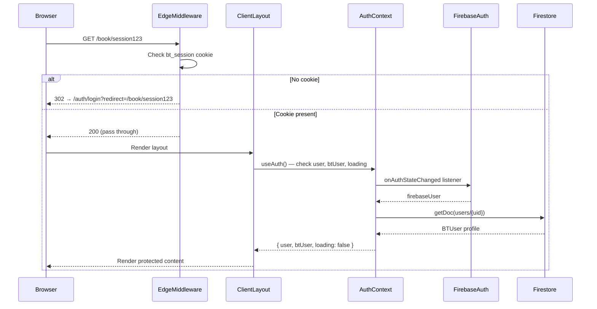
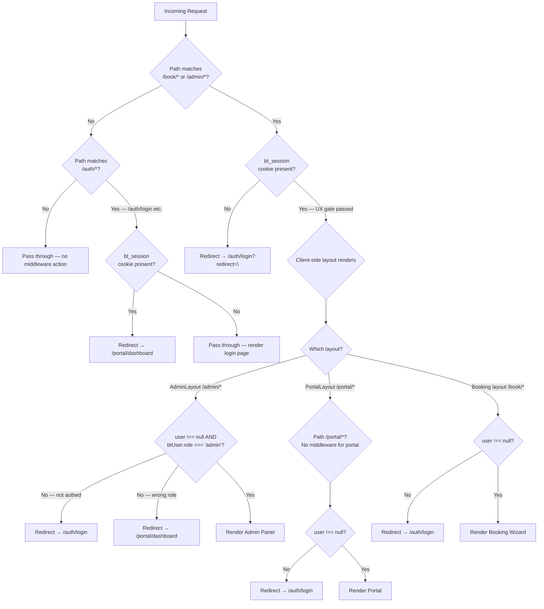

# Design Document: Authentication and Authorisation

## Overview

The Blooming Tastebuds auth system uses a **dual-layer identity model**: Firebase Authentication provides raw identity (`user`), and a Firestore document (`users/{uid}`) provides the application-level profile (`btUser`) containing role and display name. Both must be non-null for the application to treat a session as fully signed in.

Route protection is split across three layers with deliberately different security guarantees:

1. **Edge middleware** — UX gate only; checks a plain cookie
2. **Client-side layout guards** — role-aware; checks `btUser.role`
3. **Firestore security rules** — the actual security boundary for all data operations

This separation is intentional: Edge middleware runs before client JavaScript, enabling clean redirects before any page renders, but it cannot call the Firebase Admin SDK to verify tokens. Real security is enforced at the Firestore layer, which requires a verified `request.auth` token for every write.

---

## Architecture

```mermaid
graph TB
    subgraph "Browser"
        A[User Action] --> B[AuthContext<br/>src/context/AuthContext.tsx]
        B --> C[Firebase Auth SDK<br/>signIn / signUp / signOut]
        B --> D[Firestore Client SDK<br/>users/{uid} read/write]
        B --> E[document.cookie<br/>bt_session=true]
    end

    subgraph "Edge Runtime"
        F[Next.js Middleware<br/>src/middleware.ts] --> G{bt_session<br/>cookie?}
        G -->|no| H[Redirect → /auth/login]
        G -->|yes| I[NextResponse.next()]
    end

    subgraph "Client Layouts"
        J[AdminLayout] --> K{btUser.role<br/>=== 'admin'?}
        L[PortalLayout] --> M{user !== null?}
    end

    subgraph "Firebase Cloud"
        N[Firebase Auth<br/>Identity Provider]
        O[Firestore<br/>users/{uid}]
        P[Firestore Security Rules<br/>role validation]
    end

    E -.->|read by| F
    C <--> N
    D <--> O
    O --> P
```

### Request Lifecycle



---

## Components and Interfaces

### AuthContext (`src/context/AuthContext.tsx`)

The central auth state manager. Wraps the entire application via `AuthProvider` in the root layout.

```typescript
interface AuthContextType {
    user: User | null;          // Firebase Auth user object
    btUser: BTUser | null;      // Firestore users/{uid} profile
    loading: boolean;           // true until onAuthStateChanged fires + Firestore fetch completes
    signUp: (email: string, pass: string, firstName: string, lastName: string, role: UserRole) => Promise<void>;
    signIn: (email: string, pass: string) => Promise<void>;
    signInWithGoogle: (role: UserRole) => Promise<void>;
    logOut: () => Promise<void>;
    resetPassword: (email: string) => Promise<void>;
}
```

**Key invariant**: `UserRole` at sign-up is constrained by the Zod schema on the sign-up form to `'parent' | 'youngAdult'`. The `'admin'` value is never reachable via the public interface.

### Edge Middleware (`src/middleware.ts`)

Runs in the Edge runtime before page rendering. Has access only to the request headers and cookies — cannot call Firebase SDKs.

```typescript
// Protected routes — redirect unauthenticated visitors to login
const protectedRoutes = ['/book', '/admin'];

// Auth routes — redirect authenticated visitors to dashboard
const authRoutes = ['/auth/login', '/auth/signup', '/auth/forgot-password'];

export const config = {
    matcher: ['/book/:path*', '/admin/:path*', '/auth/:path*'],
};
```

`/portal/*` is deliberately absent from both lists. The portal guard is role-aware (needs `btUser.role`) and must run client-side where `AuthContext` is available.

### Sign-Up Form (`src/app/auth/signup/page.tsx`)

Uses React Hook Form + Zod. The Zod schema restricts `role` to `'parent' | 'youngAdult'` at the type level:

```typescript
const schema = z.object({
    role: z.enum(['parent', 'youngAdult'] as const),
    password: z.string().min(8, 'Password must be at least 8 characters'),
    // ... other fields
}).refine(d => d.password === d.confirmPassword, { ... });
```

The `admin` value cannot be submitted from this form — it is not present in the enum and not rendered as a UI option.

---

## Data Models

### BTUser (Firestore `users/{uid}`)

```typescript
export interface BTUser {
    uid: string;                          // Must match Firebase Auth UID
    role: 'parent' | 'youngAdult' | 'admin'; // 'admin' only assignable server-side
    firstName: string;
    lastName: string;
    email: string;
    phone?: string;
    createdAt: any;                        // Firestore serverTimestamp()
    updatedAt?: any;                       // Set on profile updates
}
```

**Immutable fields** (enforced by Firestore rules): `uid`, `role`, `createdAt`  
**Mutable fields** (client-writable): `firstName`, `lastName`, `phone`, `updatedAt`

### bt_session Cookie

| Attribute | Value |
|-----------|-------|
| Name | `bt_session` |
| Value | `true` (plain string) |
| `path` | `/` |
| `max-age` | `604800` (7 days) |
| `SameSite` | `Lax` |
| `Secure` | Present |

The cookie contains no user identity, role, or cryptographic material. It is a presence signal only.

---

## Cookie Lifecycle

```mermaid
stateDiagram-v2
    [*] --> NoCookie : First visit / after logout

    NoCookie --> CookieSet : signUp() called
    NoCookie --> CookieSet : signIn() called
    NoCookie --> CookieSet : signInWithGoogle() called
    NoCookie --> CookieSet : onAuthStateChanged fires\n(returning visitor / page refresh)

    CookieSet --> NoCookie : logOut() called\n(expires cookie)
    CookieSet --> NoCookie : Cookie max-age expires\n(7 days)

    CookieSet : bt_session=true\nmax-age=604800\nSameSite=Lax; Secure
    NoCookie : No bt_session cookie present
```



**Eager setting rationale**: `onAuthStateChanged` fires asynchronously after `signIn`/`signUp` resolve. Without the eager cookie set, a synchronous redirect immediately after sign-in would arrive at middleware before `onAuthStateChanged` fires — the cookie would be absent and the middleware would bounce the user back to login. Setting the cookie in the auth method itself (before the redirect) prevents this race condition.

---

## Route Protection Decision Tree



### Security Layer Summary

| Layer | Technology | Checks | Can verify role? |
|-------|-----------|--------|-----------------|
| Edge Middleware | Next.js Edge runtime | `bt_session` cookie presence | No |
| AdminLayout | React client component | `btUser.role === 'admin'` | Yes |
| PortalLayout | React client component | `user !== null` | No (any auth role) |
| Firestore Rules | Firebase | `request.auth.uid`, `callerRole()` | Yes — actual security boundary |

---

## Correctness Properties

*A property is a characteristic or behavior that should hold true across all valid executions of a system — essentially, a formal statement about what the system should do. Properties serve as the bridge between human-readable specifications and machine-verifiable correctness guarantees.*

### Property 1: Admin Role Invariant — Sign-Up Cannot Produce admin Role

*For any* combination of valid email, password, firstName, lastName, and role value `r ∈ {'parent', 'youngAdult'}` passed to `signUp`, the resulting `btUser.role` SHALL equal `r`, and SHALL never equal `'admin'`. Furthermore, for any attempt to call `signUp` with role `= 'admin'`, the Zod schema SHALL reject the input before the AuthContext method is invoked.

**Validates: Requirements 1.6, 10.1, 10.2, 10.3**

---

### Property 2: Cookie-State Consistency — bt_session Value Is Always the Plain String 'true'

*For any* successful invocation of `signUp`, `signIn`, or `signInWithGoogle` (with mocked Firebase), the `bt_session` cookie value in `document.cookie` SHALL equal exactly the string `'true'`. The cookie SHALL NOT contain a UID, email, role, JWT, or any user-identifiable data.

**Validates: Requirements 6.1, 6.4**

---

### Property 3: Profile Field Immutability — Role Cannot Be Elevated via Client Update

*For any* existing `users/{uid}` document with role `r`, a client-side update that includes a `role` field (whether attempting to change it or preserve its current value) SHALL be denied by Firestore security rules. The stored role SHALL remain `r` after the attempted write.

**Validates: Requirements 10.4, 11.1, 11.2, 11.3**

---

### Property 4: Google Sign-In displayName Decomposition

*For any* non-null Google `displayName` string, `signInWithGoogle` (first-time login path) SHALL set `btUser.firstName` to the substring before the first space character and `btUser.lastName` to the substring after the first space (or an empty string if no space is present). The concatenation `firstName + ' ' + lastName` (trimmed) SHALL equal the original `displayName`.

**Validates: Requirements 3.2, 3.5**

---

### Property 5: Returning Google User Role Preservation

*For any* stored `btUser.role` value `r` and *any* `role` value `r'` passed to `signInWithGoogle` (where `r' ≠ r`), the returning Google sign-in path SHALL result in `btUser.role === r` (the stored value), not `r'` (the passed value). The role stored in Firestore SHALL not be overwritten on return login.

**Validates: Requirements 3.3**

---

### Property 6: Middleware Pass-Through for /portal/* Routes

*For any* pathname beginning with `/portal/` and *any* cookie state (bt_session present or absent), the Edge middleware SHALL not redirect the request — it SHALL call `NextResponse.next()`. The portal guard is entirely delegated to PortalLayout.

**Validates: Requirements 7.3, 7.4**

---

### Property 7: Middleware Unauthenticated Redirect Coverage for Protected Routes

*For any* pathname `p` that begins with `/book/` or `/admin/`, a request without a `bt_session` cookie SHALL result in a redirect to `/auth/login` with `redirect` query parameter equal to `p`.

**Validates: Requirements 7.1**

---

### Property 8: Non-Admin Role Guard in AdminLayout

*For any* `UserRole` value `r ∈ {'parent', 'youngAdult'}`, rendering `AdminLayout` with `btUser.role = r` and `user` non-null SHALL trigger a redirect to `/portal/dashboard` and SHALL NOT render any admin panel content.

**Validates: Requirements 8.1**

---

### Property 9: Sign-Up Input Validation — Short Passwords Universally Rejected

*For any* password string of length 0 to 7 characters (inclusive), the sign-up Zod schema SHALL return a validation error and SHALL NOT call `signUp`.

**Validates: Requirements 1.7**

---

### Property 10: Sign-Up Input Validation — Password Mismatch Universally Rejected

*For any* pair of strings `(password, confirmPassword)` where `password !== confirmPassword`, the sign-up Zod schema SHALL return a validation error on the `confirmPassword` field and SHALL NOT call `signUp`.

**Validates: Requirements 1.8**

---

## Error Handling

| Scenario | Error Source | AuthContext Behaviour | UI Behaviour |
|----------|-------------|----------------------|--------------|
| Email already in use | Firebase Auth | Re-throws `FirebaseError` with code `auth/email-already-in-use` | Sign-up page shows "An account with this email already exists" |
| Invalid credentials | Firebase Auth | Re-throws `FirebaseError` | Login page shows error message |
| Firestore profile write failure at sign-up | Firestore | Re-throws error; `btUser` remains null | Sign-up page shows generic error |
| `users/{uid}` doc missing for authenticated user | AuthContext | Logs warning; sets `btUser = null` | Loading screen persists; user appears logged out to layouts |
| Google popup cancelled | Firebase Auth | Re-throws | Sign-up page shows "Failed to sign up with Google" |
| Firestore profile update rejected by rules | Firestore | Returns `PERMISSION_DENIED` error to caller | Account page shows update failure |

### Partial Sign-Up Recovery

If Firebase Auth account creation succeeds but Firestore profile creation fails (e.g., network drop), the user has a Firebase Auth account with no `users/{uid}` document. On their next sign-in, `onAuthStateChanged` will find no Firestore doc and set `btUser = null` — they'll be in a partial state where auth-gated layouts show a loading screen. Recovery requires either re-running sign-up (which will hit `auth/email-already-in-use` on the Firebase side) or a manual Admin SDK intervention. This edge case is logged with `console.warn`.

---

## Testing Strategy

### PBT Applicability Assessment

This feature involves pure logic in `AuthContext` (cookie setting, state management, displayName decomposition) and pure middleware logic (path matching, redirect construction). Both are well-suited to property-based testing because:
- Behaviour varies with input (any email, name, role, pathname)
- Running 100+ iterations finds edge cases (unusual display names, deep paths)
- Core functions are mockable (Firebase SDKs replaced with `vi.fn()`)

Firestore security rules are **not** suitable for PBT — they are infrastructure running in the Firestore emulator. Integration tests with the emulator using 2–3 representative examples are appropriate.

### Unit Tests (Vitest + Testing Library)

Tests live in `src/__tests__/auth/` mirroring the source. Firebase is mocked using `vi.mock`.

**AuthContext tests** (`src/__tests__/auth/AuthContext.test.ts`):
- Happy path sign-in, sign-up, Google sign-in, sign-out
- Error propagation for each method
- `loading` state transitions
- `btUser = null` when Firestore doc missing

**Middleware tests** (`src/__tests__/auth/middleware.test.ts`):
- Redirect for unauthenticated requests to protected routes
- Redirect for authenticated requests to auth routes
- Pass-through for `/portal/*` (property-based)
- Pass-through for public routes

**Sign-up schema tests** (`src/__tests__/auth/signup-schema.test.ts`):
- Password length property (0–7 chars all rejected)
- Password mismatch property
- Admin role rejection

**Layout tests** (`src/__tests__/auth/AdminLayout.test.tsx`, `PortalLayout.test.tsx`):
- Non-admin redirect property
- Loading screen state
- Unauthenticated redirect

### Property-Based Tests

Property-based testing is implemented with [fast-check](https://fast-check.dev/) (`fc`), which integrates with Vitest. Each property runs a minimum of 100 iterations.

```typescript
import * as fc from 'fast-check';
import { describe, it, expect } from 'vitest';

// Feature: auth-and-authorisation, Property 9: Sign-up short passwords rejected
it('rejects any password shorter than 8 characters', () => {
    fc.assert(fc.property(
        fc.string({ maxLength: 7 }),
        (shortPassword) => {
            const result = signUpSchema.safeParse({ ...validBase, password: shortPassword });
            expect(result.success).toBe(false);
        }
    ), { numRuns: 200 });
});
```

| Property | Test Location | fast-check Arbitraries |
|----------|--------------|----------------------|
| P1: Admin role invariant | `signup-schema.test.ts` | `fc.constantFrom('parent', 'youngAdult')` |
| P2: Cookie value = 'true' | `AuthContext.test.ts` | `fc.record({ email: fc.emailAddress(), ... })` |
| P4: displayName decomposition | `AuthContext.test.ts` | `fc.string()`, `fc.tuple(fc.string(), fc.string())` |
| P5: Returning Google role preservation | `AuthContext.test.ts` | `fc.constantFrom('parent', 'youngAdult', 'admin')` × 2 |
| P6: Middleware portal pass-through | `middleware.test.ts` | `fc.webPath()` filtered to `/portal/` prefix |
| P7: Middleware unauthenticated redirect | `middleware.test.ts` | `fc.webPath()` filtered to `/book/`, `/admin/` |
| P8: Non-admin layout redirect | `AdminLayout.test.tsx` | `fc.constantFrom('parent', 'youngAdult')` |
| P9: Short password rejection | `signup-schema.test.ts` | `fc.string({ maxLength: 7 })` |
| P10: Password mismatch rejection | `signup-schema.test.ts` | `fc.tuple(fc.string(), fc.string()).filter(([a,b]) => a !== b)` |

### Integration Tests (Firestore Emulator)

These tests use the Firebase Local Emulator Suite (Firestore emulator) and are run separately from the Vitest unit test suite.

```bash
firebase emulators:start --only firestore
# then:
npx jest --config jest.firestore.config.js src/__tests__/firestore-rules/
```

| Scenario | Expected Result |
|----------|----------------|
| Create `users/{uid}` with `role: 'admin'` | PERMISSION_DENIED |
| Create `users/{uid}` with `role: 'parent'` (own UID) | Allowed |
| Update `role` field on own profile | PERMISSION_DENIED |
| Update `uid` field on own profile | PERMISSION_DENIED |
| Update `firstName` on own profile | Allowed |
| Update `firstName` on another user's profile | PERMISSION_DENIED |
| Create `users/{uid}` with another user's UID | PERMISSION_DENIED |
