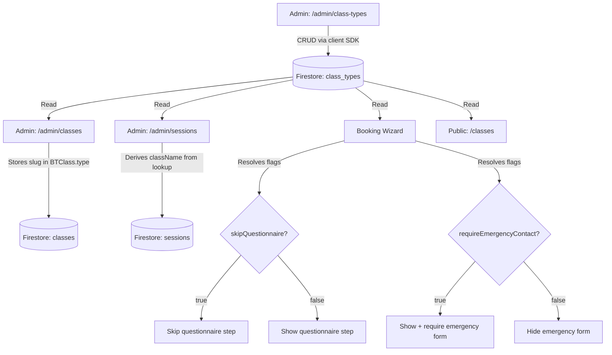
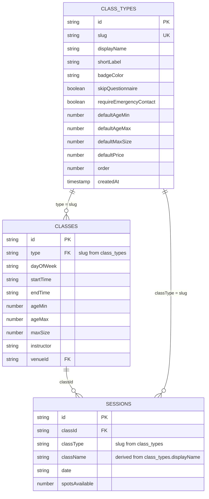

# Design Document: Dynamic Class Types

## Overview

This feature replaces the hardcoded `ClassType` union (`'kidsAfterSchool' | 'youngAdultWeekend'`) with a dynamic Firestore collection (`class_types`) managed through a dedicated admin CRUD page. All downstream consumers — the booking wizard, admin forms, session displays, and the public UI — will resolve class type metadata at runtime from this collection instead of relying on string literal comparisons embedded in code.

The design follows the existing architectural patterns: Firebase client SDK reads for UI components, React Hook Form + Zod for admin CRUD forms, CSS Modules for styling, and Firestore security rules as the authoritative access boundary.

### Key Design Decisions

1. **Client-side reads from `class_types`** — consistent with how all other reference collections (venues, recipes, instructors) are consumed.
2. **Slug as the stable reference key** — `BTClass.type` and `Session.classType` store the slug string, not a Firestore document ID, ensuring human-readable references and backward compatibility with existing data.
3. **Behavioural flags on the class type** — `skipQuestionnaire` and `requireEmergencyContact` drive wizard step visibility at runtime, replacing hardcoded `=== 'kidsAfterSchool'` checks.
4. **No API route needed** — writes go directly from the admin page via client SDK (same pattern as classes, venues, recipes). Security is enforced by Firestore rules.

---

## Architecture

### Data Flow Diagram



### Integration Points

| Consumer | Reads | Uses |
|----------|-------|------|
| Admin Class Types page | Full CRUD | All fields |
| Admin Classes page | Read all, ordered by `order` | `displayName` for dropdown, `slug` for storage |
| Admin Sessions page | Read all | `displayName` for `className` derivation, `shortLabel` + `badgeColor` for badges |
| Booking Wizard layout | Read one (by slug) | `skipQuestionnaire` for step filtering |
| Booking Wizard medical step | Read one (by slug) | `requireEmergencyContact` for form visibility |
| Public session browser | Read all | `displayName`, `shortLabel`, `badgeColor` for rendering |
| Stripe webhook (no change) | None | Session already stores denormalised `className` |

---

## Components and Interfaces

### New: Admin Class Types Page (`/admin/class-types`)

**File:** `src/app/admin/class-types/page.tsx`

A `'use client'` page following the same CRUD pattern as the existing `/admin/venues`, `/admin/classes`, and `/admin/recipes` pages:
- State: `classTypes: BTClassType[]`, `loading`, `showModal`, `editingClassType`
- On mount: `getDocs(query(collection(db, 'class_types'), orderBy('order')))` 
- Modal form: React Hook Form + Zod schema
- Optimistic local state updates after successful Firestore writes
- Delete pre-checks: query `classes` collection for documents with matching `type` slug, count total class types

**Zod Schema:**
```typescript
import { z } from 'zod';

const BADGE_COLORS = ['amber', 'green', 'indigo', 'red', 'gray'] as const;

export const classTypeSchema = z.object({
  slug: z.string()
    .min(1, 'Slug is required')
    .regex(/^[a-z0-9-]+$/, 'Slug must contain only lowercase letters, numbers, and hyphens'),
  displayName: z.string().min(1, 'Display name is required'),
  shortLabel: z.string().min(1, 'Short label is required').max(20, 'Short label max 20 chars'),
  badgeColor: z.enum(BADGE_COLORS),
  skipQuestionnaire: z.boolean(),
  requireEmergencyContact: z.boolean(),
  defaultAgeMin: z.number().int().min(0),
  defaultAgeMax: z.number().int().min(1),
  defaultMaxSize: z.number().int().min(1),
  defaultPrice: z.number().int().min(0, 'Price must be a non-negative integer (pence)'),
  order: z.number().int().min(0),
});
```

### Modified: Admin Classes Page (`/admin/classes`)

**Changes:**
1. Fetch `class_types` collection on mount (alongside venues)
2. Replace the hardcoded `<select>` with dynamic options from `classTypes` state
3. Store `slug` value as `BTClass.type` on save (already the pattern, just dynamically sourced)
4. Replace hardcoded badge rendering (`c.type === 'kidsAfterSchool' ? 'Kids' : ...`) with a lookup into the loaded `classTypes` array
5. Error state if `class_types` fetch fails

### Modified: Admin Sessions Page (`/admin/sessions`)

**Changes:**
1. Fetch `class_types` collection on mount (alongside classes, recipes, instructors)
2. In `handleSubmit`, resolve the class type's `displayName` via the loaded class types array:
   ```typescript
   const parentClass = classes.find(c => c.id === formData.classId);
   const classType = classTypes.find(ct => ct.slug === parentClass?.type);
   const data = {
     ...formData,
     className: classType?.displayName || parentClass?.type || 'Unknown',
     classType: parentClass?.type || '',
     // ... rest unchanged
   };
   ```
3. Badge rendering in the table uses `classTypes` lookup for `shortLabel` and `badgeColor`

### Modified: Booking Wizard Layout (`/book/[sessionId]/layout.tsx`)

**Changes:**
1. Fetch the class type record matching `state.session?.classType` slug
2. Replace the hardcoded `condition` function:
   ```typescript
   // Before:
   condition: (state) => state.session?.classType === 'kidsAfterSchool'
   // After:
   condition: (state, classTypeRecord) => classTypeRecord?.skipQuestionnaire === false
   ```
3. Pass resolved class type flags via context or props to child steps

### Modified: Medical Step (`/book/[sessionId]/medical/page.tsx`)

**Changes:**
1. Replace `const isKid = state.session?.classType === 'kidsAfterSchool'` with flag resolution:
   ```typescript
   const classTypeRecord = classTypes.find(ct => ct.slug === state.session?.classType);
   const showEmergencyContact = classTypeRecord?.requireEmergencyContact ?? false;
   const showQuestionnaire = !(classTypeRecord?.skipQuestionnaire ?? false);
   ```
2. Use `showEmergencyContact` instead of `isKid` for rendering the emergency contact section
3. Use `showQuestionnaire` for navigation logic (next step routing)

### Modified: Session Browser (`/components/sessions/SessionBrowser.tsx`)

**Changes:**
1. Fetch `class_types` on mount
2. Replace hardcoded type filter options with dynamic options from class types
3. Replace hardcoded badge/label rendering with lookups
4. Fallback to raw slug if class type record not found

---

## Data Models

### New: `BTClassType` Interface

```typescript
export type BadgeColor = 'amber' | 'green' | 'indigo' | 'red' | 'gray';

export interface BTClassType {
  id: string;
  slug: string;
  displayName: string;
  shortLabel: string;
  badgeColor: BadgeColor;
  skipQuestionnaire: boolean;
  requireEmergencyContact: boolean;
  defaultAgeMin: number;
  defaultAgeMax: number;
  defaultMaxSize: number;
  defaultPrice: number; // integer, pence
  order: number;
  createdAt: any; // Firestore Timestamp
}
```

### Firestore Document Schema (`class_types/{id}`)

| Field | Type | Constraints |
|-------|------|-------------|
| `slug` | `string` | Unique across collection; matches `/^[a-z0-9-]+$/` |
| `displayName` | `string` | Non-empty |
| `shortLabel` | `string` | Non-empty, max 20 chars |
| `badgeColor` | `string` | One of: `amber`, `green`, `indigo`, `red`, `gray` |
| `skipQuestionnaire` | `boolean` | — |
| `requireEmergencyContact` | `boolean` | — |
| `defaultAgeMin` | `number` | Integer ≥ 0 |
| `defaultAgeMax` | `number` | Integer ≥ 1, > `defaultAgeMin` |
| `defaultMaxSize` | `number` | Integer ≥ 1 |
| `defaultPrice` | `number` | Integer ≥ 0 (pence) |
| `order` | `number` | Integer ≥ 0, used for display sorting |
| `createdAt` | `Timestamp` | Firestore `serverTimestamp()` |

### Modified: `BTClass` Interface

```typescript
export interface BTClass {
  id: string;
  type: string; // Was ClassType union, now a slug string
  // ... all other fields unchanged
}
```

### Modified: `Session` Interface

```typescript
export interface Session {
  id: string;
  classType: string; // Was ClassType union, now a slug string
  // ... all other fields unchanged
}
```

### Relationship Diagram



---

## API / Data Access

### Read Strategy

All reads use the Firebase client SDK directly from components — no REST API layer.

| Component | Query | Caching |
|-----------|-------|---------|
| Admin Class Types page | `getDocs(query(collection(db, 'class_types'), orderBy('order')))` | Local React state; refetched on mount |
| Admin Classes page | Same query (fetched alongside venues) | Local React state |
| Admin Sessions page | Same query (fetched alongside classes, recipes, instructors) | Local React state |
| Booking Wizard | `getDocs(collection(db, 'class_types'))` in BookingProvider or layout | Stored in booking context/local state |
| Public Session Browser | Same full-collection query | Local React state |

### Write Strategy

All writes go directly from the admin class types page via client SDK (same as venues, classes, recipes):
- `addDoc(collection(db, 'class_types'), { ...data, createdAt: serverTimestamp() })`
- `updateDoc(doc(db, 'class_types', id), { ...data, updatedAt: serverTimestamp() })`
- `deleteDoc(doc(db, 'class_types', id))` — after pre-checks pass

### Slug Uniqueness Enforcement

Since Firestore does not natively enforce unique field constraints, uniqueness is validated **client-side before write**:
1. On create/edit form submit, query all class types
2. Check if any existing document (excluding the one being edited) has the same slug
3. If duplicate found, set a form error and abort the write

This is acceptable because:
- Only admins can write (small user base, low concurrency)
- The client already has the full collection in local state (it was fetched for the dropdown)
- A race condition between two concurrent admin writes is extremely unlikely given the single-admin usage pattern

### Flag Resolution in Booking Wizard

The booking wizard resolves class type flags with a lightweight lookup:

```typescript
// In BookingProvider or wizard layout
const [classTypeRecord, setClassTypeRecord] = useState<BTClassType | null>(null);

useEffect(() => {
  if (!state.session?.classType) return;
  const fetchClassType = async () => {
    const snap = await getDocs(collection(db, 'class_types'));
    const types = snap.docs.map(d => ({ id: d.id, ...d.data() } as BTClassType));
    const match = types.find(ct => ct.slug === state.session!.classType);
    setClassTypeRecord(match || null);
  };
  fetchClassType();
}, [state.session?.classType]);
```

The resolved `classTypeRecord` is then either:
- Passed via context (extending `BookingContextType`), or
- Resolved locally in the layout and medical step components

**Design decision:** Extend `BookingContextType` with an optional `classTypeRecord: BTClassType | null` field to avoid duplicate fetches across wizard steps.

---

## Migration Strategy

### Seed Data Script

A one-time seed script (run manually or as part of deployment) creates the two initial documents:

```typescript
// scripts/seed-class-types.ts (run with ts-node or via Firebase Admin SDK)
const seedData: Omit<BTClassType, 'id'>[] = [
  {
    slug: 'kidsAfterSchool',
    displayName: 'Kids After School Club',
    shortLabel: 'Kids',
    badgeColor: 'amber',
    skipQuestionnaire: false,
    requireEmergencyContact: true,
    defaultAgeMin: 5,
    defaultAgeMax: 12,
    defaultMaxSize: 15,
    defaultPrice: 1500,
    order: 1,
    createdAt: FieldValue.serverTimestamp(),
  },
  {
    slug: 'youngAdultWeekend',
    displayName: 'Weekend Workshop',
    shortLabel: 'Young Adult',
    badgeColor: 'green',
    skipQuestionnaire: true,
    requireEmergencyContact: false,
    defaultAgeMin: 18,
    defaultAgeMax: 25,
    defaultMaxSize: 15,
    defaultPrice: 2500,
    order: 2,
    createdAt: FieldValue.serverTimestamp(),
  },
];
```

### Backward Compatibility

- Existing `BTClass` documents already store `type: 'kidsAfterSchool'` or `type: 'youngAdultWeekend'` — these slugs match the seed documents, so **no migration of existing `classes` or `sessions` documents is required**.
- The `ClassType` union is removed from `src/types/index.ts` and replaced with `string`. All existing comparisons (`=== 'kidsAfterSchool'`) are replaced with flag lookups.
- The `Session.classType` field remains a `string` — existing session documents continue to work.

### Deployment Order

1. Deploy seed script → creates `class_types` documents
2. Deploy Firestore security rules (add `class_types` rule)
3. Deploy application code (new page + modified pages)

Steps 1 and 2 can be done together since the new collection has no readers until the code deploys.

---

## Firestore Security Rules

Add the following rule block to `firestore.rules` within the existing `match /databases/{database}/documents` scope:

```
// Class types — dynamic programme configuration.
// Readable by any authenticated user (admin pages, booking wizard, public session browser).
// Writable only by admins.
match /class_types/{docId} {
  allow read: if isSignedIn();
  allow write: if isAdmin();
}
```

This follows the same pattern as `venues`, `classes`, `recipes`, and `instructors`.

**Note:** The public session browser currently reads `sessions` and `classes` without authentication (`allow read: if true`). However, `class_types` is gated behind `isSignedIn()` because:
- The public classes page (`/classes`) renders session cards using denormalised data already on the session document (`className`). It only needs class type metadata for badge rendering, which is a progressive enhancement.
- If unauthenticated badge rendering is needed later, the rule can be relaxed to `allow read: if true`.

**Alternative considered:** `allow read: if true` — simpler, but unnecessarily exposes configuration data to anonymous users. Since badges degrade gracefully (fallback to slug text), authenticated-only is the safer default.

---

## Correctness Properties

*A property is a characteristic or behavior that should hold true across all valid executions of a system — essentially, a formal statement about what the system should do. Properties serve as the bridge between human-readable specifications and machine-verifiable correctness guarantees.*

### Property 1: Slug Uniqueness Invariant

*For any* collection of class type records and any attempted create or update operation, if the submitted slug already exists on a different document in the collection, the operation SHALL be rejected with a validation error, ensuring no two documents ever share the same slug value.

**Validates: Requirements 1.2, 2.3, 3.3**

### Property 2: Slug Format Validation

*For any* string submitted as a slug value, the validation layer SHALL accept it if and only if it matches the pattern `/^[a-z0-9-]+$/` (one or more lowercase alphanumeric characters or hyphens).

**Validates: Requirements 2.2**

### Property 3: Flag-Driven Questionnaire Step Visibility

*For any* session whose class type record has `skipQuestionnaire` set to a boolean value, the booking wizard SHALL show the dietary questionnaire step if and only if `skipQuestionnaire === false`. The step visibility is entirely determined by this flag — no other condition influences it.

**Validates: Requirements 7.1, 7.2**

### Property 4: Flag-Driven Emergency Contact Form Visibility

*For any* session whose class type record has `requireEmergencyContact` set to a boolean value, the medical step SHALL display and require the emergency contact form if and only if `requireEmergencyContact === true`. The form visibility and validation requirement are entirely determined by this flag.

**Validates: Requirements 8.1, 8.2**

### Property 5: Delete Safety — Referenced Type Cannot Be Deleted

*For any* class type that is referenced by one or more `BTClass` documents (where `BTClass.type === classType.slug`), any attempt to delete that class type SHALL be blocked, preserving referential integrity between the collections.

**Validates: Requirements 4.1**

### Property 6: Minimum-One Invariant

*For any* state of the `class_types` collection where exactly one document remains, any attempt to delete that document SHALL be blocked, ensuring the collection always contains at least one class type.

**Validates: Requirements 4.2**

### Property 7: Display Name Derivation

*For any* session created or updated through the admin sessions page, the session's `className` field SHALL always equal the `displayName` of the `BTClassType` record whose `slug` matches the parent `BTClass.type` value. The session never stores a stale or manually entered class name.

**Validates: Requirements 6.1, 9.1**

### Property 8: Badge Rendering From Class Type Record

*For any* session rendered in the UI (admin or public), the badge element SHALL display text equal to the class type's `shortLabel` and use a CSS class corresponding to the class type's `badgeColor`. If no matching class type record is found, the badge SHALL fall back to displaying the raw slug with `gray` colour.

**Validates: Requirements 9.2, 9.3, 10.1, 10.2, 10.3**

---

## Error Handling

| Scenario | Handling |
|----------|----------|
| `class_types` collection fetch fails (network/permission) | Display inline error alert; disable dependent form controls (e.g., class type dropdown). Do not crash the page. |
| Slug uniqueness check fails (duplicate detected) | Set React Hook Form field error on the slug input; prevent form submission. |
| Delete pre-check finds references | Display modal/alert listing the referencing BTClass documents; abort deletion. |
| Delete pre-check finds collection has one item | Display message: "Cannot delete the last class type. At least one must exist." |
| Class type record not found for a session's slug | UI falls back to displaying the raw slug string with `gray` badge colour. No crash. |
| Zod validation fails on form submit | React Hook Form displays field-level error messages; form is not submitted. |
| Concurrent slug conflict (race condition) | Firestore write succeeds (no server-side unique constraint), but the next page load or edit will surface the duplicate. Acceptable given single-admin usage. |

---

## Testing Strategy

### Unit Tests (Vitest + Testing Library)

| Test File | Coverage |
|-----------|----------|
| `src/__tests__/admin/class-types.test.tsx` | CRUD operations, form validation, modal state, delete pre-checks |
| `src/__tests__/admin/classes-dropdown.test.tsx` | Dynamic dropdown rendering, slug storage on selection |
| `src/__tests__/admin/sessions-classname.test.tsx` | className derivation from class type lookup |
| `src/__tests__/booking/wizard-step-visibility.test.tsx` | Step filtering based on `skipQuestionnaire` flag |
| `src/__tests__/booking/medical-emergency-contact.test.tsx` | Emergency contact form visibility based on `requireEmergencyContact` flag |
| `src/__tests__/components/session-browser-badges.test.tsx` | Badge rendering with dynamic class types, fallback behaviour |

### Property-Based Tests (Vitest + fast-check)

Library: [`fast-check`](https://github.com/dubzzz/fast-check) — the standard property-based testing library for TypeScript/JavaScript.

Configuration: Each property test runs a minimum of **100 iterations**.

Each property test is tagged with a comment referencing its design property:

```typescript
// Feature: dynamic-class-types, Property 1: Slug Uniqueness Invariant
```

| Property | Test Description |
|----------|-----------------|
| Property 1: Slug Uniqueness | Generate random arrays of class type records + a candidate slug. Verify the validation function rejects duplicates and accepts unique slugs. |
| Property 2: Slug Format | Generate arbitrary strings. Verify the slug validator accepts iff the string matches `/^[a-z0-9-]+$/`. |
| Property 3: Questionnaire Visibility | Generate random `skipQuestionnaire` boolean + session state. Verify step filter function includes/excludes the questionnaire step correctly. |
| Property 4: Emergency Contact Visibility | Generate random `requireEmergencyContact` boolean. Verify the form visibility function returns the correct value. |
| Property 5: Delete Safety | Generate random class type collections + BTClass reference sets. Verify the delete guard blocks when references exist. |
| Property 6: Minimum-One | Generate collections of size 1. Verify the delete guard always blocks. |
| Property 7: Display Name Derivation | Generate random class types + BTClass records. Verify the derivation function always returns the matching displayName. |
| Property 8: Badge Rendering | Generate random class types + session records. Verify the badge resolver returns correct shortLabel + badgeColor, with fallback for missing types. |

### Integration Tests

| Test | Scope |
|------|-------|
| Firestore rules (`class_types`) | Firebase emulator: verify authenticated read, admin-only write, deny unauthenticated |
| Seed data verification | Verify the two seed documents exist with expected field values after migration |
| End-to-end booking flow | Verify wizard correctly shows/hides questionnaire and emergency contact for each seeded class type |

### Test Mocking Patterns

Following existing project conventions:
- Firebase `getDocs` / `addDoc` / `updateDoc` / `deleteDoc` are mocked via `vi.mock('firebase/firestore')`
- `useAuth` is mocked to provide admin context for admin page tests
- CSS Modules are auto-stubbed by the existing Vitest plugin (`styles.anyClass === 'anyClass'`)
