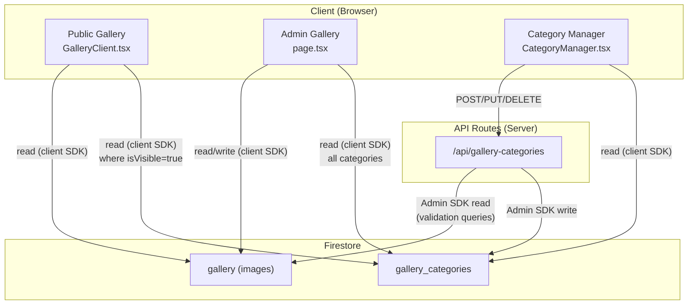

# Design Document: Dynamic Gallery Categories

## Overview

This design replaces the hardcoded `PUBLIC_CATEGORIES`, `ADMIN_CATEGORIES`, and `CATEGORY_LABELS` arrays in `src/lib/gallery-categories.ts` with a Firestore-backed `gallery_categories` collection. Admins manage categories (create, rename, reorder, toggle visibility, delete) from a new Category Manager section in the admin panel. The public gallery and admin image upload form read categories dynamically at runtime.

The approach preserves backward compatibility with existing gallery image documents that reference legacy category slugs (`cakes`, `cookies`, `breads`) by retaining the `normalizeCategory` function and seeding Firestore with the two existing categories on first deployment.

### Key Design Decisions

| Decision | Rationale |
|----------|-----------|
| Client SDK reads for categories | Consistent with all other public-facing collections (sessions, venues, classes). No API route needed for reads. |
| Admin SDK writes via API route | Follows the project pattern — all admin mutations go through server-side code for security. Enables slug uniqueness validation and batch reordering atomically. |
| Slug immutability after creation | Prevents orphaning existing gallery images that reference the slug. Only the label can change. |
| Fallback to hardcoded defaults | If Firestore is empty or read fails, the UI degrades gracefully using the two original categories. |
| Batch writes for reorder/delete | Maintains contiguous `order` values (1-based) across all operations. |

## Architecture



### Data Flow

1. **Public Gallery Load**: `GalleryClient` fetches `gallery_categories` (where `isVisible == true`, ordered by `order` ASC) and renders them as tabs alongside the hardcoded "All Photos" tab.
2. **Admin Gallery Load**: Admin gallery page fetches all `gallery_categories` (regardless of `isVisible`) for the category dropdown in the upload/edit form.
3. **Category Manager CRUD**: The Category Manager component reads categories client-side for display, but all mutations (create, update, reorder, delete) go through `POST /api/gallery-categories` which uses the Admin SDK.

## Components and Interfaces

### New Files

| File | Type | Purpose |
|------|------|---------|
| `src/app/admin/gallery/categories/page.tsx` | Page (client) | Category Manager admin page |
| `src/app/admin/gallery/categories/page.module.css` | Styles | CSS Module for Category Manager |
| `src/app/api/gallery-categories/route.ts` | API Route | Server-side CRUD handler for categories |
| `src/lib/gallery-categories-service.ts` | Service | Shared logic for slug generation, validation, and fallback |

### Modified Files

| File | Change |
|------|--------|
| `src/types/index.ts` | Add `GalleryCategoryDoc` interface, update `GalleryCategory` type |
| `src/lib/gallery-categories.ts` | Add `fetchCategories()` function, retain `normalizeCategory()` with extended mapping |
| `src/app/(public)/gallery/GalleryClient.tsx` | Fetch categories from Firestore instead of using `PUBLIC_CATEGORIES` |
| `src/app/admin/gallery/page.tsx` | Fetch categories from Firestore instead of using `ADMIN_CATEGORIES` |
| `firestore.rules` | Add `gallery_categories` collection rules |

### Component Interfaces

#### `GalleryCategoryDoc` (new type in `src/types/index.ts`)

```typescript
export interface GalleryCategoryDoc {
  id: string;
  slug: string;        // Unique, lowercase, hyphens, max 60 chars
  label: string;       // Display name, max 50 chars
  order: number;       // 1-based contiguous sort position
  isVisible: boolean;  // Controls public visibility
  createdAt: any;      // Firestore Timestamp
}
```

#### Updated `GalleryCategory` type

```typescript
// Change from union literal to string to support dynamic slugs
export type GalleryCategory = string;
```

#### API Route: `/api/gallery-categories`

```typescript
// POST - Create a new category
interface CreateCategoryRequest {
  action: 'create';
  label: string;
}

// PUT - Update an existing category
interface UpdateCategoryRequest {
  action: 'update';
  id: string;
  label?: string;
  isVisible?: boolean;
}

// PUT - Reorder categories
interface ReorderCategoryRequest {
  action: 'reorder';
  id: string;
  direction: 'up' | 'down';
}

// DELETE - Delete a category
interface DeleteCategoryRequest {
  action: 'delete';
  id: string;
  confirmed?: boolean; // Required when images exist
}
```

#### `gallery-categories-service.ts`

```typescript
export function generateSlug(label: string): string;
export function validateLabel(label: string): { valid: boolean; error?: string };
export function validateSlug(slug: string): boolean;
export const DEFAULT_CATEGORIES: GalleryCategoryDoc[];
```

#### Category Manager Component Props

```typescript
// Self-contained client page — no props needed
// Manages its own state via Firestore reads + API route writes
```

### Slug Generation Algorithm

```
1. Trim leading/trailing whitespace
2. Convert to lowercase
3. Replace spaces with hyphens
4. Remove characters that are not [a-z0-9-]
5. Collapse consecutive hyphens into one
6. Truncate to 60 characters
```

## Data Models

### Firestore Collection: `gallery_categories`

| Field | Type | Constraints | Description |
|-------|------|-------------|-------------|
| `slug` | `string` | Unique, `[a-z0-9-]+`, max 60 chars | Category identifier stored on image docs |
| `label` | `string` | Non-empty, max 50 chars | Display name shown in UI |
| `order` | `number` | Positive integer, 1-based, contiguous | Sort position |
| `isVisible` | `boolean` | — | If `false`, hidden from public gallery |
| `createdAt` | `Timestamp` | Server timestamp | Creation time |

**Document ID**: Auto-generated by Firestore (not the slug) to allow future slug changes if ever needed.

### Seed Data

When the `gallery_categories` collection is empty (first deployment), the system seeds:

| slug | label | order | isVisible |
|------|-------|-------|-----------|
| `cooking-classes` | Cooking Classes | 1 | `true` |
| `personal-gallery` | Personal Gallery | 2 | `true` |

### Firestore Security Rules Addition

```
match /gallery_categories/{docId} {
  allow read: if true;
  allow write: if isAdmin();
}
```

Public read is required because both the public gallery page and unauthenticated visitors need to see category tabs. Writes are restricted to admins. The actual write operations go through the Admin SDK API route (which bypasses rules), but the rule provides defence-in-depth against accidental client-side writes.

### Legacy Category Mapping (updated `normalizeCategory`)

```typescript
export function normalizeCategory(raw: string | undefined, validSlugs?: Set<string>): string {
  if (!raw) return 'cooking-classes';
  if (LEGACY_PERSONAL.has(raw)) return 'personal-gallery';
  // If we have dynamic slugs, check membership
  if (validSlugs && validSlugs.has(raw)) return raw;
  // For known slugs without a validSlugs set, pass through
  if (raw === 'personal-gallery' || raw === 'cooking-classes') return raw;
  // Unknown legacy value
  return 'cooking-classes';
}
```

### Index Requirements

A composite index is needed for the public gallery query:

```
Collection: gallery_categories
Fields: isVisible ASC, order ASC
```

This supports the public gallery query: `where('isVisible', '==', true)` + `orderBy('order', 'asc')`.


## Correctness Properties

*A property is a characteristic or behavior that should hold true across all valid executions of a system — essentially, a formal statement about what the system should do. Properties serve as the bridge between human-readable specifications and machine-verifiable correctness guarantees.*

### Property 1: Slug generation produces valid slugs

*For any* non-empty string label (1–50 characters after trimming), the `generateSlug` function SHALL produce a string that contains only characters matching `[a-z0-9-]`, does not contain consecutive hyphens, does not start or end with a hyphen, is at most 60 characters long, and is non-empty.

**Validates: Requirements 2.1**

### Property 2: Label validation correctness

*For any* string input, the `validateLabel` function SHALL accept it if and only if the trimmed string is non-empty and at most 50 characters long. Any string composed entirely of whitespace or exceeding 50 characters after trimming SHALL be rejected.

**Validates: Requirements 2.2, 3.2**

### Property 3: Slug immutability on update

*For any* existing `GalleryCategoryDoc` and any valid new label, updating the category's label SHALL change only the `label` field while the `slug` field remains identical to its value before the update.

**Validates: Requirements 3.1**

### Property 4: Order contiguity invariant

*For any* list of N gallery categories (N ≥ 1) and any valid mutation (reorder move or deletion), the resulting `order` values SHALL form a contiguous sequence from 1 to the number of remaining categories, with no gaps or duplicates.

**Validates: Requirements 4.1, 5.5**

### Property 5: Visibility filtering for public view

*For any* set of gallery categories with arbitrary `isVisible` flags, the public gallery SHALL display only categories where `isVisible` is `true` as filter tabs, and when filtering by category, only images belonging to visible categories SHALL appear in the category-specific views. Images belonging to hidden categories SHALL still appear under "All Photos".

**Validates: Requirements 3.4, 3.5, 6.4**

### Property 6: Category filter correctness

*For any* set of gallery images with various category slugs and any selected category slug, filtering SHALL return exactly the images whose `category` field (after normalization) matches the selected slug, and no others.

**Validates: Requirements 6.3**

### Property 7: Deletion reassigns images to lowest-order category

*For any* set of gallery categories (N ≥ 2) and any category that has images assigned, deleting that category SHALL reassign all its images to the category with the lowest `order` value among the remaining categories. No images SHALL be orphaned.

**Validates: Requirements 5.3**

### Property 8: Legacy normalization maps unknown strings to default

*For any* string that is not a valid current category slug and not one of the legacy values (`cakes`, `cookies`, `breads`, `personal-gallery`, `cooking-classes`), the `normalizeCategory` function SHALL return `'cooking-classes'` (the default category).

**Validates: Requirements 8.2**

### Property 9: Admin view shows all categories regardless of visibility

*For any* set of gallery categories with arbitrary `isVisible` flags, the admin category dropdown SHALL include every category in the set, regardless of its `isVisible` value, ordered by `order` ascending.

**Validates: Requirements 7.1, 7.2**

## Error Handling

| Scenario | Behavior | User Impact |
|----------|----------|-------------|
| `gallery_categories` collection empty | System uses hardcoded defaults: `cooking-classes` and `personal-gallery` | Transparent — users see original tabs |
| Firestore read failure (public gallery) | Display all images without category tabs; show subtle error banner | Degraded UX but content visible |
| Firestore read failure (admin dropdown) | Show error message; disable form submission | Admin cannot upload until retry |
| Firestore write failure (create/update) | Show error toast; preserve form state | Admin can retry without re-entering data |
| Firestore write failure (reorder batch) | Show error toast; revert optimistic UI update | Order reverts to previous state |
| Firestore write failure (delete) | Show error toast; category remains in list | No data loss |
| Slug collision on create | Show validation error: "A category with this name already exists" | Admin must choose different label |
| Delete last category attempt | Show error: "At least one category must exist" | Deletion prevented |
| Delete category with images (unconfirmed) | Show warning with image count; require explicit confirmation | Admin can cancel or confirm |

### Error Recovery Patterns

- **Optimistic UI for reorder**: The Category Manager shows the new order immediately, then rolls back if the batch write fails.
- **Form preservation**: All create/edit forms retain user input on failure so admins don't re-type.
- **Retry capability**: All error states include a way to retry (re-submit form, refresh page).
- **Graceful degradation**: Public-facing pages never show a blank state — they fall back to showing all images.

## Testing Strategy

### Unit Tests (Vitest)

| Test Area | What to Test |
|-----------|-------------|
| `generateSlug()` | Specific examples: spaces → hyphens, uppercase → lowercase, special chars removed, consecutive hyphens collapsed |
| `validateLabel()` | Empty string, whitespace-only, exactly 50 chars, 51 chars, normal valid labels |
| `normalizeCategory()` | Legacy values (`cakes` → `personal-gallery`), undefined → `cooking-classes`, valid slugs pass through |
| API route validation | Invalid payloads rejected, missing auth returns 401 |
| Fallback logic | Empty collection returns defaults, error returns defaults |

### Property-Based Tests (fast-check)

The project already has `fast-check@^4.9.0` installed. Each correctness property maps to a single property-based test with minimum 100 iterations.

| Property | Test File | Generator Strategy |
|----------|-----------|-------------------|
| P1: Slug validity | `src/__tests__/gallery/slug-generation.property.test.ts` | `fc.string()` filtered to 1–50 non-whitespace-only chars |
| P2: Label validation | `src/__tests__/gallery/label-validation.property.test.ts` | `fc.string()` with full unicode range |
| P3: Slug immutability | `src/__tests__/gallery/slug-immutability.property.test.ts` | `fc.record()` for category + `fc.string()` for new label |
| P4: Order contiguity | `src/__tests__/gallery/order-contiguity.property.test.ts` | `fc.array(fc.record())` for category lists + `fc.nat()` for move index |
| P5: Visibility filtering | `src/__tests__/gallery/visibility-filtering.property.test.ts` | `fc.array()` of categories with random `isVisible` booleans |
| P6: Category filter | `src/__tests__/gallery/category-filter.property.test.ts` | `fc.array()` of images with random slugs + `fc.constantFrom()` for selection |
| P7: Deletion reassignment | `src/__tests__/gallery/deletion-reassignment.property.test.ts` | `fc.array()` of categories (N≥2) + random image assignments |
| P8: Legacy normalization | `src/__tests__/gallery/legacy-normalization.property.test.ts` | `fc.string()` excluding known slugs and legacy values |
| P9: Admin visibility | `src/__tests__/gallery/admin-visibility.property.test.ts` | `fc.array()` of categories with random `isVisible` flags |

**Configuration**: Each property test runs with `{ numRuns: 100 }` minimum.

**Tag format**: Each test includes a comment: `// Feature: dynamic-gallery-categories, Property N: <property text>`

### Integration Tests

| Test Area | What to Test |
|-----------|-------------|
| Category Manager page | Create → appears in list; edit label → updates; toggle visibility; reorder; delete |
| Public gallery with categories | Fetches categories, renders tabs, filters work |
| Admin gallery dropdown | Shows all categories including hidden ones |
| Seeding | Empty collection triggers seed on first load |

### Test Mocking Strategy

- **Firestore reads**: Mock `getDocs` and `getDoc` from `firebase/firestore`
- **API route calls**: Mock `fetch` with `vi.stubGlobal('fetch', vi.fn())`
- **Admin SDK**: Mock `@/lib/firebase-admin` in API route tests
- **Pure functions** (`generateSlug`, `validateLabel`, `normalizeCategory`): No mocks needed — test directly
