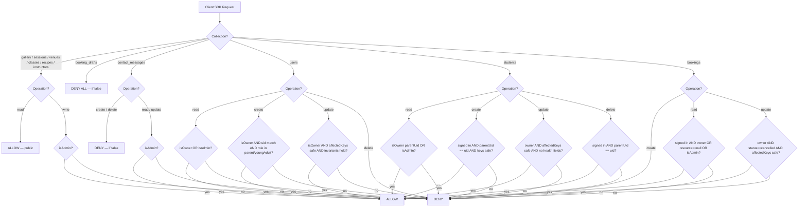

# Design Document: Firestore Security Rules

## Overview

The Firestore security rules (`firestore.rules`) are the **primary security boundary** for all Blooming Tastebuds Firestore data. They govern every operation made by the Firebase Client SDK running in the browser. The Firebase Admin SDK — used in server-side API routes (`/api/payments/create-intent`, `/api/contact`, `/api/webhooks/stripe`) — bypasses these rules entirely and therefore needs no corresponding rule grants.

The rules enforce:
- **Public read** for non-sensitive business data (gallery, sessions, venues, classes, recipes, instructors)
- **Deny-all client access** for server-managed collections (`booking_drafts`)
- **Server-write-only** for contact messages and bookings
- **Fine-grained field-level protection** for user profiles and student records
- **Role escalation prevention** — clients can never self-assign `admin`
- **Sensitive health data protection** — `medicalInfo`, `emergencyContact`, `questionnaire` on students are webhook-managed and blocked from all client writes

---

## Architecture

### Security Layer Stack

```
Browser / Client SDK
        │
        ▼
┌───────────────────────────┐
│  Firestore Security Rules  │  ← This feature
│  (firestore.rules)         │
└───────────────────────────┘
        │
        ▼
┌───────────────────────────┐
│     Cloud Firestore        │
└───────────────────────────┘
        ▲
        │
┌───────────────────────────┐
│  Firebase Admin SDK        │  Bypasses rules — server-side only
│  (API routes, webhook)     │
└───────────────────────────┘
```

### Rule Evaluation Flow



---

## Components and Interfaces

### Helper Functions

| Function | Signature | Description |
|----------|-----------|-------------|
| `isSignedIn()` | `() → bool` | Returns `request.auth != null` |
| `callerRole()` | `() → string` | Reads `users/{request.auth.uid}.role` — costs one security-rules read quota |
| `isAdmin()` | `() → bool` | `isSignedIn() && callerRole() == 'admin'` |
| `isOwner(uid)` | `(uid: string) → bool` | `isSignedIn() && request.auth.uid == uid` |

> **Performance note**: `callerRole()` performs a Firestore document read against the security-rules quota. It is only called on write paths or admin-read paths — never on public read paths — to avoid unnecessary quota consumption.

### Collection Rules Summary

| Collection | Unauthenticated Read | Authenticated Read | Authenticated Write | Admin Read | Admin Write |
|-----------|---------------------|-------------------|-------------------|-----------|------------|
| `gallery` | ✅ | ✅ | ❌ | ✅ | ✅ |
| `sessions` | ✅ | ✅ | ❌ | ✅ | ✅ |
| `venues` | ✅ | ✅ | ❌ | ✅ | ✅ |
| `classes` | ✅ | ✅ | ❌ | ✅ | ✅ |
| `recipes` | ✅ | ✅ | ❌ | ✅ | ✅ |
| `instructors` | ✅ | ✅ | ❌ | ✅ | ✅ |
| `booking_drafts` | ❌ | ❌ | ❌ | N/A (Admin SDK) | N/A (Admin SDK) |
| `contact_messages` | ❌ | ❌ (create/delete) | ❌ (create/delete) | ✅ | ✅ (update only) |
| `users/{uid}` | ❌ | Own only | Own (restricted fields) | ✅ | N/A (Admin SDK) |
| `students/{id}` | ❌ | Own parent only | Own parent (restricted) | ✅ | N/A (Admin SDK) |
| `bookings/{id}` | ❌ | Own only (+ null poll) | ❌ (create) / Own cancel | ✅ | ✅ |

---

## Data Models

### Field-Level Write Constraints

#### `users/{uid}` — Create
Allowed fields: `uid`, `role` (must be `'parent'` or `'youngAdult'`), `firstName`, `lastName`, `email`, `phone`, `createdAt`
Blocked: `role: 'admin'`

#### `users/{uid}` — Update
```
affectedKeys().hasOnly(['firstName', 'lastName', 'phone', 'updatedAt'])
```
Immutable fields enforced by equality guards: `role`, `uid`, `createdAt`

#### `students/{studentId}` — Create
```
keys().hasOnly(['firstName', 'lastName', 'dateOfBirth', 'parentUid', 'createdAt'])
```
Blocked by key allowlist: `medicalInfo`, `emergencyContact`, `questionnaire`

#### `students/{studentId}` — Update
```
affectedKeys().hasOnly(['firstName', 'lastName', 'dateOfBirth', 'updatedAt'])
```
Blocked (not in allowed set): `parentUid`, `medicalInfo`, `emergencyContact`, `questionnaire`

#### `bookings/{bookingId}` — Update (cancellation only)
```
request.resource.data.status == 'cancelled'
affectedKeys().hasOnly(['status', 'cancelledAt'])
```
All other booking fields are immutable from the client.

### `affectedKeys()` Mechanics

The expression `request.resource.data.diff(resource.data).affectedKeys()` returns the set of keys that differ between the incoming document and the existing document. Using `.hasOnly([...])` ensures that only the listed fields can change. This defends against both:
1. **Targeted attacks** — explicitly setting a disallowed field
2. **Full-document overwrites** — using `setDoc` without `merge: true` which would carry over existing values for unchanged privileged fields but still trigger if any disallowed key is touched

---

## Correctness Properties

*A property is a characteristic or behavior that should hold true across all valid executions of a system — essentially, a formal statement about what the system should do. Properties serve as the bridge between human-readable specifications and machine-verifiable correctness guarantees.*

These properties are tested using the **Firebase Local Emulator Suite** with the `@firebase/rules-unit-testing` library. Each property maps to one or more integration tests that exercise the Firestore emulator directly.

**Property Reflection**: After prework analysis, several properties were consolidated:
- Properties about `booking_drafts` reads and writes are combined (both are deny-all by identical rule)
- Properties about public collection reads across all 6 collections are combined (same rule pattern)
- Health field protection properties for student create and update are combined (same invariant, two operations)

---

### Property 1: Deny-All on booking_drafts

*For any* client SDK request (authenticated or unauthenticated) targeting the `booking_drafts` collection, both read and write operations SHALL be denied.

**Validates: Requirements 4.1, 4.2, 4.3**

---

### Property 2: Public Collections Allow Unauthenticated Reads

*For any* document in the `gallery`, `sessions`, `venues`, `classes`, `recipes`, or `instructors` collections, an unauthenticated read request SHALL be permitted.

**Validates: Requirements 3.1, 3.2, 3.3, 3.4, 3.5, 3.6**

---

### Property 3: Public Collections Deny Non-Admin Writes

*For any* document in the `gallery`, `sessions`, `venues`, `classes`, `recipes`, or `instructors` collections, a write request (create, update, or delete) made by a non-admin user (including unauthenticated) SHALL be denied.

**Validates: Requirements 3.7, 3.8**

---

### Property 4: Admin Role Cannot Be Self-Assigned

*For any* user creation request where `request.resource.data.role == 'admin'`, the Security_Rules SHALL deny the operation, regardless of the caller's authentication state.

**Validates: Requirements 7.3, 7.4**

---

### Property 5: User Profile Role Is Immutable via Client Update

*For any* authenticated update to `users/{uid}` that attempts to change the `role` field to a value different from the existing `resource.data.role`, the Security_Rules SHALL deny the operation.

**Validates: Requirements 8.2, 8.7**

---

### Property 6: User Profile Update Restricted to Safe Fields

*For any* authenticated update to `users/{uid}`, if the set of affected keys is not a subset of `['firstName', 'lastName', 'phone', 'updatedAt']`, the Security_Rules SHALL deny the operation.

**Validates: Requirements 8.1, 8.2, 8.3, 8.4, 8.5, 8.6**

---

### Property 7: No Client Can Create a Booking

*For any* authenticated or unauthenticated Client_SDK create request targeting the `bookings` collection, the Security_Rules SHALL deny the operation.

**Validates: Requirements 14.1, 14.2**

---

### Property 8: Booking Cancellation Is the Only Permitted Client Update

*For any* authenticated update to `bookings/{bookingId}` by the booking owner that either (a) sets `status` to a value other than `'cancelled'` or (b) includes keys outside `['status', 'cancelledAt']`, the Security_Rules SHALL deny the operation.

**Validates: Requirements 16.1, 16.2, 16.3, 16.4, 16.5**

---

### Property 9: Student Health Fields Are Client-Write-Protected

*For any* Client_SDK `create` or `update` request on `students/{studentId}` that includes the fields `medicalInfo`, `emergencyContact`, or `questionnaire`, the Security_Rules SHALL deny the operation.

**Validates: Requirements 11.4, 11.5, 11.6, 12.4, 12.5, 12.6**

---

### Property 10: Student Parent Ownership Is Immutable

*For any* Client_SDK `create` or `update` request on `students/{studentId}`, the `parentUid` field in the resulting document must equal `request.auth.uid` (on create) or the existing `resource.data.parentUid` (on update). Any deviation SHALL be denied.

**Validates: Requirements 11.2, 11.7, 12.3, 12.8**

---

### Property 11: Users Can Only Read Their Own Profile (or Admin)

*For any* two distinct user UIDs `A` and `B`, user `A` SHALL be denied a read on `users/B` unless `A` has the `admin` role.

**Validates: Requirements 6.1, 6.2, 6.3, 6.4**

---

### Property 12: Contact Messages Cannot Be Created or Deleted by Any Client

*For any* Client_SDK `create` or `delete` request on the `contact_messages` collection (regardless of authentication state or role), the Security_Rules SHALL deny the operation.

**Validates: Requirements 5.1, 5.2, 5.3**

---

## Error Handling

### Permission Denied Responses

All rule denials result in a Firestore `PERMISSION_DENIED` error (gRPC code 7). The client SDK surfaces this as a `FirebaseError` with `code: 'permission-denied'`. The application handles this in the following ways:

| Scenario | Handler |
|----------|---------|
| Unauthenticated read of private collection | `AuthContext` redirects to login before the query is attempted |
| Non-admin write to public collection | Admin panel performs client-side role check before write; rules provide defence-in-depth |
| Client attempts to create booking | Never attempted — no UI path exists for this; rules are backstop |
| User tries to update disallowed fields | Form validation (Zod schema) prevents invalid field submission; rules are backstop |

### Defensive-in-Depth

The security rules are the final layer in a defence-in-depth stack:

1. **Edge middleware** (`src/middleware.ts`) — blocks unauthenticated access to `/book/*` and `/admin/*` via `bt_session` cookie (UX gate only)
2. **Client-side role checks** — `AdminLayout` redirects non-admins; `PortalLayout` redirects unauthenticated users
3. **Firestore security rules** — the cryptographic security boundary; all above layers can be bypassed by a determined attacker but rules cannot

---

## Testing Strategy

### Approach: Firebase Local Emulator Integration Tests

Property-based testing in the traditional sense (random input generation) is **partially applicable** here. The rules are evaluated against Firestore operations, meaning tests must create real Firestore documents in the emulator and issue real SDK calls. However, several properties (field-level write constraints, ownership checks) genuinely benefit from parameterised test data that covers a wide input space.

The testing strategy uses:
- **`@firebase/rules-unit-testing`** — official Firebase library for testing security rules against the emulator
- **Vitest** — test runner (consistent with the existing project test setup)
- **Firebase Local Emulator Suite** — runs a local Firestore instance, no production data touched

Tests live in `src/__tests__/firestore-rules/` and are run with `vitest --run` (single-pass, non-interactive).

### Test Organisation

```
src/__tests__/
└── firestore-rules/
    ├── helpers.ts            # Shared test utilities: initTestEnvironment, makeAuthContext, etc.
    ├── public-collections.test.ts
    ├── booking-drafts.test.ts
    ├── contact-messages.test.ts
    ├── users.test.ts
    ├── students.test.ts
    └── bookings.test.ts
```

### Test Patterns per Property

**Property 1 (booking_drafts deny-all)**:
- Test unauthenticated read → expect `PERMISSION_DENIED`
- Test authenticated (non-admin) read → expect `PERMISSION_DENIED`
- Test authenticated write → expect `PERMISSION_DENIED`

**Property 2 (public reads)**:
- For each of the 6 public collections: unauthenticated `getDoc` → expect success
- Parameterise over collection names

**Property 3 (public write denial)**:
- For each of 6 collections × 3 non-admin user types (unauthenticated, parent, youngAdult): write → `PERMISSION_DENIED`

**Property 4 (no admin self-assign)**:
- Attempt `setDoc` on `users/{uid}` with `role: 'admin'` → `PERMISSION_DENIED`
- Verify `role: 'parent'` and `role: 'youngAdult'` succeed under otherwise valid conditions

**Property 5 (role immutability)**:
- Create a user with `role: 'parent'`, then update with `role: 'youngAdult'` → `PERMISSION_DENIED`
- Create a user with `role: 'youngAdult'`, then update with `role: 'admin'` → `PERMISSION_DENIED`

**Property 6 (user update field restriction)**:
- Test updates with each disallowed field (email, uid, createdAt, role) individually → `PERMISSION_DENIED`
- Test update with only allowed fields → success

**Property 7 (no client booking creation)**:
- Authenticated user attempts `setDoc` on `bookings/{any}` → `PERMISSION_DENIED`
- Unauthenticated user attempts same → `PERMISSION_DENIED`

**Property 8 (booking cancellation only)**:
- Update with `status: 'confirmed'` → `PERMISSION_DENIED`
- Update with extra keys (e.g. `payment.status`) → `PERMISSION_DENIED`
- Update with valid `{ status: 'cancelled', cancelledAt: ... }` by owner → success

**Property 9 (student health field protection)**:
- Create with `medicalInfo` field → `PERMISSION_DENIED`
- Create with `emergencyContact` → `PERMISSION_DENIED`
- Create with `questionnaire` → `PERMISSION_DENIED`
- Update with any health field → `PERMISSION_DENIED`

**Property 10 (student parentUid ownership)**:
- Create with `parentUid` != caller UID → `PERMISSION_DENIED`
- Update attempting to change `parentUid` → `PERMISSION_DENIED`

**Property 11 (user cross-read denial)**:
- User A reads `users/userA` → success
- User A reads `users/userB` → `PERMISSION_DENIED`

**Property 12 (contact message create/delete denial)**:
- Unauthenticated create → `PERMISSION_DENIED`
- Authenticated (parent) create → `PERMISSION_DENIED`
- Authenticated (admin) create → `PERMISSION_DENIED` (admin SDK creates these, not client SDK)
- Any delete → `PERMISSION_DENIED`

### Emulator Setup

```typescript
// src/__tests__/firestore-rules/helpers.ts
import {
  initializeTestEnvironment,
  RulesTestEnvironment,
  assertFails,
  assertSucceeds,
} from '@firebase/rules-unit-testing';
import { readFileSync } from 'fs';
import { resolve } from 'path';

export async function createTestEnv(): Promise<RulesTestEnvironment> {
  return initializeTestEnvironment({
    projectId: 'bt-mvp-test',
    firestore: {
      rules: readFileSync(
        resolve(__dirname, '../../../../firestore.rules'),
        'utf8'
      ),
      host: '127.0.0.1',
      port: 8080,
    },
  });
}

export { assertFails, assertSucceeds };
```

### Running Tests

```bash
# Terminal 1 — start emulator (run manually)
firebase emulators:start --only firestore

# Terminal 2 — run rules tests (single pass)
npm run test:run -- src/__tests__/firestore-rules/
```

### Unit vs Integration Balance

- **Integration tests against emulator** are the appropriate tool for security rules — they test the actual rule evaluation engine against real operations
- **No unit tests** are written for helper functions in isolation (they are pure expressions, not importable functions)
- **No property-based random generation** for field names — the field name space is small and finite; exhaustive enumeration of allowed/disallowed fields is preferred over randomisation
- The emulator tests ARE the source of truth for rule correctness; there is no separate mock layer
