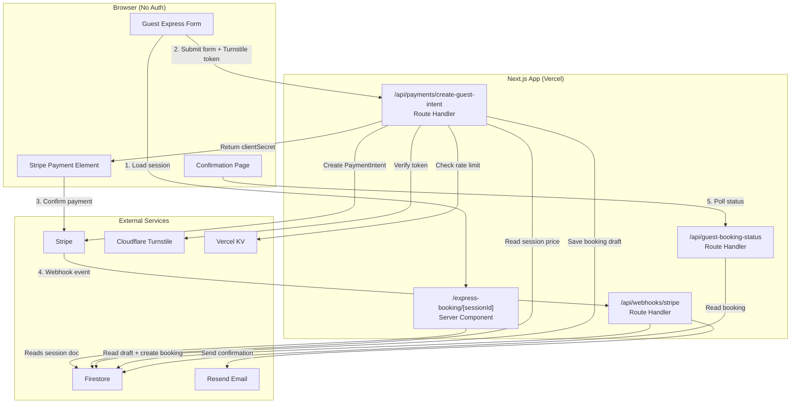
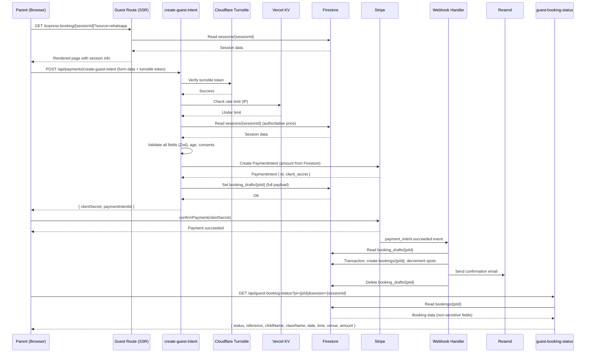
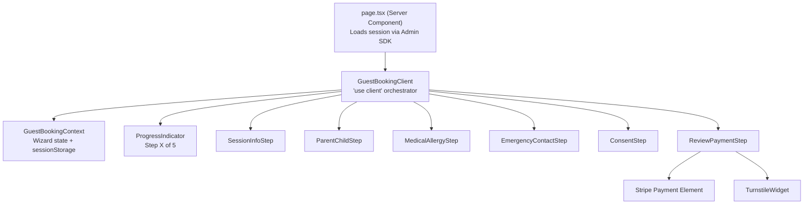

# Design Document: Guest Express Checkout

## Overview

The Guest Express Checkout feature adds a parallel, unauthenticated booking path alongside the existing authenticated booking wizard. Parents discovering Blooming Tastebuds through WhatsApp, social media, QR codes, or the website can book a session without creating a Firebase account.

### Design Goals

- **Zero friction**: No account creation, no login — tap a link, fill a form, pay
- **Safety first**: Collect all child safety data (medical, allergy, emergency contact, authorised collector) with the same rigour as the authenticated flow
- **Security parity**: Guest data is protected by Firestore rules, server-side validation, bot protection, and rate limiting — never exposed to unauthenticated clients
- **No regression**: The existing authenticated booking flow (`/book/[sessionId]`) remains completely unchanged
- **Feature-flag gated**: Controlled by `NEXT_PUBLIC_GUEST_CHECKOUT_ENABLED`, deployed to Preview only

### Key Design Decisions

| Decision | Rationale |
|----------|-----------|
| Separate route (`/express-booking/[sessionId]`) | Avoids middleware conflicts with protected `/book/*` route |
| Separate API endpoint (`/api/payments/create-guest-intent`) | No auth token required; different validation schema; preserves existing endpoint |
| Embedded snapshots (no linked documents) | Guest bookings have no Firebase UID — data must be self-contained |
| Cloudflare Turnstile for bot protection | Free, privacy-respecting, invisible mode available |
| Vercel KV for rate limiting | Serverless-compatible, persistent across function invocations |
| Server-mediated confirmation (polling API) | Guest cannot read Firestore directly — short-lived server endpoint provides status |
| `bookingMode` discriminator field | Allows admin queries to include/exclude guest bookings; null-safe rendering |


## Architecture

### System Context




### Request Flow (Happy Path)




### Feature Flag Gating

The feature flag `NEXT_PUBLIC_GUEST_CHECKOUT_ENABLED` gates access at multiple layers:

| Layer | Behaviour when disabled |
|-------|------------------------|
| Route (`/express-booking/*`) | Server Component renders "feature not available" message |
| API (`/api/payments/create-guest-intent`) | Returns 403 immediately |
| API (`/api/guest-booking-status`) | Returns 403 immediately |
| Public session pages | "Book as guest" button hidden |
| Admin panel | "Copy Guest Link" actions hidden |
| Webhook | No change needed — drafts can't be created when API rejects |

```typescript
// Feature flag utility — src/lib/feature-flags.ts
export function isGuestCheckoutEnabled(): boolean {
  return process.env.NEXT_PUBLIC_GUEST_CHECKOUT_ENABLED === 'true';
}
```

## Components and Interfaces

### New Route Structure

```
src/app/
├── express-booking/
│   └── [sessionId]/
│       ├── page.tsx                    # Server Component: loads session, renders GuestBookingClient
│       ├── GuestBookingClient.tsx      # 'use client': multi-step form orchestrator
│       ├── GuestBookingContext.tsx     # Wizard state (sessionStorage persistence)
│       ├── steps/
│       │   ├── SessionInfoStep.tsx     # Step 0: session info display + "no account required"
│       │   ├── ParentChildStep.tsx     # Step 1: parent + child details
│       │   ├── MedicalAllergyStep.tsx  # Step 2: medical + allergy info
│       │   ├── EmergencyContactStep.tsx # Step 3: emergency + authorised collector
│       │   ├── ConsentStep.tsx         # Step 4: mandatory + optional consents
│       │   └── ReviewPaymentStep.tsx   # Step 5: summary + Stripe Payment Element
│       ├── confirmation/
│       │   └── page.tsx               # Server Component: confirmation page shell
│       │   └── ConfirmationClient.tsx  # 'use client': polls /api/guest-booking-status
│       └── styles/
│           ├── GuestBooking.module.css
│           └── Steps.module.css
```


### New API Routes

```
src/app/api/
├── payments/
│   ├── create-intent/route.ts          # UNCHANGED — existing authenticated endpoint
│   └── create-guest-intent/route.ts    # NEW — guest payment intent creation
├── guest-booking-status/route.ts       # NEW — server-mediated confirmation polling
└── webhooks/
    └── stripe/route.ts                 # MODIFIED — handles guest booking mode
```

### UI Component Hierarchy



### GuestBookingContext Design

Similar to `BookingContext` but tailored for the guest flow — no Firebase auth dependencies, includes consent and emergency contact state:

```typescript
// src/app/express-booking/[sessionId]/GuestBookingContext.tsx
'use client';

interface GuestBookingWizardState {
  sessionId: string;
  session?: GuestSessionInfo;
  currentStep: number;
  parentDetails?: GuestParentDetails;
  childDetails?: GuestChildDetails;
  medicalInfo?: GuestMedicalInfo;
  allergyDietaryInfo?: GuestAllergyDietaryInfo;
  emergencyContact?: GuestEmergencyContact;
  authorisedCollector?: GuestAuthorisedCollector;
  consents?: GuestConsentRecord;
  source?: BookingSource;
}

interface GuestBookingContextType {
  state: GuestBookingWizardState;
  loading: boolean;
  setParentDetails: (details: GuestParentDetails) => void;
  setChildDetails: (details: GuestChildDetails) => void;
  setMedicalInfo: (info: GuestMedicalInfo) => void;
  setAllergyDietaryInfo: (info: GuestAllergyDietaryInfo) => void;
  setEmergencyContact: (contact: GuestEmergencyContact) => void;
  setAuthorisedCollector: (collector: GuestAuthorisedCollector) => void;
  setConsents: (consents: GuestConsentRecord) => void;
  goToStep: (step: number) => void;
  clearState: () => void;
}
```

Persistence: `sessionStorage` key `guest_booking_${sessionId}`. Cleared on successful payment redirect to confirmation.


## Data Models

All new types are added to `src/types/index.ts` following the existing single-source-of-truth pattern.

### Guest Booking Types

```typescript
// ============================================================
// Guest Express Checkout Types
// ============================================================

export type BookingMode = 'account' | 'guest';

export type BookingSource =
  | 'website'
  | 'website_express'
  | 'whatsapp_express'
  | 'facebook_express'
  | 'instagram_express'
  | 'qr_express'
  | 'google_express'
  | 'unknown';

export type SafetyReviewStatus =
  | 'not_required'
  | 'pending'
  | 'reviewed'
  | 'contact_parent'
  | 'cannot_accommodate';

export interface GuestParentDetails {
  firstName: string;
  lastName: string;
  email: string;
  telephone: string;
}

export interface GuestChildDetails {
  firstName: string;
  lastName: string;
  dateOfBirth: string; // YYYY-MM-DD
}

export interface GuestMedicalInfo {
  foodAllergies: boolean;
  dietaryRequirements: string;
  airborneAllergies: boolean;
  allergenDetails: string;
  knownReactions: string;
  symptoms: string;
  epipenRequired: boolean;
  epipenDetails: string;
  medicationDetails: string;
  respiratoryProblems: boolean;
  medicalConditions: string;
  recentOperations: string;
  visionImpairment: boolean;
  hearingImpairment: boolean;
  additionalSupportNeeds: string;
  otherSafetyInfo: string;
}

export interface GuestAllergyDietaryInfo {
  foodAllergies: string[];
  dietaryRequirements: string[];
  airborneAllergies: string[];
  allergenDetails: string;
  reactionDetails: string;
  symptoms: string;
}

export interface GuestEmergencyContact {
  name: string;
  relationship: string;
  mobile: string;
  alternativePhone: string;
  email: string;
}

export interface GuestAuthorisedCollector {
  name: string;
  relationship: string;
  phone: string;
  sameAsParent: boolean;
}

export interface GuestConsentRecord {
  // Mandatory consents
  parentGuardianAuthority: boolean;
  accuracyOfInformation: boolean;
  healthSafetyDataProcessing: boolean;
  emergencyAssistanceAuthorisation: boolean;
  termsAndCancellationPolicy: boolean;
  privacyNoticeAcknowledgement: boolean;
  // Optional consents
  photographyPromotionalUse: boolean;
  emailMarketing: boolean;
  whatsappMarketing: boolean;
}

export interface ConsentAudit {
  consents: GuestConsentRecord;
  acceptedAt: any; // Firestore Timestamp
  acceptedBy: string; // Full name of accepting person
  termsVersion: string;
  privacyNoticeVersion: string;
  sourceChannel: BookingSource;
  submissionTimestamp: any; // Firestore Timestamp
}

export interface GuestSessionInfo {
  id: string;
  className: string;
  classType: string;
  date: string;
  startTime: string;
  endTime: string;
  venueName: string;
  ageMin: number;
  ageMax: number;
  price: number; // pence
  spotsAvailable: number;
  status: string;
}

### Guest Booking Document (Firestore: `bookings/{paymentIntentId}`)

```typescript
export interface GuestBooking {
  id: string; // = PaymentIntent ID
  bookingMode: 'guest';
  bookingSource: BookingSource;
  sessionId: string;
  status: BookingStatus;

  // Embedded snapshots (no linked documents)
  guestContact: GuestParentDetails;
  childSnapshot: GuestChildDetails;
  medicalSnapshot: GuestMedicalInfo;
  allergyDietarySnapshot: GuestAllergyDietaryInfo;
  emergencyContactSnapshot: GuestEmergencyContact;
  authorisedCollectorSnapshot: GuestAuthorisedCollector;
  consentAudit: ConsentAudit;
  sessionSnapshot: GuestSessionInfo;

  // Safety review
  safetyReviewStatus: SafetyReviewStatus;
  safetyReviewNotes?: string;
  safetyReviewedAt?: any;
  safetyReviewedBy?: string;

  // Payment (same shape as existing Booking.payment)
  payment: {
    stripePaymentIntentId: string;
    amount: number; // pence
    currency: string;
    status: PaymentStatus;
    receiptUrl?: string;
  };

  // Flags
  overbooking?: boolean;

  // Timestamps
  createdAt: any; // Firestore Timestamp
}
```

### Guest Booking Draft (Firestore: `booking_drafts/{paymentIntentId}`)

```typescript
export interface GuestBookingDraft {
  stripePaymentIntentId: string;
  paymentStatus: 'pending' | 'failed';
  bookingMode: 'guest';
  sessionId: string;
  source: BookingSource;

  guestContact: GuestParentDetails;
  childDetails: GuestChildDetails;
  medicalInfo: GuestMedicalInfo;
  allergyDietaryInfo: GuestAllergyDietaryInfo;
  emergencyContact: GuestEmergencyContact;
  authorisedCollector: GuestAuthorisedCollector;
  consentAudit: ConsentAudit;

  // Idempotency
  submissionRef: string;

  createdAt: any; // Firestore serverTimestamp()
}
```


### Augmented Existing Booking Type

The existing `Booking` interface gains optional guest fields while remaining backward-compatible:

```typescript
// Added to existing Booking interface
export interface Booking {
  // ... existing fields unchanged ...
  bookingMode?: BookingMode;       // undefined for legacy bookings = 'account'
  bookingSource?: BookingSource;
  safetyReviewStatus?: SafetyReviewStatus;
  safetyReviewNotes?: string;
  // Guest-specific embedded snapshots (only present when bookingMode === 'guest')
  guestContact?: GuestParentDetails;
  childSnapshot?: GuestChildDetails;
  medicalSnapshot?: GuestMedicalInfo;
  allergyDietarySnapshot?: GuestAllergyDietaryInfo;
  emergencyContactSnapshot?: GuestEmergencyContact;
  authorisedCollectorSnapshot?: GuestAuthorisedCollector;
  consentAudit?: ConsentAudit;
  sessionSnapshot?: GuestSessionInfo;
}
```

## API Design

### POST /api/payments/create-guest-intent

#### Request Schema

```typescript
interface CreateGuestIntentRequest {
  sessionId: string;
  source: BookingSource;
  submissionRef: string; // UUID generated client-side for idempotency
  turnstileToken: string;

  parentDetails: GuestParentDetails;
  childDetails: GuestChildDetails;
  medicalInfo: GuestMedicalInfo;
  allergyDietaryInfo: GuestAllergyDietaryInfo;
  emergencyContact: GuestEmergencyContact;
  authorisedCollector: GuestAuthorisedCollector;
  consents: GuestConsentRecord;

  // Consent metadata
  termsVersion: string;
  privacyNoticeVersion: string;
}
```

#### Response Schema

```typescript
// Success (200)
interface CreateGuestIntentResponse {
  clientSecret: string;
  paymentIntentId: string;
}

// Error (400 | 403 | 429 | 500)
interface GuestIntentErrorResponse {
  error: string;
  code?: string; // Machine-readable error code
}
```


#### Processing Pipeline

```
1. Feature flag check → 403 if disabled
2. Parse JSON body (max 64KB payload)
3. Rate limit check (Vercel KV, per IP) → 429 if exceeded
4. Turnstile token verification → 400 if invalid
5. Submission reference deduplication (Vercel KV, 5min window) → 409 if duplicate
6. Zod schema validation → 400 with field errors
7. Session lookup from Firestore → 400 if not found/closed/cancelled/full/past
8. Child age validation against session ageMin/ageMax → 400 if out of range
9. Mandatory consent validation → 400 if any missing
10. Emergency contact + authorised collector validation → 400 if incomplete
11. Create Stripe PaymentIntent (Firestore price, GBP, metadata: mode + sessionId + source + draftId)
12. Save booking_drafts/{piId} with full payload
13. If draft save fails → cancel PaymentIntent, return 500
14. Return { clientSecret, paymentIntentId }
```

#### Stripe PaymentIntent Metadata (minimal — no PII, no medical data)

```typescript
{
  bookingMode: 'guest',
  sessionId: string,
  source: BookingSource,
  draftId: string, // = paymentIntentId
  env: 'development' | 'production'
}
```

### GET /api/guest-booking-status

Server-mediated confirmation page polling endpoint. Returns non-sensitive booking summary without requiring authentication.

#### Request

```
GET /api/guest-booking-status?pi={paymentIntentId}&session={sessionId}
```

#### Security Mechanism

The confirmation page receives `paymentIntentId` and `sessionId` via client-side state (sessionStorage, passed during redirect). The API validates:

1. `paymentIntentId` format matches Stripe PI format (`pi_*`)
2. `sessionId` matches the booking's `sessionId` (prevents enumeration)
3. Response contains only non-sensitive summary fields
4. No long-lived token in URL — values come from sessionStorage (cleared on page leave)
5. Rate-limited to prevent brute-force enumeration

#### Response

```typescript
// Pending (webhook not yet processed)
{ status: 'pending' }

// Confirmed
{
  status: 'confirmed',
  reference: string,       // paymentIntentId (last 8 chars)
  childFirstName: string,
  className: string,
  date: string,
  startTime: string,
  endTime: string,
  venueName: string,
  amountPaid: number       // pence
}

// Feature disabled
{ status: 'unavailable' } // 403
```


### Webhook Modifications

The existing `handlePaymentIntentSucceeded` function is extended to handle guest bookings:

```typescript
async function handlePaymentIntentSucceeded(paymentIntent: Stripe.PaymentIntent) {
  const piId = paymentIntent.id;
  const draftSnap = await adminDb.doc(`booking_drafts/${piId}`).get();

  if (!draftSnap.exists) { /* existing error handling */ return; }

  const draft = draftSnap.data()!;

  // NEW: branch on bookingMode
  if (draft.bookingMode === 'guest') {
    await handleGuestPaymentSucceeded(paymentIntent, draft);
    return;
  }

  if (draft.bundleId) {
    await handleBundlePaymentSucceeded(paymentIntent, draft);
    return;
  }

  // ... existing single-session logic unchanged ...
}
```

#### Guest Booking Creation (`handleGuestPaymentSucceeded`)

```typescript
async function handleGuestPaymentSucceeded(
  paymentIntent: Stripe.PaymentIntent,
  draft: FirebaseFirestore.DocumentData
) {
  const piId = paymentIntent.id;
  const sessionId = draft.sessionId;

  // 1. Validate consent records exist in draft
  if (!draft.consentAudit?.consents) {
    console.error(`[webhook] Guest draft ${piId} missing consent records`);
    return;
  }

  // 2. Determine safety review status
  const safetyReviewStatus = determineSafetyReviewStatus(draft);

  // 3. Atomic booking creation + capacity decrement (same pattern as existing)
  const bookingRef = adminDb.doc(`bookings/${piId}`);
  const sessionRef = adminDb.doc(`sessions/${sessionId}`);

  await adminDb.runTransaction(async (tx) => {
    const existing = await tx.get(bookingRef);
    if (existing.exists) return; // Idempotent — duplicate webhook

    const sessionDoc = await tx.get(sessionRef);
    // ... same overbooking logic as existing ...

    tx.set(bookingRef, buildGuestBookingDoc(draft, paymentIntent, safetyReviewStatus));
    tx.update(sessionRef, {
      spotsAvailable: admin.firestore.FieldValue.increment(-1),
    });
  });

  // 4. Send guest confirmation email
  await sendGuestConfirmationEmail(draft);

  // 5. Notify admin (includes safety review flag)
  await sendAdminBookingNotification({ ...draft, bookingMode: 'guest' });

  // 6. Delete draft
  await draftRef.delete();
}
```

#### Safety Review Status Determination

```typescript
function determineSafetyReviewStatus(draft: any): SafetyReviewStatus {
  const medical = draft.medicalInfo;
  const hasHighRiskDeclarations =
    medical?.foodAllergies === true ||
    medical?.epipenRequired === true ||
    medical?.respiratoryProblems === true ||
    medical?.airborneAllergies === true ||
    (medical?.medicalConditions && medical.medicalConditions.trim().length > 0);

  return hasHighRiskDeclarations ? 'pending' : 'not_required';
}
```


### Firestore Security Rule Changes

```
// ADDED: Guest bookings are readable by admin only (no bookedByUid to match)
// The existing rule already handles this correctly because:
// 1. Unauthenticated users cannot satisfy `isSignedIn()` → read denied
// 2. Authenticated users: `resource.data.bookedByUid == request.auth.uid` fails
//    for guest bookings (bookedByUid is absent/null)
// 3. Admin rule `allow read, write: if isAdmin()` already catches all admin reads
//
// NO CHANGES NEEDED to bookings rules — existing rules are already correct for guest data.
//
// booking_drafts: existing deny-all rule is sufficient (guest drafts use same collection)
```

The existing Firestore rules already correctly protect guest booking data:
- `booking_drafts/{docId}`: `allow read, write: if false` — deny all client access ✓
- `bookings/{bookingId}`: unauthenticated → denied by `isSignedIn()` check ✓
- `bookings/{bookingId}`: authenticated non-owner → denied by `bookedByUid` check ✓
- `bookings/{bookingId}`: admin → allowed by `allow read, write: if isAdmin()` ✓

No new Firestore security rules are required.

### Bot Protection: Cloudflare Turnstile

#### Integration Points

1. **Client-side widget**: Embedded invisibly in `ReviewPaymentStep.tsx` before form submission
2. **Server-side verification**: `create-guest-intent` calls Turnstile siteverify API

```typescript
// src/lib/turnstile.ts
const TURNSTILE_VERIFY_URL = 'https://challenges.cloudflare.com/turnstile/v0/siteverify';

export async function verifyTurnstileToken(token: string, ip?: string): Promise<boolean> {
  const response = await fetch(TURNSTILE_VERIFY_URL, {
    method: 'POST',
    headers: { 'Content-Type': 'application/json' },
    body: JSON.stringify({
      secret: process.env.TURNSTILE_SECRET_KEY,
      response: token,
      remoteip: ip,
    }),
  });
  const data = await response.json();
  return data.success === true;
}
```

#### Environment Variables

```
NEXT_PUBLIC_TURNSTILE_SITE_KEY=...  # Client-side (visible)
TURNSTILE_SECRET_KEY=...             # Server-side only
```


### Rate Limiting Strategy

Uses Vercel KV (Redis-compatible) for serverless-safe rate limiting:

```typescript
// src/lib/rate-limit.ts
import { kv } from '@vercel/kv';

interface RateLimitResult {
  allowed: boolean;
  remaining: number;
  resetAt: number; // Unix timestamp
}

export async function checkRateLimit(
  identifier: string,
  limit: number = 5,
  windowSeconds: number = 60
): Promise<RateLimitResult> {
  const key = `rate_limit:guest_intent:${identifier}`;
  const now = Math.floor(Date.now() / 1000);

  const count = await kv.incr(key);

  // Set expiry on first request in window
  if (count === 1) {
    await kv.expire(key, windowSeconds);
  }

  const ttl = await kv.ttl(key);
  return {
    allowed: count <= limit,
    remaining: Math.max(0, limit - count),
    resetAt: now + (ttl > 0 ? ttl : windowSeconds),
  };
}
```

**Rate limits:**
- `create-guest-intent`: 5 requests per IP per 60 seconds
- `guest-booking-status`: 30 requests per IP per 60 seconds (polling)
- Submission reference deduplication: 5 minute window in Vercel KV

### Confirmation Page Secure Access Mechanism

The guest confirmation page uses a **knowledge-based access** pattern rather than tokens:

1. After successful payment, the client stores `paymentIntentId` and `sessionId` in sessionStorage
2. Client redirects to `/express-booking/[sessionId]/confirmation`
3. Confirmation page reads `paymentIntentId` from sessionStorage
4. Page polls `GET /api/guest-booking-status?pi={piId}&session={sessionId}`
5. API validates the `pi + session` pair matches an actual booking
6. API returns only non-sensitive summary data

**Security properties:**
- No secrets in the URL (safe to share/screenshot)
- sessionStorage is tab-scoped and cleared on close
- The `pi + session` pair is not guessable (PaymentIntent IDs are cryptographically random)
- Rate limiting prevents enumeration attacks
- Response excludes all medical/allergy/emergency data


### Email Template Design

#### Guest Confirmation Email

```typescript
// Sent by webhook after successful guest booking creation
interface GuestConfirmationEmailParams {
  to: string;
  parentFirstName: string;
  childFirstName: string;
  className: string;
  sessionDate: string;
  startTime: string;
  endTime: string;
  venueName: string;
  amountPaid: number; // pence
  bookingReference: string; // last 8 chars of PI ID
  isPreview: boolean; // prefix subject with [PREVIEW]
}
```

**Email content includes:** Parent's first name, child's first name, class name, session date/time, venue, amount paid, booking reference, arrival information, BT contact details, and "Your safety information has been received" message.

**Email content excludes:** Medical details, allergy information, emergency contacts, full payment intent ID.

**Preview mode:** Subject prefixed with `[PREVIEW]`, sent only to approved test recipients (env var `PREVIEW_EMAIL_RECIPIENTS`).

### Admin Panel Changes

#### Booking List Modifications

- Display `bookingMode` badge ("Account" / "Guest") on each booking row
- Display `bookingSource` label (e.g., "WhatsApp", "QR Code")
- Handle null `bookedByUid` gracefully — show `guestContact.firstName + lastName` instead
- Filter/sort options: by booking mode, by source

#### Session Register Modifications

- Include guest bookings in participant list
- Display for each participant: name, calculated age, booking mode badge, source, status, medical flag (🏥), emergency flag (📞), authorised collector name, sign-in/sign-out fields
- Guest participant name from `childSnapshot.firstName + lastName`
- Parent/booker name from `guestContact.firstName + lastName`

#### Safety Review Queue (New Admin View)

- List all bookings where `safetyReviewStatus === 'pending' || 'contact_parent'`
- Display: child name, parent name, parent email/phone, medical summary, status
- Admin actions: Update status to `reviewed` / `contact_parent` / `cannot_accommodate`
- Admin can add operational notes

#### Guest Link Management

- "Copy Guest Link" button on each open session in admin sessions view
- "Copy WhatsApp Link" button (formats with `https://wa.me/?text=...` protocol)
- Links contain only session ID and source parameter
- Hidden when feature flag is disabled


### Zod Validation Schemas

```typescript
// src/app/api/payments/create-guest-intent/schemas.ts
import { z } from 'zod';

const bookingSourceSchema = z.enum([
  'website', 'website_express', 'whatsapp_express',
  'facebook_express', 'instagram_express', 'qr_express',
  'google_express', 'unknown'
]);

const parentDetailsSchema = z.object({
  firstName: z.string().min(1).max(100),
  lastName: z.string().min(1).max(100),
  email: z.string().email().max(254),
  telephone: z.string().min(10).max(20),
});

const childDetailsSchema = z.object({
  firstName: z.string().min(1).max(100),
  lastName: z.string().min(1).max(100),
  dateOfBirth: z.string().regex(/^\d{4}-\d{2}-\d{2}$/),
});

const medicalInfoSchema = z.object({
  foodAllergies: z.boolean(),
  dietaryRequirements: z.string().max(1000),
  airborneAllergies: z.boolean(),
  allergenDetails: z.string().max(1000),
  knownReactions: z.string().max(1000),
  symptoms: z.string().max(1000),
  epipenRequired: z.boolean(),
  epipenDetails: z.string().max(500),
  medicationDetails: z.string().max(500),
  respiratoryProblems: z.boolean(),
  medicalConditions: z.string().max(1000),
  recentOperations: z.string().max(500),
  visionImpairment: z.boolean(),
  hearingImpairment: z.boolean(),
  additionalSupportNeeds: z.string().max(1000),
  otherSafetyInfo: z.string().max(1000),
});

const emergencyContactSchema = z.object({
  name: z.string().min(1).max(100),
  relationship: z.string().min(1).max(50),
  mobile: z.string().min(10).max(20),
  alternativePhone: z.string().max(20),
  email: z.string().email().max(254),
});

const authorisedCollectorSchema = z.object({
  name: z.string().min(1).max(100),
  relationship: z.string().min(1).max(50),
  phone: z.string().min(10).max(20),
  sameAsParent: z.boolean(),
});

const consentsSchema = z.object({
  parentGuardianAuthority: z.literal(true),
  accuracyOfInformation: z.literal(true),
  healthSafetyDataProcessing: z.literal(true),
  emergencyAssistanceAuthorisation: z.literal(true),
  termsAndCancellationPolicy: z.literal(true),
  privacyNoticeAcknowledgement: z.literal(true),
  photographyPromotionalUse: z.boolean(),
  emailMarketing: z.boolean(),
  whatsappMarketing: z.boolean(),
});

export const createGuestIntentSchema = z.object({
  sessionId: z.string().min(1).max(128),
  source: bookingSourceSchema,
  submissionRef: z.string().uuid(),
  turnstileToken: z.string().min(1),
  parentDetails: parentDetailsSchema,
  childDetails: childDetailsSchema,
  medicalInfo: medicalInfoSchema,
  allergyDietaryInfo: z.object({
    foodAllergies: z.array(z.string()).max(20),
    dietaryRequirements: z.array(z.string()).max(20),
    airborneAllergies: z.array(z.string()).max(20),
    allergenDetails: z.string().max(1000),
    reactionDetails: z.string().max(1000),
    symptoms: z.string().max(1000),
  }),
  emergencyContact: emergencyContactSchema,
  authorisedCollector: authorisedCollectorSchema,
  consents: consentsSchema,
  termsVersion: z.string().min(1).max(50),
  privacyNoticeVersion: z.string().min(1).max(50),
});
```


## Error Handling

### API Error Strategy

All guest-facing API endpoints follow a consistent error response pattern:

```typescript
interface ApiErrorResponse {
  error: string;   // User-friendly message (no internal details)
  code?: string;   // Machine-readable code for client logic
}
```

**Error classification and HTTP status codes:**

| Category | HTTP Status | Code | User Message |
|----------|-------------|------|--------------|
| Feature disabled | 403 | `FEATURE_DISABLED` | "Guest booking is not currently available." |
| Rate limited | 429 | `RATE_LIMITED` | "Too many requests. Please wait a moment and try again." |
| Bot check failed | 400 | `BOT_CHECK_FAILED` | "Verification failed. Please try again." |
| Duplicate submission | 409 | `DUPLICATE_SUBMISSION` | "This booking is already being processed." |
| Validation error | 400 | `VALIDATION_ERROR` | "Please check your form details and try again." |
| Session not found | 400 | `SESSION_NOT_FOUND` | "Session not found. Please check the link is correct." |
| Session closed/cancelled | 400 | `SESSION_UNAVAILABLE` | "This session is no longer accepting bookings." |
| Session full | 400 | `SESSION_FULL` | "This session is fully booked." |
| Session past | 400 | `SESSION_PAST` | "This session has already taken place." |
| Age out of range | 400 | `AGE_INVALID` | "Your child's age is outside the range for this session." |
| Consent missing | 400 | `CONSENT_INCOMPLETE` | "All mandatory consents must be accepted." |
| Stripe error | 500 | `PAYMENT_ERROR` | "Payment service error. Please try again." |
| Firestore error | 500 | `SERVER_ERROR` | "Booking service is temporarily unavailable." |
| Admin SDK not init | 500 | `SERVER_ERROR` | "Booking service is temporarily unavailable." |

### Error Logging Rules (Medical Data Protection)

```typescript
// SAFE to log:
console.error('[create-guest-intent] Session validation failed:', {
  sessionId, piId, errorCode, ip: request.headers.get('x-forwarded-for')
});

// NEVER log:
// - medicalInfo, allergyDietaryInfo, emergencyContact fields
// - Full parent email/phone (use redacted: a***@example.com)
// - Child's full name or date of birth
```

### Client-Side Error Handling

```typescript
// GuestBookingClient.tsx error display
const handleApiError = (response: ApiErrorResponse) => {
  switch (response.code) {
    case 'SESSION_FULL':
    case 'SESSION_UNAVAILABLE':
    case 'SESSION_PAST':
      // Show blocking message, prevent form resubmission
      setBlockingError(response.error);
      break;
    case 'RATE_LIMITED':
      // Show retry message with countdown
      setRetryError(response.error, response.resetAt);
      break;
    case 'VALIDATION_ERROR':
      // Scroll to first invalid field
      scrollToFirstError();
      break;
    default:
      // Generic toast notification
      setToastError(response.error);
  }
};
```

### Webhook Error Recovery

| Scenario | Handling |
|----------|----------|
| Draft not found | Log error, return (manual intervention needed) |
| Missing consent in draft | Log error, return without creating booking |
| Session doc not found | Throw error → Stripe retries |
| Transaction conflict | Firestore auto-retries |
| Email send failure | Log warning, continue (booking is created) |
| Draft delete failure | Log warning, continue (cleanup handles later) |

### Stripe Payment Element Error Handling

```typescript
// ReviewPaymentStep.tsx
const handlePaymentError = (error: StripeError) => {
  if (error.type === 'card_error' || error.type === 'validation_error') {
    setPaymentError(error.message ?? 'Payment failed. Please try again.');
  } else {
    setPaymentError('An unexpected error occurred. Please try again.');
  }
  // Allow retry — Payment Element remains rendered
};
```


## Correctness Properties

*A property is a characteristic or behavior that should hold true across all valid executions of a system — essentially, a formal statement about what the system should do. Properties serve as the bridge between human-readable specifications and machine-verifiable correctness guarantees.*

### Property 1: Age Validation Correctness

*For any* child date of birth and session with defined `ageMin` and `ageMax`, the age validation function SHALL accept the child if and only if the child's age (calculated at the session date) is >= ageMin and <= ageMax.

**Validates: Requirements 3.2, 3.3, 8.5**

### Property 2: Session Eligibility Gate

*For any* session state (status, date, spotsAvailable), the session validation function SHALL return eligible=true if and only if: status is `open`, date is in the future, and spotsAvailable > 0. All other combinations SHALL return an appropriate rejection.

**Validates: Requirements 2.1, 2.2, 2.3, 2.4, 2.5, 8.4**

### Property 3: Mandatory Consent Enforcement

*For any* consent record where at least one mandatory consent field (`parentGuardianAuthority`, `accuracyOfInformation`, `healthSafetyDataProcessing`, `emergencyAssistanceAuthorisation`, `termsAndCancellationPolicy`, `privacyNoticeAcknowledgement`) is `false`, the validation SHALL reject the submission. Only when all mandatory fields are `true` SHALL validation pass, regardless of optional consent values.

**Validates: Requirements 6.1, 6.3, 8.7**

### Property 4: Consent Audit Round-Trip

*For any* guest booking submission with valid consents, the resulting `consentAudit` document SHALL contain: each individual consent value matching the submitted values, an `acceptedAt` timestamp, `acceptedBy` matching the parent's full name, `termsVersion` and `privacyNoticeVersion` matching the submitted versions, `sourceChannel` matching the submission source, and a `submissionTimestamp`.

**Validates: Requirements 6.5, 20.1, 20.2, 20.3, 20.4, 20.5, 20.6, 20.7**

### Property 5: Server-Authoritative Price

*For any* guest payment intent request, regardless of any client-supplied amount value in the request body, the created Stripe PaymentIntent amount SHALL equal the `price` field read from the Firestore session document.

**Validates: Requirements 8.6, 8.9**


### Property 6: Medical Data Exclusion Invariant

*For any* guest booking payload containing medical or allergy information, the Stripe PaymentIntent metadata, API error responses, confirmation email content, confirmation page response, and URL parameters SHALL NOT contain any medical, allergy, or dietary data fields.

**Validates: Requirements 4.5, 8.13, 10.7, 23.1, 23.2, 23.3, 23.4, 23.5**

### Property 7: Guest Booking Data Completeness

*For any* valid guest booking draft processed by the webhook, the resulting booking document SHALL contain all required embedded snapshots (`guestContact`, `childSnapshot`, `medicalSnapshot`, `allergyDietarySnapshot`, `emergencyContactSnapshot`, `authorisedCollectorSnapshot`, `consentAudit`, `sessionSnapshot`) with values matching the original draft data, plus `bookingMode: 'guest'` and a valid `bookingSource`.

**Validates: Requirements 9.5, 17.3, 17.4, 18.1, 18.2, 18.3, 18.4, 18.5, 18.6, 18.7, 18.8, 18.9, 18.10, 18.11, 18.12**

### Property 8: Safety Review Status Classification

*For any* set of medical declarations, the `determineSafetyReviewStatus` function SHALL return `'pending'` if any of (`foodAllergies === true`, `epipenRequired === true`, `respiratoryProblems === true`, `airborneAllergies === true`, `medicalConditions` is non-empty) is true, and `'not_required'` otherwise.

**Validates: Requirements 9.6, 13.1, 13.2**

### Property 9: Webhook Idempotency

*For any* PaymentIntent ID, regardless of how many `payment_intent.succeeded` webhook events are received, the system SHALL create at most one booking document and decrement `spotsAvailable` at most once.

**Validates: Requirements 9.3, 9.9, 21.4, 21.5**

### Property 10: Feature Flag API Gating

*For any* request to the guest payment API or guest booking status API, when `NEXT_PUBLIC_GUEST_CHECKOUT_ENABLED` is not `'true'`, the API SHALL respond with HTTP 403 and SHALL NOT create any PaymentIntents, drafts, or bookings.

**Validates: Requirements 16.1, 16.2, 16.4**

### Property 11: Confirmation Response Non-Sensitivity

*For any* confirmed guest booking, the guest-booking-status API response SHALL contain only: status, reference (last 8 chars of PI ID), child's first name, class name, date, start time, end time, venue name, and amount paid. It SHALL NOT contain: medical data, allergy data, emergency contact details, full payment intent ID, parent email, parent phone, or child's last name.

**Validates: Requirements 10.6, 25.1, 25.2, 25.3, 25.4**

### Property 12: Same-as-Parent Auto-Population

*For any* parent details, when `sameAsParent` is `true` on the authorised collector, the collector's name SHALL equal the parent's full name and the collector's phone SHALL equal the parent's telephone.

**Validates: Requirements 5.3**

### Property 13: Zod Schema Validation Consistency

*For any* input object, the `createGuestIntentSchema` SHALL accept the input if and only if all fields conform to their type constraints (non-empty required strings, valid email format, valid date format, valid phone length, all mandatory consents true). Invalid inputs SHALL produce a parse error.

**Validates: Requirements 3.4, 8.3**

### Property 14: Draft Failure Triggers PaymentIntent Cancellation

*For any* guest payment intent creation where the Firestore draft write fails after the PaymentIntent is successfully created, the system SHALL cancel the PaymentIntent and return an error to the client, ensuring no orphaned PaymentIntents exist without corresponding drafts.

**Validates: Requirements 8.11**


## Testing Strategy

### Property-Based Testing Library

**Library:** `fast-check` (TypeScript property-based testing library, compatible with Vitest)

**Configuration:** Each property test runs a minimum of 100 iterations. Tests are tagged with the feature name and property number.

### Property-Based Tests

Property-based tests validate the 14 correctness properties defined above. Each test uses `fast-check` to generate random inputs and verify universal properties.

```typescript
// Tag format for each property test:
// Feature: guest-express-checkout, Property {N}: {property_text}
```

**Test file structure:**

```
src/__tests__/
├── guest-checkout/
│   ├── properties/
│   │   ├── age-validation.property.test.ts      # Property 1
│   │   ├── session-eligibility.property.test.ts  # Property 2
│   │   ├── consent-enforcement.property.test.ts  # Property 3
│   │   ├── consent-audit.property.test.ts        # Property 4
│   │   ├── price-authoritative.property.test.ts  # Property 5
│   │   ├── medical-exclusion.property.test.ts    # Property 6
│   │   ├── booking-completeness.property.test.ts # Property 7
│   │   ├── safety-review.property.test.ts        # Property 8
│   │   ├── webhook-idempotency.property.test.ts  # Property 9
│   │   ├── feature-flag.property.test.ts         # Property 10
│   │   ├── confirmation-response.property.test.ts # Property 11
│   │   ├── same-as-parent.property.test.ts       # Property 12
│   │   ├── zod-schema.property.test.ts           # Property 13
│   │   └── draft-failure.property.test.ts        # Property 14
│   ├── unit/
│   │   ├── create-guest-intent.test.ts
│   │   ├── guest-webhook.test.ts
│   │   ├── guest-booking-status.test.ts
│   │   ├── turnstile.test.ts
│   │   └── rate-limit.test.ts
│   ├── components/
│   │   ├── SessionInfoStep.test.tsx
│   │   ├── ParentChildStep.test.tsx
│   │   ├── MedicalAllergyStep.test.tsx
│   │   ├── EmergencyContactStep.test.tsx
│   │   ├── ConsentStep.test.tsx
│   │   ├── ReviewPaymentStep.test.tsx
│   │   └── ConfirmationClient.test.tsx
│   └── integration/
│       ├── guest-booking-flow.test.ts
│       └── admin-guest-views.test.ts
```

### Unit Tests (Example-Based)

Unit tests cover specific scenarios, edge cases, and integration points:

| Test Area | Key Scenarios |
|-----------|--------------|
| `create-guest-intent` | Missing fields, invalid email, past session, closed session, full session, underage child, overage child, missing consents, rate limit hit, Turnstile failure, duplicate submission |
| `guest-webhook` | Successful creation, missing draft, duplicate event, payment failed, missing consents in draft, overbooking |
| `guest-booking-status` | Pending state, confirmed state, invalid PI format, mismatched session, feature disabled |
| Components | Conditional field display, form validation feedback, step navigation, progress indicator |
| Admin views | Guest booking rendering, null bookedByUid handling, safety queue filtering |

### Integration Tests

- Full guest booking flow: form submission → API → mock Stripe → mock webhook → booking created
- Admin views render guest bookings without errors
- Feature flag toggling hides/shows all guest components

### Test Configuration

```typescript
// vitest.config.ts additions
export default defineConfig({
  test: {
    // ... existing config ...
    testTimeout: 30000, // Property tests may take longer
  },
});
```

### Testing Mocking Strategy

| Dependency | Mock Approach |
|------------|--------------|
| Stripe | `vi.mock('@/lib/stripe')` — return controlled PaymentIntent objects |
| Firebase Admin | `vi.mock('@/lib/firebase-admin')` — mock adminDb methods |
| Vercel KV | `vi.mock('@vercel/kv')` — in-memory Map for rate limit state |
| Cloudflare Turnstile | `vi.mock('@/lib/turnstile')` — configurable pass/fail |
| Resend | `vi.mock('@/lib/resend')` — capture sent emails |
| `fetch` | `vi.stubGlobal('fetch', vi.fn())` for Turnstile HTTP calls |

