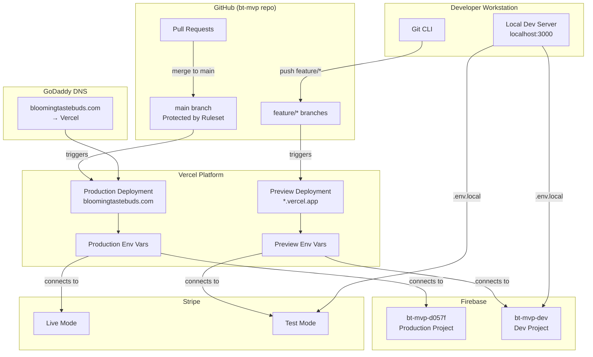
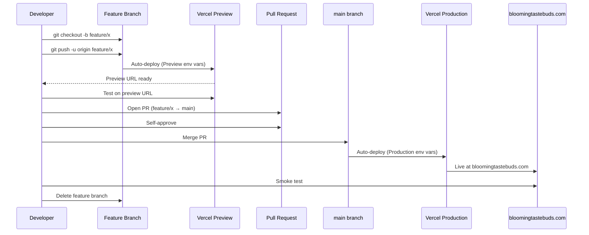

# Design Document: Safe Deployment Workflow

## Overview

This design defines the infrastructure architecture and configuration steps to establish a safe deployment pipeline for the Blooming Tastebuds MVP. The goal is to move from the current "push to main → instant production" model to a controlled flow where feature branches get isolated preview deployments and `main` remains protected behind pull request gates.

The system comprises four external services (GitHub, Vercel, Firebase, Stripe) that must be configured to work together across two environments:

| Environment | Branch | Domain | Firebase Project | Stripe Mode |
|-------------|--------|--------|-----------------|-------------|
| Production | `main` | `bloomingtastebuds.com` | `bt-mvp-d057f` (existing) | Live (`pk_live_`, `sk_live_`) |
| Preview/Dev | `feature/*` | `<project>-<hash>-<scope>.vercel.app` | `bt-mvp-dev` (new) | Test (`pk_test_`, `sk_test_`) |

The implementation is incremental:
- **Phase 1**: Branch protection + Vercel preview deployments (immediate value, no Firebase changes)
- **Phase 2**: Firebase dev project + Stripe test isolation (full data separation)

### Design Decisions

1. **No staging branch or staging subdomain** — The solo developer workflow doesn't justify the overhead. Preview URLs serve as the testing environment.
2. **Self-approval permitted** — As a solo project, the PR gate is for accidental push prevention, not multi-person review.
3. **GitHub Rulesets over legacy branch protection** — Rulesets are GitHub's newer, more flexible mechanism with bypass lists.
4. **Environment variable scoping over runtime detection** — Vercel's built-in scope mechanism (Production vs Preview) handles environment switching automatically at build time with no code changes needed.

---

## Architecture

### System Context Diagram



### Promotion Flow



---

## Components and Interfaces

### Component 1: GitHub Repository Ruleset

**Purpose:** Prevent accidental direct pushes to `main`, enforce PR workflow.

**Configuration:**
- **Ruleset name:** `protect-main`
- **Target:** Branch name pattern `main`
- **Enforcement:** Active
- **Bypass list:** Repository administrator (with explicit bypass selection)
- **Rules enabled:**
  - Require pull request before merging
  - Required approvals: 1
  - Allow self-approval: Yes (solo project)
  - Block force pushes
  - Block branch deletion

**Interface with Vercel:** No direct integration — Vercel watches branch pushes independently of GitHub rulesets.

---

### Component 2: Vercel Project Configuration

**Purpose:** Automatically deploy the correct environment based on branch context.

**Current state:** The Vercel project is already connected to the GitHub repo and auto-deploys `main` to production. Preview deployments are enabled by default for non-production branches.

**Configuration changes:**
- Add Preview-scoped environment variables (Phase 2)
- Verify Deployment Protection is set to allow public preview access (or disabled)
- No changes to production deployment settings or domain mapping

**Interface with GitHub:** Vercel GitHub integration listens for push events on all branches. It deploys `main` pushes as Production and all other pushes as Preview.

---

### Component 3: Firebase Dev Project (`bt-mvp-dev`)

**Purpose:** Provide an isolated Firebase backend for preview deployments and local development.

**Setup steps:**
1. Create project `bt-mvp-dev` in Firebase Console
2. Enable Authentication (email/password + Google OAuth)
3. Create Firestore database (start in test mode, then deploy rules)
4. Enable Firebase Storage
5. Deploy `firestore.rules` and `storage.rules` from the repo
6. Generate service account key for Admin SDK access

**Interface with Vercel:** The service account JSON and client config values are stored as Preview-scoped environment variables in Vercel.

**Interface with local dev:** The same dev credentials go in `.env.local`.

---

### Component 4: `.firebaserc` Configuration

**Purpose:** Allow the Firebase CLI to target either project by alias.

**Updated structure:**
```json
{
  "projects": {
    "default": "bt-mvp-d057f",
    "dev": "bt-mvp-dev"
  }
}
```

**Usage:**
- `firebase deploy --only firestore:rules` → deploys to production (default)
- `firebase deploy --only firestore:rules --project bt-mvp-dev` → deploys to dev
- `firebase use dev` → switches active alias to dev

---

### Component 5: Stripe Test Mode Configuration

**Purpose:** Ensure preview deployments never process real payments.

**Configuration:**
- Stripe Dashboard → Developers → API keys → Toggle to "Test mode"
- Copy `pk_test_*` and `sk_test_*` keys
- Create a test-mode webhook endpoint pointed at a Preview URL + `/api/webhooks/stripe`
- Generate `whsec_*` secret for the test webhook

**Interface with Vercel:** Test keys stored as Preview-scoped environment variables.

---

### Component 6: Vercel Environment Variable Scoping

**Purpose:** The mechanism that ties everything together — automatically switches between production and dev backends based on deployment type.

**Scoping model:**
- "Production" scope → injected only when deploying from `main`
- "Preview" scope → injected for all non-`main` branch deployments
- "Development" scope → injected for `vercel dev` (local Vercel CLI, not commonly used here)

No code changes are needed in the application — `process.env.NEXT_PUBLIC_FIREBASE_PROJECT_ID` resolves differently based on which scope Vercel injected at build time.

---

## Data Models

This spec does not introduce new application data models. The data architecture changes are:

### Environment Variable Mapping

| Variable | Production Scope | Preview Scope | `.env.local` |
|----------|-----------------|---------------|--------------|
| `NEXT_PUBLIC_FIREBASE_API_KEY` | Production Firebase key | Dev Firebase key | Dev Firebase key |
| `NEXT_PUBLIC_FIREBASE_AUTH_DOMAIN` | `bt-mvp-d057f.firebaseapp.com` | `bt-mvp-dev.firebaseapp.com` | `bt-mvp-dev.firebaseapp.com` |
| `NEXT_PUBLIC_FIREBASE_PROJECT_ID` | `bt-mvp-d057f` | `bt-mvp-dev` | `bt-mvp-dev` |
| `NEXT_PUBLIC_FIREBASE_STORAGE_BUCKET` | `bt-mvp-d057f.appspot.com` | `bt-mvp-dev.appspot.com` | `bt-mvp-dev.appspot.com` |
| `NEXT_PUBLIC_FIREBASE_MESSAGING_SENDER_ID` | Production sender ID | Dev sender ID | Dev sender ID |
| `NEXT_PUBLIC_FIREBASE_APP_ID` | Production app ID | Dev app ID | Dev app ID |
| `FIREBASE_ADMIN_SERVICE_ACCOUNT` | Production SA JSON | Dev SA JSON | Dev SA JSON |
| `NEXT_PUBLIC_STRIPE_PUBLISHABLE_KEY` | `pk_live_...` | `pk_test_...` | `pk_test_...` |
| `STRIPE_SECRET_KEY` | `sk_live_...` (or `rk_live_...`) | `sk_test_...` (or `rk_test_...`) | `sk_test_...` |
| `STRIPE_WEBHOOK_SECRET` | Production `whsec_...` | Test `whsec_...` (or omitted) | Test `whsec_...` |
| `NEXT_PUBLIC_APP_URL` | `https://bloomingtastebuds.com` | `(auto or preview URL)` | `http://localhost:3000` |
| `RESEND_API_KEY` | Production key | Same key (or test key) | Same key |
| `RESEND_FROM_EMAIL` | `bloomingtastebuds@gmail.com` | Same | Same |
| `RESEND_ADMIN_EMAIL` | `bloomingtastebuds@gmail.com` | Same | Same |

### `.firebaserc` Model (After Phase 2)

```json
{
  "projects": {
    "default": "bt-mvp-d057f",
    "dev": "bt-mvp-dev"
  }
}
```

### Configuration Files Affected

| File | Change | Phase |
|------|--------|-------|
| `.firebaserc` | Add `"dev": "bt-mvp-dev"` alias | Phase 2 |
| `.env.local` | Update to use dev Firebase + Stripe test keys | Phase 2 |
| `.env.local.example` | Add comments noting Production vs Dev values | Phase 2 |

No changes to application source code (`src/`), `next.config.ts`, `firebase.json`, `firestore.rules`, `storage.rules`, or `package.json`.

---

## Correctness Properties

### Property 1: Environment isolation invariant

*For any* Preview deployment built from a non-`main` branch, the runtime value of `NEXT_PUBLIC_FIREBASE_PROJECT_ID` SHALL equal the Dev Firebase project ID (`bt-mvp-dev`) and SHALL NOT equal the Production Firebase project ID (`bt-mvp-d057f`).

**Validates: Requirements 5.7, 7.4**

### Property 2: Production immutability during setup

*For any* configuration change made during Phase 1 or Phase 2 implementation, the Production-scoped environment variables in Vercel, the Production Firebase project data, and the GoDaddy DNS configuration SHALL remain unchanged.

**Validates: Requirements 7.1, 7.2, 7.3, 7.7**

### Property 3: Branch protection enforcement

*For any* git push operation targeting the `main` branch directly (not via merged PR), the GitHub Ruleset SHALL reject the push, ensuring code only reaches `main` through an approved Pull Request.

**Validates: Requirements 2.2, 2.5, 7.5**

### Property 4: Stripe mode isolation

*For any* payment processed on a Preview deployment, the Stripe API key used SHALL contain the `_test_` segment, ensuring no real charges are created during development.

**Validates: Requirements 8.1, 8.2, 8.3**

### Property 5: Reversibility of all configuration

*For any* phase of the implementation, removing the configuration added during that phase (ruleset deletion, env var removal, Firebase project deletion) SHALL NOT require redeployment of the Production environment or modification of Production-scoped settings.

**Validates: Requirements 2.8, 4.8, 7.6, 9.6**

---

## Error Handling

### Phase 1 Failure Scenarios

| Scenario | Detection | Recovery |
|----------|-----------|----------|
| Ruleset misconfigured (blocks admin) | Cannot push or merge at all | Delete ruleset from GitHub Settings → Rules |
| Preview deployment build fails | Red status check on PR + Vercel Dashboard error | Fix code on feature branch, push again |
| Preview URL returns 404/500 | Manual visit to URL after deploy | Check Vercel deployment logs |
| Accidental direct push to main blocked | CLI error: "push rejected" | Work on feature branch instead (expected behavior) |

### Phase 2 Failure Scenarios

| Scenario | Detection | Recovery |
|----------|-----------|----------|
| Preview connects to production Firebase | `NEXT_PUBLIC_FIREBASE_PROJECT_ID` in browser shows production ID | Fix Preview-scoped env vars in Vercel Dashboard |
| Dev service account key invalid | API routes return 500, `adminInitError` logged | Regenerate key in Firebase Console, update Vercel env var |
| Stripe test key not set in Preview | Payments process in live mode | Check Vercel env vars — `pk_test_` prefix missing |
| Firestore rules not deployed to dev | Permission denied errors in preview | Run `firebase deploy --only firestore:rules --project bt-mvp-dev` |
| Production env vars accidentally modified | Production site breaks | Restore from Vercel env var history or redeploy with correct values |

### Rollback Procedures

| What to revert | How |
|---------------|-----|
| GitHub Ruleset | Delete from Settings → Rules → `protect-main` |
| Preview env vars | Remove Preview-scoped vars from Vercel Dashboard (production unaffected) |
| Firebase dev project | Delete project from Firebase Console, remove `dev` alias from `.firebaserc` |
| `.env.local` changes | Restore from `.env.local.example` or git stash |
| Bad production deploy | Revert merge commit via new PR, or use Vercel "Redeploy" on previous production deployment |

---

## Testing Strategy

### Testing Approach

This spec is purely infrastructure configuration — it involves no pure functions, no data transformations, no parsers, and no algorithmic logic. While correctness properties are defined above as invariants to verify, they are validated through **smoke tests and integration checks** rather than property-based testing with generated inputs.

The appropriate testing strategies are:

- **Smoke tests**: Single verification that a configuration is correctly applied
- **Integration checks**: Confirm services are wired correctly to each other
- **Manual verification checklists**: Step-by-step confirmation procedures

Property-based testing (randomized input generation, 100+ iterations) is not applicable because:
- The "inputs" are manual actions in external dashboards (GitHub, Vercel, Firebase Console)
- There is no code logic where input variation reveals edge cases
- All checks are binary pass/fail states (push rejected or not, URL loads or not)

### Phase 1 Verification Checklist

| # | Check | Method | Pass Criteria |
|---|-------|--------|---------------|
| 1 | Branch protection active | Attempt `git push origin main` directly | Push rejected with error message |
| 2 | Force push blocked | Attempt `git push --force origin main` | Push rejected |
| 3 | PR required for merge | Open GitHub web UI on main branch | "Create pull request" is the only merge path |
| 4 | Self-approval works | Create PR, approve own PR | PR shows "Approved" status |
| 5 | Preview deploy triggers | Push a test feature branch | Vercel Dashboard shows new Preview deployment |
| 6 | Preview URL accessible | Visit the generated URL | HTTP 200 on root path |
| 7 | Production unaffected | Visit `bloomingtastebuds.com` | HTTP 200, no visual changes |
| 8 | PR status check shows | Open PR on GitHub | Vercel deployment status visible |

### Phase 2 Verification Checklist

| # | Check | Method | Pass Criteria |
|---|-------|--------|---------------|
| 1 | Dev Firebase project exists | Visit Firebase Console | `bt-mvp-dev` project visible |
| 2 | Auth providers enabled | Check dev project Auth settings | Email/password + Google enabled |
| 3 | Firestore rules deployed | Run `firebase deploy --only firestore:rules --project bt-mvp-dev` | Deploy succeeds |
| 4 | Storage rules deployed | Run `firebase deploy --only storage --project bt-mvp-dev` | Deploy succeeds |
| 5 | Preview uses dev Firebase | Deploy feature branch, inspect `NEXT_PUBLIC_FIREBASE_PROJECT_ID` in browser | Shows `bt-mvp-dev` |
| 6 | Data isolation confirmed | Create test record on preview URL | Record appears in dev Firestore, NOT in production Firestore |
| 7 | Stripe test mode active | Attempt payment on preview URL with test card `4242...` | Payment succeeds in Stripe test dashboard |
| 8 | Production Firebase untouched | Check production Firestore | No test records present |
| 9 | Production Stripe untouched | Check production Stripe dashboard | No test transactions |
| 10 | `.env.local` uses dev values | Run `npm run dev`, check console/network | Connects to `bt-mvp-dev` |
| 11 | Service account key not in git | Check `.gitignore` for `.env.local` | File is ignored |

### Rollback Test

| # | Check | Method | Pass Criteria |
|---|-------|--------|---------------|
| 1 | Ruleset removal | Delete ruleset, attempt direct push to main | Push succeeds (protection removed) |
| 2 | Dev project removal | Delete `bt-mvp-dev` from Firebase Console | No effect on production site |
| 3 | Preview var removal | Remove Preview-scoped vars from Vercel | Production deployment unchanged |

### Day-to-Day Workflow Smoke Test

After full setup, validate the end-to-end flow:

1. `git checkout -b feature/test-workflow`
2. Make a trivial change (e.g., add a comment)
3. `git push -u origin feature/test-workflow`
4. Confirm Preview deployment URL appears in Vercel Dashboard
5. Visit preview URL — verify HTTP 200
6. Open PR on GitHub
7. Self-approve and merge
8. Confirm production deployment triggers
9. Visit `bloomingtastebuds.com` — verify HTTP 200
10. Delete feature branch

---

## Implementation Phases Summary

```mermaid
gantt
    title Safe Deployment Workflow — Implementation Phases
    dateFormat  X
    axisFormat %s

    section Phase 1
    Create GitHub Ruleset           :p1a, 0, 1
    Verify branch protection        :p1b, after p1a, 1
    Push test feature branch        :p1c, after p1b, 1
    Verify preview deployment       :p1d, after p1c, 1
    Run Phase 1 checklist           :p1e, after p1d, 1

    section Phase 2
    Create bt-mvp-dev Firebase project  :p2a, after p1e, 1
    Enable Auth + Firestore + Storage   :p2b, after p2a, 1
    Deploy security rules to dev        :p2c, after p2b, 1
    Generate dev service account key    :p2d, after p2c, 1
    Add Preview env vars in Vercel      :p2e, after p2d, 1
    Configure Stripe test keys          :p2f, after p2e, 1
    Update .firebaserc                  :p2g, after p2f, 1
    Update .env.local                   :p2h, after p2g, 1
    Run Phase 2 checklist               :p2i, after p2h, 1
```


