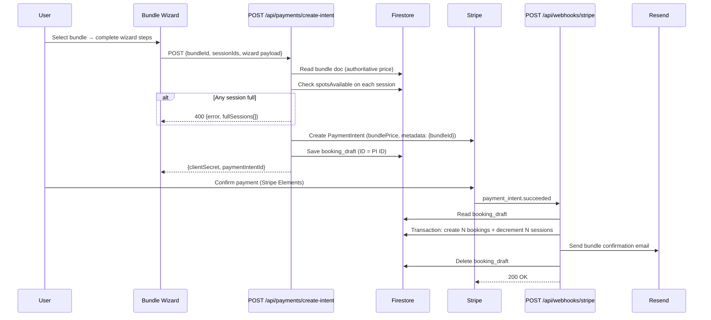

# Design Document: Session Bundles

## Overview

Session Bundles extends the Blooming Tastebuds booking platform to allow admins to package multiple sessions from the same class into a single bookable unit at a discounted price. Users purchase the entire bundle in one Stripe transaction, and the system atomically creates one booking document per session.

### Key Design Decisions

1. **Single PaymentIntent, multiple bookings**: A bundle uses one Stripe PaymentIntent (same as today's single-session flow) but the webhook fans out into N booking documents — one per session. This keeps Stripe integration simple while supporting multi-session atomicity.

2. **Booking document ID scheme**: Bundle bookings use `{paymentIntentId}_{sessionId}` as the document ID (vs. `{paymentIntentId}` for single-session bookings). This maintains idempotency per session while allowing multiple bookings from one payment.

3. **`bundleId` field as linkage**: All bookings from a bundle share a `bundleId` field. This enables grouping in the portal and atomic cancellation without a separate junction collection.

4. **Parallel route, shared logic**: The bundle wizard lives at `/book/bundle/[bundleId]/` and reuses the same step components (medical, questionnaire, terms, payment) via a `BundleBookingContext` that mirrors `BookingContext` but holds multiple sessions.

5. **Server-authoritative pricing**: Like single sessions, the bundle price is read from Firestore server-side. The client never sends an amount.

6. **Bundle status lifecycle**: `active` → `closed` (all dates passed) or `cancelled` (admin action). Only `active` bundles are shown to users.

## Architecture

```mermaid
flowchart TD
    subgraph Admin
        A[Admin Panel /admin/bundles] -->|CRUD| B[(Firestore: bundles)]
    end

    subgraph Public
        C[Classes Page / Portal Find-Class] -->|reads| B
        C -->|reads| D[(Firestore: sessions)]
    end

    subgraph Booking Flow
        E[Bundle Wizard /book/bundle/bundleId] -->|POST| F[/api/payments/create-intent]
        F -->|creates| G[(Firestore: booking_drafts)]
        F -->|creates| H[Stripe PaymentIntent]
        H -->|payment_intent.succeeded| I[/api/webhooks/stripe]
        I -->|reads| G
        I -->|transaction: N bookings + N spot decrements| J[(Firestore: bookings)]
        I -->|transaction: decrement| D
        I -->|sends| K[Resend: confirmation email]
    end

    subgraph Portal
        L[My Classes] -->|reads bookings grouped by bundleId| J
        L -->|Cancel Bundle| M[/api/emails/send]
        L -->|transaction: cancel + increment spots| J
        L -->|transaction: increment| D
    end
```

### Data Flow — Bundle Booking



## Components and Interfaces

### New Components

| Component | Path | Type | Purpose |
|-----------|------|------|---------|
| `AdminBundlesPage` | `src/app/admin/bundles/page.tsx` | Client | CRUD management of bundles |
| `BundleForm` | `src/app/admin/bundles/BundleForm.tsx` | Client | Create/edit form with session selector |
| `BundleBrowser` | `src/components/sessions/BundleBrowser.tsx` | Client | Public/portal bundle card display |
| `BundleBookingProvider` | `src/context/BundleBookingContext.tsx` | Client | Wizard state for bundle bookings |
| `BundleWizardLayout` | `src/app/book/bundle/[bundleId]/layout.tsx` | Client | Mounts BundleBookingProvider + stepper |
| `BundleStudentStep` | `src/app/book/bundle/[bundleId]/student/page.tsx` | Client | Step 1 — student selection |
| `BundleMedicalStep` | `src/app/book/bundle/[bundleId]/medical/page.tsx` | Client | Step 2 — medical info |
| `BundleQuestionnaireStep` | `src/app/book/bundle/[bundleId]/questionnaire/page.tsx` | Client | Step 3 — dietary (conditional) |
| `BundleTermsStep` | `src/app/book/bundle/[bundleId]/terms/page.tsx` | Client | Step 4 — T&Cs |
| `BundlePaymentStep` | `src/app/book/bundle/[bundleId]/payment/page.tsx` | Client | Step 5 — Stripe Elements |
| `BundleConfirmationStep` | `src/app/book/bundle/[bundleId]/confirmation/page.tsx` | Client | Step 6 — polls for bookings |
| `BundleGroupCard` | `src/components/portal/BundleGroupCard.tsx` | Client | My Classes bundle grouping |

### Modified Components

| Component | Change |
|-----------|--------|
| `src/app/api/payments/create-intent/route.ts` | Add `bundleId` code path — reads bundle price, validates all session spots, stores extended draft |
| `src/app/api/webhooks/stripe/route.ts` | Detect `bundleId` in draft → fan-out into N bookings in single transaction |
| `src/app/api/emails/send/route.ts` | Support `type: 'bundle-cancellation'` with multi-session template |
| `src/app/portal/my-classes/page.tsx` | Group bookings by `bundleId`, render `BundleGroupCard` |
| `src/middleware.ts` | Add `/book/bundle/*` to auth-required routes |
| `src/components/sessions/SessionBrowser.tsx` | Include `BundleBrowser` above session list |
| `src/app/admin/layout.tsx` | Add "Bundles" nav link |
| `src/types/index.ts` | Add `Bundle` and extend `Booking` interfaces |
| `firestore.rules` | Add `bundles` collection rules |

### New API Behaviour (create-intent)

The existing `POST /api/payments/create-intent` gains a bundle code path triggered by the presence of `bundleId` in the request body:

```ts
// Request body when booking a bundle
{
  bundleId: string;
  // No sessionId — derived from bundle document
  bookedByName: string;
  bookedByEmail: string;
  studentId: string;
  studentName: string;
  medicalInfo: MedicalInfo;
  emergencyContact?: EmergencyContact;
  questionnaire?: Questionnaire;
  termsAccepted: boolean;
}
```

Server-side logic:
1. Verify auth token → `verifiedUid`
2. Read `bundles/{bundleId}` → get `sessionIds`, `bundlePrice`, `classType`
3. Validate bundle status is `active`
4. Read all sessions → verify each has `spotsAvailable > 0`
5. If any session is full → return `400` with `{ error, fullSessions: [{sessionId, date}] }`
6. Create Stripe PaymentIntent with `amount = bundlePrice`, metadata `{ bundleId }`
7. Save booking_draft with `bundleId`, `sessionIds`, per-session denormalized data, wizard payload
8. Return `{ clientSecret, paymentIntentId }`

### Webhook Extension

The existing webhook handler detects a bundle via the `bundleId` field in the draft:

```ts
if (draft.bundleId) {
  // Bundle path — create N bookings atomically
  await handleBundlePaymentSucceeded(paymentIntent, draft);
} else {
  // Existing single-session path
  await handleSinglePaymentSucceeded(paymentIntent, draft);
}
```

`handleBundlePaymentSucceeded`:
1. For each `sessionId` in `draft.sessionIds`:
   - Check if doc `bookings/{piId}_{sessionId}` exists (idempotency)
   - If not, create booking doc with `bundleId` field
   - Decrement `spotsAvailable` on the session (or flag `overbooking: true` if already 0)
2. All operations in a single Firestore `runTransaction`
3. On success: send bundle confirmation email, delete draft
4. On failure: return 500 (Stripe retries)

## Data Models

### New: `Bundle` Interface

```ts
export type BundleStatus = 'active' | 'closed' | 'cancelled';

export interface Bundle {
  id: string;
  name: string;                    // 3–100 characters
  classId: string;
  className: string;
  classType: string;               // e.g. 'kidsAfterSchool' | 'youngAdultWeekend'
  sessionIds: string[];            // 2–20 session IDs, all from same classId
  bundlePrice: number;             // integer, pence (> 0, <= totalIndividualPrice)
  totalIndividualPrice: number;    // sum of session prices in pence
  status: BundleStatus;
  venueId: string;
  venueName: string;
  createdAt: any;                  // Firestore Timestamp
}
```

Stored in `bundles/{bundleId}` (auto-generated ID).

### Modified: `Booking` Interface

```ts
export interface Booking {
  id: string;
  sessionId: string;
  sessionDate: string;
  className: string;
  venueName: string;
  bookedByUid: string;
  bookedByName: string;
  studentId: string;
  studentName: string;
  status: BookingStatus;
  medicalInfo: MedicalInfo;
  emergencyContact?: EmergencyContact;
  questionnaire?: Questionnaire;
  termsAccepted: boolean;
  termsAcceptedAt: any;
  payment: {
    stripePaymentIntentId: string;
    amount: number;                // For bundles: bundlePrice / sessionCount (informational)
    currency: string;
    status: PaymentStatus;
    receiptUrl?: string;
  };
  // --- New fields for bundles ---
  bundleId?: string;               // Present only for bundle bookings; links all bookings in a bundle
  bundleName?: string;             // Denormalized for display without extra reads
  overbooking?: boolean;           // True if session was full at webhook time
  createdAt: any;
}
```

Document ID scheme:
- Single session: `{paymentIntentId}` (unchanged)
- Bundle session: `{paymentIntentId}_{sessionId}`

### New: `BundleBookingDraft` (stored in `booking_drafts/{piId}`)

```ts
// Extended draft for bundle bookings
{
  stripePaymentIntentId: string;
  paymentStatus: 'pending';
  bundleId: string;
  bundleName: string;
  sessionIds: string[];
  sessions: Array<{               // Denormalized per-session data for email/display
    sessionId: string;
    date: string;
    startTime: string;
    endTime: string;
    venueName: string;
  }>;
  classType: string;
  className: string;
  bookedByUid: string;
  bookedByName: string;
  bookedByEmail: string;
  studentId: string;
  studentName: string;
  medicalInfo: MedicalInfo | null;
  emergencyContact: EmergencyContact | null;
  questionnaire: Questionnaire | null;
  termsAccepted: boolean;
  createdAt: Timestamp;
}
```

### New: `BundleBookingWizardState`

```ts
export interface BundleBookingWizardState {
  bundleId: string;
  bundle?: Bundle;
  sessions?: Session[];
  studentId?: string;
  student?: Student | 'self';
  medicalInfo?: MedicalInfo;
  emergencyContact?: EmergencyContact;
  questionnaire?: Questionnaire;
  termsAccepted?: boolean;
}
```

### Firestore Indexes

```json
{
  "collectionGroup": "bundles",
  "queryScope": "COLLECTION",
  "fields": [
    { "fieldPath": "status", "order": "ASCENDING" },
    { "fieldPath": "classId", "order": "ASCENDING" }
  ]
}
```

```json
{
  "collectionGroup": "bookings",
  "queryScope": "COLLECTION",
  "fields": [
    { "fieldPath": "bundleId", "order": "ASCENDING" },
    { "fieldPath": "bookedByUid", "order": "ASCENDING" }
  ]
}
```

## Firestore Security Rules

```
// BUNDLES — public read (for classes/portal pages), admin write
match /bundles/{bundleId} {
  allow read: if true;
  allow write: if isAdmin();
}

// BOOKINGS — extended for bundle bookings
// Bundle booking doc IDs use {piId}_{sessionId} pattern.
// The existing read/update rules still work because they check bookedByUid
// on the document data, not the document ID format.
match /bookings/{bookingId} {
  // Existing rules remain unchanged — bookedByUid check applies to all bookings
  allow read: if isSignedIn()
    && (resource == null || resource.data.bookedByUid == request.auth.uid);

  // Cancel: user may cancel individual or bundle bookings (portal handles bundle atomicity)
  allow update: if isSignedIn()
    && resource.data.bookedByUid == request.auth.uid
    && request.resource.data.status == 'cancelled'
    && request.resource.data.diff(resource.data).affectedKeys()
         .hasOnly(['status', 'cancelledAt']);

  allow read, write: if isAdmin();
}
```

The `bundles` collection is readable by all users (same pattern as `sessions`, `classes`, `venues`) since it contains no PII. Writes are admin-only.

## Correctness Properties

*A property is a characteristic or behavior that should hold true across all valid executions of a system — essentially, a formal statement about what the system should do. Properties serve as the bridge between human-readable specifications and machine-verifiable correctness guarantees.*

### Property 1: Bundle validation schema

*For any* bundle creation payload, the system SHALL accept it if and only if: the name has 3–100 characters, sessionIds contains 2–20 elements all from the same classId with status 'open', and bundlePrice is an integer greater than 0 and less than or equal to the sum of the individual session prices.

**Validates: Requirements 1.2, 1.4**

### Property 2: Session filter for bundle creation

*For any* collection of sessions with mixed statuses and classIds, the session selector filter SHALL return exactly those sessions where `status === 'open'` AND `classId` matches the selected class.

**Validates: Requirements 1.3**

### Property 3: Bundle document completeness

*For any* valid bundle creation input, the resulting Firestore document SHALL contain all required fields (id, name, classId, className, classType, sessionIds, bundlePrice, totalIndividualPrice, status, venueId, venueName, createdAt) with status defaulting to 'active'.

**Validates: Requirements 1.6, 7.1**

### Property 4: Per-session saving calculation

*For any* bundle with N sessions and a bundlePrice, the displayed per-session saving SHALL equal `(totalIndividualPrice - bundlePrice) / N` converted to pounds with two decimal places.

**Validates: Requirements 2.2**

### Property 5: Bundle availability status derivation

*For any* bundle and its associated sessions: if all sessions have `spotsAvailable === 0`, the derived status SHALL be "Full"; if at least one session has `spotsAvailable === 0` but at least one has `spotsAvailable > 0`, the derived status SHALL be "Limited Availability"; otherwise the derived status SHALL be "Available".

**Validates: Requirements 2.3, 2.4**

### Property 6: Session dates chronological ordering

*For any* array of session date strings in YYYY-MM-DD format, the display functions SHALL always output them sorted in ascending chronological order.

**Validates: Requirements 2.5, 3.4**

### Property 7: Pre-payment availability gate

*For any* bundle booking attempt, if any session in the bundle has `spotsAvailable === 0` at PaymentIntent creation time, the system SHALL reject the request and the response SHALL identify each full session by sessionId and date.

**Validates: Requirements 3.5, 5.1, 5.2**

### Property 8: Bundle booking transaction atomicity — creation

*For any* bundle of N sessions, when `payment_intent.succeeded` fires, the webhook SHALL create exactly N booking documents (one per session) and decrement `spotsAvailable` by 1 on each session, all within a single Firestore transaction. If the transaction fails, zero booking documents SHALL exist.

**Validates: Requirements 3.6, 4.4, 4.7, 5.4**

### Property 9: PaymentIntent amount equals bundle price

*For any* bundle, the Stripe PaymentIntent amount SHALL equal the `bundlePrice` stored on the bundle document, and the PaymentIntent metadata SHALL contain the `bundleId`.

**Validates: Requirements 4.1**

### Property 10: Booking draft completeness for bundles

*For any* valid bundle booking wizard submission, the booking_draft document SHALL contain `bundleId`, all `sessionIds`, per-session denormalized data (date, time, venue), and the full wizard payload (bookedByUid, studentId, medicalInfo, etc.).

**Validates: Requirements 4.2**

### Property 11: Booking document ID scheme

*For any* bundle of N sessions processed by the webhook, the N resulting booking documents SHALL have IDs matching the pattern `{paymentIntentId}_{sessionId}` for each session in the bundle.

**Validates: Requirements 4.3**

### Property 12: Bundle linkage invariant

*For any* bundle booking, all booking documents created from that bundle SHALL share the same `bundleId` field value equal to the source bundle's ID.

**Validates: Requirements 4.5**

### Property 13: Webhook idempotency

*For any* bundle payment event processed twice, the second invocation SHALL create zero additional booking documents and SHALL not decrement any session's `spotsAvailable` beyond what the first invocation already did.

**Validates: Requirements 4.6**

### Property 14: Overbooking flag on zero-spots sessions

*For any* session in a bundle that has `spotsAvailable === 0` at webhook processing time, the corresponding booking document SHALL be created with `overbooking: true`.

**Validates: Requirements 5.3**

### Property 15: Bundle cancellation atomicity

*For any* confirmed bundle of N bookings, cancellation SHALL update all N booking statuses to 'cancelled' and increment `spotsAvailable` by 1 on each of the N sessions, all within a single Firestore transaction. If the transaction fails, zero statuses and zero spots SHALL be modified.

**Validates: Requirements 6.2, 6.5**

### Property 16: Cancellation regardless of session dates

*For any* bundle containing sessions with dates in the past, present, or future, cancellation SHALL proceed for all sessions in the bundle without filtering by date.

**Validates: Requirements 6.7**

### Property 17: Auto-close lifecycle

*For any* bundle where all session dates are strictly before today's date, the lifecycle check SHALL set the bundle status to 'closed'.

**Validates: Requirements 7.2**

### Property 18: Admin cancel prevents new bookings

*For any* bundle with status 'cancelled', any attempt to create a new booking against that bundle SHALL be rejected.

**Validates: Requirements 7.3**

### Property 19: Public display filter

*For any* collection of bundles with mixed statuses, the public query SHALL return only those with `status === 'active'`.

**Validates: Requirements 7.4**

### Property 20: Prevent removal of booked sessions

*For any* bundle edit that attempts to remove a session from `sessionIds`, if that session has at least one booking document referencing it with the bundle's ID, the edit SHALL be rejected.

**Validates: Requirements 7.5**

### Property 21: Bundle confirmation email completeness

*For any* bundle booking, the confirmation email SHALL contain the bundle name in the subject line, the participant name, the total amount formatted as £XX.XX, and all session dates listed in chronological order with start time and venue.

**Validates: Requirements 8.2, 8.5**

### Property 22: Cancellation email completeness

*For any* bundle cancellation, the system SHALL send a single email containing the bundle name, all cancelled session dates with venue and time, and a link to the My Classes portal page.

**Validates: Requirements 6.3**

## Error Handling

### Payment Flow Errors

| Error Condition | Response | User Experience |
|----------------|----------|-----------------|
| Bundle not found | 404 | "This bundle is no longer available" |
| Bundle status not 'active' | 400 | "This bundle is no longer accepting bookings" |
| Any session has 0 spots | 400 + `fullSessions[]` | Show which sessions are full, prevent payment |
| Stripe PI creation fails | 500 | "Payment service error. Please try again." |
| Draft write fails after PI created | Cancel PI, 500 | "Failed to initialize booking. Please try again." |
| Student doesn't belong to user | 403 | "Invalid student selection" |
| Firebase Admin SDK not initialised | 500 | "Booking service temporarily unavailable" |

### Webhook Errors

| Error Condition | Behaviour |
|----------------|-----------|
| No draft found for PI | Log error, return 200 (manual intervention needed) |
| Firestore transaction fails | Return 500 → Stripe retries |
| Session has 0 spots at webhook time | Create booking with `overbooking: true`, log warning |
| Session document not found | Throw → 500 → Stripe retries |
| Email send fails | Log error, continue (booking creation is not blocked) |
| Duplicate webhook delivery | Skip creation (idempotency check), return 200 |

### Cancellation Errors

| Error Condition | Response | User Experience |
|----------------|----------|-----------------|
| Transaction fails | No partial updates | "Cancellation could not be completed. Please try again." |
| Bundle already cancelled | Hide cancel button (UI prevents this) | — |
| Email send fails after cancel | Log error, cancellation still persists | User sees success; email is best-effort |

### Admin Errors

| Error Condition | Response |
|----------------|----------|
| Remove session with existing bookings | Inline error: "Cannot remove [session date] — it has existing bookings" |
| Bundle name empty or > 100 chars | Inline validation error on name field |
| Bundle price > sum of sessions | Inline error: "Bundle price cannot exceed total individual price" |
| Fewer than 2 sessions selected | Inline error: "Select at least 2 sessions" |

## Testing Strategy

### Property-Based Tests (Vitest + fast-check)

Property-based tests use the `fast-check` library with a minimum of **100 iterations** per property. Each test references its design property.

**Library**: `fast-check` (TypeScript PBT library compatible with Vitest)

**Target areas** (pure logic, testable without infrastructure):
- Bundle validation schema (Property 1)
- Session filter logic (Property 2)
- Per-session saving calculation (Property 4)
- Availability status derivation (Property 5)
- Date sorting (Property 6)
- Booking ID generation (Property 11)
- Bundle linkage (Property 12)
- Public display filter (Property 19)

**Configuration**:
- Minimum 100 iterations per property: `fc.assert(fc.property(...), { numRuns: 100 })`
- Tag format: `// Feature: session-bundles, Property N: <title>`

### Unit Tests (Vitest + Testing Library)

- Admin bundle form validation (field-level errors, submit prevention)
- BundleBrowser rendering (badge, pricing display, availability indicators)
- BundleGroupCard rendering (grouped display, Cancel Bundle action visibility)
- Wizard step navigation (conditional questionnaire skip)
- Email template assembly (content verification)

### Integration Tests (Vitest with mocked Firebase/Stripe)

- `create-intent` bundle code path (end-to-end with mocked Firestore + Stripe)
- Webhook bundle handler (transaction fan-out, idempotency, overbooking)
- Bundle cancellation transaction (all-or-nothing status + spots updates)
- Auto-close lifecycle function

### Test File Structure

```
src/__tests__/
├── bundles/
│   ├── bundle-validation.property.test.ts     # Properties 1, 2
│   ├── bundle-display.property.test.ts        # Properties 4, 5, 6, 19
│   ├── bundle-booking-ids.property.test.ts    # Properties 11, 12
│   ├── admin-bundle-form.test.tsx             # Unit: form rendering + validation
│   ├── bundle-browser.test.tsx                # Unit: BundleBrowser component
│   ├── bundle-group-card.test.tsx             # Unit: portal grouping
│   ├── create-intent-bundle.test.ts           # Integration: API route
│   ├── webhook-bundle.test.ts                 # Integration: webhook handler
│   └── bundle-cancellation.test.ts            # Integration: cancellation flow
```

### Mocking Strategy

- **Firestore**: Mock `adminDb` with in-memory document store for transaction testing
- **Stripe**: Mock `stripe.paymentIntents.create` to return controlled PI IDs
- **Resend**: Mock `resend.emails.send` to capture email payloads for content assertions
- **Firebase Auth**: Mock `adminAuth.verifyIdToken` to return controlled UIDs
- **SessionStorage**: Use `vi.stubGlobal` for `sessionStorage` in wizard state tests
