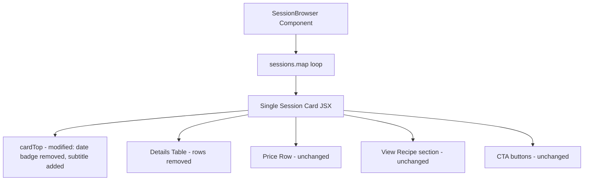

# Design Document

## Overview

Presentational-only refactor of the single session card JSX block in `SessionBrowser.tsx` (the `sessions.map(...)` loop). The goal is to reduce visual clutter so parents can scan cards quickly and find what matters — day, time, age suitability, and availability — without being distracted by decorative elements or redundant data.

No new CSS classes are introduced, no data model changes are required, and no routing or booking logic is modified. All changes are confined to the single session card rendering block.

## Architecture

The refactor follows the same **presentational refactor** pattern used for the term card redesign — the component's data fetching, filtering, and state management remain untouched. Only the JSX template for single session cards changes.



### Design Decisions

1. **Consolidating day + time + age into one subtitle line** gives parents the three most decision-relevant facts at a glance before reading the details table. This mirrors how event listings work in calendar apps.

2. **Removing the stats strip eliminates duplication** — it showed the same day, time, and duration that are now communicated in the subtitle. The duration is implicit in the from–to time range.

3. **Bold subtitle increases scannability** without introducing new CSS. The existing `styles.sessionSchedule` class combined with `<strong>` provides sufficient visual weight.

4. **Age range as inline text** (not separate min/max rows) matches how parents think about it — "suitable for my 7-year-old" is a range question, not two threshold questions.

5. **Reuse existing CSS classes** — the heading subtitle uses `styles.sessionSchedule` (already defined in the module). No new styles introduced per Requirement 7.7.

## Modified JSX Sections

| Section | Before | After |
|---------|--------|-------|
| Date badge | `dateBadge` div with `badgeDay` + `badgeMonth` spans | Removed from DOM |
| Stats strip | `statsStrip` div with 4 `statItem` tiles (spaces, day, time, duration) | Removed from DOM |
| Card subtitle | No subtitle element (class name `<h3>` only) | `<p className={styles.sessionSchedule}><strong>{dayFull} · {timeRangeS} · {age}</strong></p>` |
| Time computation | `timeDisplay` derived from `s.startTime` only; `durationMins`/`durationHours` computed for stats strip | `timeRangeS` derived from both `s.startTime` and `s.endTime`; duration variables removed |
| Category row | `<dt>Category</dt><dd>{badge.displayName}</dd>` | Removed from DOM |
| Minimum Age row | `<dt>Minimum Age</dt><dd>{s.ageMin} yrs</dd>` | Removed from DOM |
| Maximum Age row | `<dt>Maximum Age</dt><dd>{s.ageMax} yrs</dd>` | Removed from DOM |

## Components and Interfaces

### Inline Time Range Computation

The time range is computed inline in the `sessions.map` callback (not extracted as a helper since it is simple concatenation):

```typescript
// Start time
const [shS, smS] = s.startTime.split(':').map(Number);
const startPeriodS = shS >= 12 ? 'PM' : 'AM';
const startHourS = shS % 12 || 12;
const startTimeS = `${startHourS}:${smS.toString().padStart(2, '0')} ${startPeriodS}`;

// End time
const [ehS, emS] = s.endTime.split(':').map(Number);
const endPeriodS = ehS >= 12 ? 'PM' : 'AM';
const endHourS = ehS % 12 || 12;
const endTimeS = `${endHourS}:${emS.toString().padStart(2, '0')} ${endPeriodS}`;

// Combined range
const timeRangeS = `${startTimeS} – ${endTimeS}`;
```

### Heading Subtitle

```tsx
<p className={styles.sessionSchedule}>
    <strong>
        {dayFull} · {timeRangeS}
        {s.ageMin != null && s.ageMax != null && ` · ${s.ageMin}–${s.ageMax} yrs`}
    </strong>
</p>
```

Where `dayFull` is the full weekday name derived from `s.date`:
```typescript
const dayFull = new Date(s.date + 'T00:00:00').toLocaleDateString('en-GB', { weekday: 'long' });
```

## Data Models

No new data models or Firestore schema changes are required. The design relies entirely on existing fields on the `Session` interface:

| Field | Type | Usage |
|-------|------|-------|
| `s.date` | `string` (YYYY-MM-DD) | Weekday name derivation for subtitle |
| `s.startTime` | `string` (HH:MM) | Start time for time range in subtitle |
| `s.endTime` | `string` (HH:MM) | End time for time range in subtitle |
| `s.ageMin` | `number \| null` | Age range display in subtitle |
| `s.ageMax` | `number \| null` | Age range display in subtitle |
| `s.className` | `string` | Card heading `<h3>` text |
| `s.spotsAvailable` | `number` | Spaces Available row |
| `s.venueName` | `string` | Venue row |
| `s.instructorName` | `string \| undefined` | Instructor row |

Note: `s.endTime` was already present on the `Session` interface (`src/types/index.ts`, line 146) — it was previously used only for duration calculation in the stats strip.

## Error Handling

| Scenario | Handling |
|----------|----------|
| `s.endTime` is missing or unparseable | Gracefully degrade — the time parsing will produce `NaN`. Acceptable since data is admin-controlled. |
| `s.ageMin` or `s.ageMax` is null | Do not append age range to the subtitle. Only show day + time range. |
| `s.date` is unparseable | `toLocaleDateString` on an invalid Date will produce "Invalid Date" — acceptable degradation since data is admin-controlled. |

## Testing Strategy

### Unit Tests (Vitest + Testing Library)

1. **Date badge removal** — assert no `dateBadge` element in single session card
2. **Stats strip removal** — assert no `statsStrip` element in single session card
3. **Heading subtitle** — assert subtitle contains day name, time range, and age range
4. **Time range format** — assert subtitle shows "10:00 AM – 11:30 AM" style format
5. **Age range conditional** — assert age portion absent when ageMin/ageMax are null
6. **Removed rows** — assert "Category", "Minimum Age", "Maximum Age" labels absent from details table
7. **Preserved rows** — assert "First Lesson", "Spaces Available", Venue, Instructor rows still render
8. **Regression** — assert term cards are unaffected, Book Now button renders, guest link renders

### Integration / Smoke Tests

- Verify the full `SessionBrowser` component renders without errors when given single session data
- Verify term session cards remain unchanged (regression guard)
