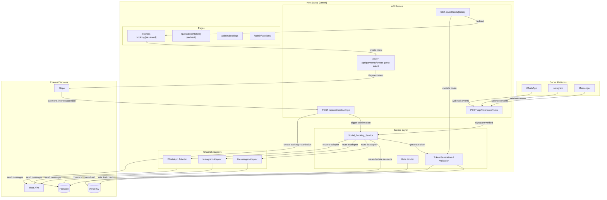
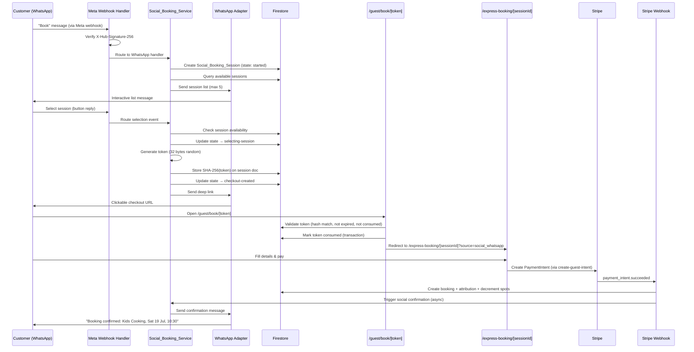

# Design Document: Social Commerce Guest Booking

## Overview

Social Commerce Guest Booking extends Blooming Tastebuds' guest express checkout to social messaging platforms (WhatsApp, Instagram, Facebook Messenger). The system uses a channel-neutral architecture with platform-specific adapters, enabling customers to discover sessions and initiate bookings through social channels while completing payment on the existing website guest checkout.

The design philosophy is "social channels as acquisition funnels, website as checkout engine." Social adapters handle conversation and discovery; the existing `/express-booking/[sessionId]` page handles all sensitive data collection, payment, and booking creation. This avoids duplicating booking logic across channels and keeps PII off social platforms.

### Key Design Decisions

1. **Channel-neutral core + adapter pattern** — `Social_Booking_Service` contains zero platform-specific code. Each channel is a plug-in adapter implementing a unified interface.
2. **Single Meta webhook endpoint** — One `POST /api/webhooks/meta` route handles WhatsApp, Instagram, and Messenger events, routing by payload structure.
3. **Secure one-time tokens** — Cryptographically random tokens (32 bytes, URL-safe base64) link a social session to a checkout URL. Only SHA-256 hashes stored in Firestore.
4. **Deep-link to existing checkout** — `/guest/book/[token]` resolves and redirects to `/express-booking/[sessionId]?source=social_<channel>&campaign=<name>`. No new payment flow.
5. **Attribution propagation** — Channel and campaign metadata flows from `Social_Booking_Session` → token → query params → booking draft → confirmed booking.
6. **Phased delivery** — Foundation (tokens, deep-links, attribution) ships first without Meta credentials. Channel adapters are additive phases.

## Architecture



### Request Flow: Social Booking Happy Path



## Components and Interfaces

### 1. Channel Adapter Interface

```typescript
// src/lib/social-booking/adapters/types.ts

export type SocialChannel = 'whatsapp' | 'instagram' | 'messenger';

export interface SessionSummary {
  sessionId: string;
  className: string;
  date: string;          // "Sat 19 Jul"
  startTime: string;     // "10:30"
  venueName: string;
  ageRange: string;      // "5–12"
  spotsAvailable: number;
  price: string;         // "£15.00"
}

export interface BookingConfirmation {
  className: string;
  date: string;
  startTime: string;
  venueName: string;
  bookingRef: string;    // Last 8 chars of PaymentIntent ID
}

export interface ChannelAdapter {
  readonly channel: SocialChannel;

  /** Send available sessions to the user */
  sendSessionList(
    recipientId: string,
    sessions: SessionSummary[]
  ): Promise<void>;

  /** Send checkout deep link to the user */
  sendCheckoutLink(
    recipientId: string,
    deepLinkUrl: string,
    sessionSummary: SessionSummary
  ): Promise<void>;

  /** Send booking confirmation */
  sendBookingConfirmation(
    recipientId: string,
    confirmation: BookingConfirmation
  ): Promise<void>;

  /** Send no-sessions-available message */
  sendNoSessionsMessage(recipientId: string): Promise<void>;

  /** Send session-unavailable message */
  sendSessionUnavailableMessage(
    recipientId: string,
    sessions: SessionSummary[]
  ): Promise<void>;

  /** Send unrecognised command help message */
  sendHelpMessage(recipientId: string): Promise<void>;

  /** Send error/retry message */
  sendErrorMessage(recipientId: string): Promise<void>;

  /** Parse inbound webhook payload into normalised event */
  parseEvent(payload: unknown): ParsedSocialEvent | null;
}
```

### 2. Social Booking Service

```typescript
// src/lib/social-booking/service.ts

export interface SocialBookingService {
  /** Handle an inbound social message (trigger, selection, or unknown) */
  handleInboundMessage(event: ParsedSocialEvent): Promise<void>;

  /** Generate a secure checkout token for a session selection */
  generateCheckoutToken(
    socialBookingSessionId: string,
    sessionId: string
  ): Promise<string>;

  /** Validate and consume a checkout token, returning session context */
  validateAndConsumeToken(rawToken: string): Promise<TokenValidationResult>;

  /** Mark session as confirmed (called by Stripe webhook) */
  confirmBooking(socialBookingSessionId: string, paymentIntentId: string): Promise<void>;

  /** Send social channel confirmation (async, best-effort) */
  sendSocialConfirmation(socialBookingSessionId: string, bookingRef: string): Promise<void>;

  /** Query available sessions (open, future, spots > 0, max 5) */
  getAvailableSessions(): Promise<SessionSummary[]>;
}
```

### 3. Meta Webhook Handler

```typescript
// src/app/api/webhooks/meta/route.ts

export async function POST(req: Request): Promise<Response>;
export async function GET(req: Request): Promise<Response>;
```

**POST handler flow:**
1. Read raw body + `X-Hub-Signature-256` header
2. Compute HMAC-SHA256 with `META_APP_SECRET`, compare to header
3. Reject with 403 if signature invalid or missing
4. Check replay protection (event timestamp within 5 minutes)
5. Check idempotency (event ID in `meta_webhook_events` Vercel KV)
6. Determine channel from payload structure
7. Route to appropriate adapter's `parseEvent()`
8. Delegate to `SocialBookingService.handleInboundMessage()`
9. Return 200 within 5 seconds (async processing after acknowledgement)

**GET handler flow (verification challenge):**
1. Check `hub.mode === 'subscribe'`
2. Check `hub.verify_token === META_WEBHOOK_VERIFY_TOKEN`
3. Return `hub.challenge` with 200, or 403 if token mismatch

### 4. Token Generation & Validation Service

```typescript
// src/lib/social-booking/token.ts

export interface TokenService {
  /** Generate a secure token, store hash in Firestore */
  generate(socialBookingSessionId: string, sessionId: string): Promise<string>;

  /** Validate token: hash match, not expired, not consumed. Consumes atomically. */
  validateAndConsume(rawToken: string): Promise<TokenValidationResult>;
}

export type TokenValidationResult =
  | { valid: true; sessionId: string; channel: SocialChannel; campaign: string | null; socialBookingSessionId: string }
  | { valid: false; reason: 'expired' | 'consumed' | 'invalid' | 'session_unavailable' };
```

**Token generation algorithm:**
1. Generate 32 cryptographically random bytes using `crypto.randomBytes(32)`
2. Encode as URL-safe base64 (replace `+` → `-`, `/` → `_`, strip `=`)
3. Compute `SHA-256(rawToken)` → hex string
4. Store hash, sessionId, expiresAt (now + 15min) in `Social_Booking_Session`
5. Return raw token (never stored)

**Token validation algorithm (Firestore transaction):**
1. Compute `SHA-256(presentedToken)` → hex string
2. Query `social_booking_sessions` where `checkoutTokenHash === hash`
3. Inside transaction: check `expiresAt > now`, check `tokenConsumed !== true`
4. If valid: set `tokenConsumed = true`, return session context
5. If invalid: return error reason

### 5. Deep Link Resolution Page

```typescript
// src/app/guest/book/[token]/page.tsx (Server Component)
```

**Resolution flow:**
1. Extract token from URL params
2. Extract optional UTM params from search params
3. Call `TokenService.validateAndConsume(token)`
4. If invalid → render error page with retry instructions
5. If valid but session unavailable → render session-unavailable page
6. If valid → redirect to `/express-booking/[sessionId]?source=social_<channel>&campaign=<name>`
7. Store UTM params on `Social_Booking_Session` if present

### 6. Rate Limiting

| Endpoint | Limit | Window | Key | Store |
|----------|-------|--------|-----|-------|
| Token generation | 10 tokens/hour | Rolling 1h | `social_token_rate:<externalUserId>` | Vercel KV |
| Deep link resolution | 20 requests/min | Rolling 1min | `social_deeplink_rate:<IP>` | Vercel KV |
| Failed token attempts | 5 failures/10min | Rolling 10min | `social_token_fail:<IP>` | Vercel KV |

After 5 consecutive token failures from an IP, that IP is blocked for 30 minutes via a `social_ip_block:<IP>` key with 1800s TTL.

## Data Models

### Social_Booking_Session (Firestore: `social_booking_sessions/{id}`)

```typescript
// Addition to src/types/index.ts

export type SocialBookingState =
  | 'started'
  | 'selecting-session'
  | 'checkout-created'
  | 'payment-pending'
  | 'confirmed'
  | 'expired';

export interface SocialBookingSession {
  id: string;
  channel: SocialChannel;
  externalConversationId: string;
  externalUserId: string;
  state: SocialBookingState;
  sessionId: string | null;
  checkoutTokenHash: string | null;
  tokenConsumed: boolean;
  tokenExpiresAt: any | null;       // Firestore Timestamp
  source: BookingSource;
  campaign: CampaignAttribution | null;
  socialBookingSessionId: string;    // Self-reference for attribution
  createdAt: any;                    // Firestore Timestamp
  expiresAt: any;                    // Firestore Timestamp (createdAt + 30min)
  updatedAt: any;                    // Firestore Timestamp
}

export interface CampaignAttribution {
  source: string | null;    // utm_source
  medium: string | null;    // utm_medium
  campaign: string | null;  // utm_campaign
}
```

### Booking Document Additions

The existing `Booking` and `GuestBooking` types gain an optional `acquisition` field:

```typescript
export interface AcquisitionMetadata {
  bookingSource: BookingSource;
  campaign: CampaignAttribution | null;
  socialBookingSessionId: string | null;
}
```

The Stripe webhook adds this to the booking document when social attribution is present in the draft.

### Meta Webhook Event Deduplication (Vercel KV)

- Key: `meta_event:<eventId>`
- Value: `1`
- TTL: 86400 seconds (24 hours)

### Firestore Security Rules Addition

```
// social_booking_sessions — server-side only (Admin SDK)
match /social_booking_sessions/{docId} {
  allow read, write: if false;
}
```

### Environment Variables (New)

| Variable | Purpose | Server-only |
|----------|---------|-------------|
| `META_APP_SECRET` | HMAC-SHA256 webhook signature verification | Yes |
| `META_WEBHOOK_VERIFY_TOKEN` | Webhook subscription challenge | Yes |
| `META_WHATSAPP_ACCESS_TOKEN` | WhatsApp Cloud API calls | Yes |
| `META_WHATSAPP_PHONE_NUMBER_ID` | WhatsApp sender identity | Yes |
| `META_INSTAGRAM_ACCESS_TOKEN` | Instagram Messaging API calls | Yes |
| `META_INSTAGRAM_PAGE_ID` | Instagram page identity | Yes |
| `META_MESSENGER_ACCESS_TOKEN` | Messenger Platform Send API | Yes |
| `META_MESSENGER_PAGE_ID` | Messenger page identity | Yes |
| `NEXT_PUBLIC_SOCIAL_BOOKING_ENABLED` | Feature flag for social booking | No (client) |

None of the Meta tokens are prefixed with `NEXT_PUBLIC_` — they are server-side only.


## Correctness Properties

*A property is a characteristic or behavior that should hold true across all valid executions of a system — essentially, a formal statement about what the system should do. Properties serve as the bridge between human-readable specifications and machine-verifiable correctness guarantees.*

### Property 1: Webhook Signature Verification

*For any* HTTP request body and X-Hub-Signature-256 header value, the Meta webhook handler SHALL accept the request if and only if the header equals `sha256=HMAC-SHA256(body, META_APP_SECRET)`, and SHALL reject with HTTP 403 otherwise (including when the header is missing).

**Validates: Requirements 3.2, 3.3, 3.4, 11.1**

### Property 2: Channel Routing from Payload Structure

*For any* valid webhook event payload, the Meta webhook handler SHALL correctly identify the originating channel (whatsapp, instagram, or messenger) based on the payload's structural characteristics, and route the event to the corresponding Channel_Adapter.

**Validates: Requirements 3.5, 3.7**

### Property 3: Event Idempotency

*For any* webhook event processed by the Meta webhook handler, processing the same event ID a second time SHALL produce no side effects — no duplicate Social_Booking_Session creation, no duplicate adapter responses, and no duplicate state transitions.

**Validates: Requirements 3.9**

### Property 4: Replay Protection

*For any* webhook event whose entry-level timestamp is older than 5 minutes relative to the server's current time, the Meta webhook handler SHALL reject the event with HTTP 403.

**Validates: Requirements 11.6**

### Property 5: Token Format and Randomness

*For any* generated Guest_Checkout_Token, the token SHALL be exactly 43 characters of URL-safe base64 (encoding 32 random bytes), containing only characters from the set `[A-Za-z0-9_-]`, and SHALL contain no personally identifiable information.

**Validates: Requirements 6.1, 6.5**

### Property 6: Token Hash Storage

*For any* generated Guest_Checkout_Token, the value stored in the Social_Booking_Session document's `checkoutTokenHash` field SHALL equal the hex-encoded SHA-256 hash of the raw token, and SHALL never equal the raw token itself.

**Validates: Requirements 6.2, 6.7**

### Property 7: Token Expiry

*For any* Guest_Checkout_Token, if the token is presented for validation at a time greater than 15 minutes after its server-side generation timestamp, the validation SHALL fail with reason 'expired' regardless of client-side clock values.

**Validates: Requirements 6.3**

### Property 8: Token Single-Use

*For any* valid Guest_Checkout_Token, the first validation-and-consume call SHALL succeed, and all subsequent calls with the same token (including concurrent calls) SHALL fail with reason 'consumed'. Exactly one of N concurrent requests SHALL succeed.

**Validates: Requirements 6.4, 6.8**

### Property 9: Session Availability Filtering

*For any* collection of sessions in Firestore, the `getAvailableSessions()` result SHALL contain only sessions where status is 'open', spotsAvailable is greater than 0, and date is after the current server date; SHALL be ordered by date ascending; SHALL contain at most 5 entries (the 5 earliest); and each entry SHALL include class name, formatted date, start time, venue name, age range, spots available, and formatted price.

**Validates: Requirements 5.2, 5.3, 5.4**

### Property 10: Session State Machine Transitions

*For any* Social_Booking_Session, the state SHALL only transition through the valid sequence: `started → selecting-session → checkout-created → payment-pending → confirmed`, or from any non-confirmed state to `expired` when expiresAt is exceeded. No other state transitions SHALL be permitted.

**Validates: Requirements 4.1, 4.3, 4.5, 4.6, 4.7, 4.8**

### Property 11: Deep Link Resolution Redirect

*For any* valid Guest_Checkout_Token associated with a bookable session, resolving the deep link `/guest/book/[token]` SHALL redirect to `/express-booking/[sessionId]?source=social_<channel>` with the correct sessionId from the Social_Booking_Session, and SHALL append `&campaign=<name>` if campaign data is present on the session.

**Validates: Requirements 7.1, 7.3, 7.4**

### Property 12: UTM Parameter Validation

*For any* UTM parameter value (utm_source, utm_medium, utm_campaign), the system SHALL accept the value if it contains only characters from `[A-Za-z0-9._-]` and is at most 128 characters in length; SHALL ignore the parameter if it exceeds 128 characters or contains disallowed characters; and SHALL preserve all valid parameters while discarding only invalid ones.

**Validates: Requirements 7.5, 9.1, 9.3**

### Property 13: Attribution Propagation Round-Trip

*For any* booking completed through the social channel flow, the confirmed booking document SHALL contain an acquisition metadata object with `bookingSource` matching the originating channel, `campaign` matching the Social_Booking_Session's campaign data (or null), and `socialBookingSessionId` matching the session document ID — propagated from Social_Booking_Session → booking_draft → booking.

**Validates: Requirements 8.1, 8.3, 9.6**

### Property 14: Data Minimisation in Social Messages

*For any* outbound social channel message generated by a Channel_Adapter and *for any* Social_Booking_Session document, the content SHALL NOT contain medical information, allergy details, emergency contact details, payment card information, customer email addresses, customer phone numbers, or customer full names (only first name or platform display name is permitted).

**Validates: Requirements 10.1, 10.3, 10.5, 10.7, 16.3, 16.4**

### Property 15: Token Generation Rate Limiting

*For any* externalUserId, if 10 token generation requests have been made within the current hour, the 11th and subsequent requests SHALL be rejected with HTTP 429 and a Retry-After header indicating seconds until the limit resets.

**Validates: Requirements 11.3**

### Property 16: Deep Link Rate Limiting

*For any* IP address, if 20 deep link resolution requests have been made within the current minute, the 21st and subsequent requests SHALL be rejected with HTTP 429 and a Retry-After header indicating seconds until the limit resets.

**Validates: Requirements 11.4**

### Property 17: IP Blocking After Failed Attempts

*For any* IP address that presents 5 invalid Guest_Checkout_Tokens (not matching any stored hash) within a 10-minute window, all subsequent deep link requests from that IP SHALL be blocked for 30 minutes.

**Validates: Requirements 11.5**

### Property 18: Active Session Reuse

*For any* customer who already has an active (non-expired, non-confirmed) Social_Booking_Session on the same channel, initiating a new booking conversation SHALL return the existing session rather than creating a duplicate.

**Validates: Requirements 4.10**

### Property 19: Unavailable Session Rejection

*For any* session selection where the session status is not 'open' or spotsAvailable is 0, the Social_Booking_Service SHALL NOT transition to 'selecting-session' state and SHALL inform the customer that the session is unavailable.

**Validates: Requirements 4.4**

## Error Handling

### Webhook Errors

| Error Condition | Response | Side Effect |
|----------------|----------|-------------|
| Missing X-Hub-Signature-256 header | HTTP 403 | Log IP + timestamp |
| Invalid signature | HTTP 403 | Log IP + timestamp |
| Unrecognised payload format | HTTP 200 | Log payload structure (no retry) |
| Event timestamp > 5 min old | HTTP 403 | Log stale event |
| Duplicate event ID | HTTP 200 | Skip processing (idempotent) |
| Channel adapter send failure | HTTP 200 (acknowledged) | Update session with error state, retry once after 2s |
| Internal processing error | HTTP 200 (to prevent Meta retries) | Log error, mark session for retry |

### Token Errors

| Error Condition | User Experience | System Behavior |
|----------------|----------------|-----------------|
| Expired token (> 15 min) | Error page: "Link expired" + restart instructions | Log expiry event |
| Consumed token (already used) | Error page: "Link already used" + restart instructions | Log duplicate attempt |
| Invalid token (no hash match) | Error page: "Invalid link" + restart instructions | Increment fail counter for IP |
| Rate limited (10 tokens/hour) | HTTP 429 in social message context | Inform user via adapter |
| IP blocked (5 failures) | Error page: "Too many attempts" | Block for 30 minutes |

### Session Availability Errors

| Error Condition | User Experience | System Behavior |
|----------------|----------------|-----------------|
| Session no longer open at selection | "Session unavailable" + re-present list | No state transition |
| Session unavailable at token resolution | Error page: "Session no longer available" | Token consumed but redirect blocked |
| Firestore query timeout/failure | "Cannot retrieve sessions, try again" | Log error, no state change |

### Stripe Webhook + Social Attribution Errors

| Error Condition | Behavior |
|----------------|----------|
| Social_Booking_Session missing at webhook time | Create booking normally, use draft attribution data, set campaign to null |
| Social_Booking_Session expired at webhook time | Create booking normally, use draft attribution data |
| Social confirmation message delivery failure | Log failure, booking remains confirmed, email still sent |
| Social_Booking_Session not found for confirmation | Skip social message, log, proceed with email only |

### Adapter-Level Error Isolation

Each Channel_Adapter wraps all Meta API calls in try/catch. Failures:
1. Do NOT propagate to the Social_Booking_Service core
2. Do NOT affect other channel adapters
3. Are logged with channel, externalUserId, and error context
4. Update the Social_Booking_Session with an error annotation (not a state change)
5. Retry once after 2 seconds for message delivery failures

## Testing Strategy

### Testing Framework

- **Test runner**: Vitest (^4.1.4)
- **Property-based testing**: fast-check (^4.9.0, already in devDependencies)
- **Component testing**: @testing-library/react
- **Mocking**: vi.mock, vi.stubGlobal

### Property-Based Tests

Each correctness property is implemented as a single property-based test using `fast-check`. Minimum 100 iterations per property test. Each test is tagged with its design property reference.

```typescript
// Tag format for each property test:
// Feature: social-commerce-guest-booking, Property N: <property_text>
```

**Property tests to implement:**

| Property | Test File | Generator Strategy |
|----------|-----------|-------------------|
| P1: Signature verification | `webhook-signature.property.test.ts` | Generate random payloads + random keys, verify HMAC acceptance/rejection |
| P2: Channel routing | `channel-routing.property.test.ts` | Generate payloads with WhatsApp/Instagram/Messenger structures |
| P3: Event idempotency | `event-idempotency.property.test.ts` | Generate random events, process twice, verify no duplicates |
| P4: Replay protection | `replay-protection.property.test.ts` | Generate events with timestamps ±5 min, verify acceptance boundary |
| P5: Token format | `token-format.property.test.ts` | Generate many tokens, verify base64url format and length |
| P6: Token hash storage | `token-hash.property.test.ts` | Generate tokens, verify stored hash = SHA-256(token) |
| P7: Token expiry | `token-expiry.property.test.ts` | Generate tokens with time offsets, verify 15-min boundary |
| P8: Token single-use | `token-single-use.property.test.ts` | Generate tokens, validate twice, verify first=success, second=consumed |
| P9: Session filtering | `session-filtering.property.test.ts` | Generate random session collections with mixed states/dates/spots |
| P10: State machine | `state-machine.property.test.ts` | Generate random event sequences, verify valid transitions only |
| P11: Deep link redirect | `deep-link-redirect.property.test.ts` | Generate valid tokens + sessions, verify redirect URL shape |
| P12: UTM validation | `utm-validation.property.test.ts` | Generate random strings of various characters/lengths |
| P13: Attribution propagation | `attribution-propagation.property.test.ts` | Generate attribution data, trace through session → draft → booking |
| P14: Data minimisation | `data-minimisation.property.test.ts` | Generate sessions with sensitive fields, verify exclusion from messages |
| P15: Token rate limit | `token-rate-limit.property.test.ts` | Generate N requests per user, verify threshold at 10 |
| P16: Deep link rate limit | `deep-link-rate-limit.property.test.ts` | Generate N requests per IP, verify threshold at 20 |
| P17: IP blocking | `ip-blocking.property.test.ts` | Generate failure sequences, verify block at 5 |
| P18: Session reuse | `session-reuse.property.test.ts` | Generate active sessions + same-user triggers, verify reuse |
| P19: Unavailable session | `unavailable-session.property.test.ts` | Generate sessions with status ≠ open or spots = 0, verify rejection |

### Unit Tests (Example-Based)

| Area | Test File | Cases |
|------|-----------|-------|
| Webhook verification challenge | `webhook-challenge.test.ts` | Valid challenge, invalid token, missing mode |
| Token error pages | `token-error-pages.test.ts` | Expired page render, consumed page render, invalid page render |
| Admin source badges | `admin-source-badges.test.ts` | Each source renders correct badge label |
| Admin source filtering | `admin-source-filtering.test.ts` | Filter by each source, filter by "all" |
| Link generation control | `admin-link-generator.test.ts` | Generate link, copy to clipboard, campaign appended |
| Social confirmation message | `social-confirmation.test.ts` | Correct fields included, sensitive fields excluded |
| No-sessions-available response | `no-sessions.test.ts` | Message includes website URL |
| Session expiry | `session-expiry.test.ts` | Sessions past 30min marked expired |

### Integration Tests

| Area | Test File | Purpose |
|------|-----------|---------|
| Full social booking flow | `social-booking-e2e.test.ts` | Trigger → session list → select → token → redirect → booking |
| Stripe webhook + attribution | `webhook-attribution.test.ts` | Social draft → webhook → booking has attribution |
| Existing flow regression | `regression-authenticated.test.ts` | Authenticated flow unchanged |
| Existing guest regression | `regression-guest.test.ts` | Guest express flow unchanged |
| WhatsApp adapter integration | `whatsapp-adapter.test.ts` | Mocked WhatsApp Cloud API calls |
| Instagram adapter integration | `instagram-adapter.test.ts` | Mocked Instagram Messaging API calls |
| Messenger adapter integration | `messenger-adapter.test.ts` | Mocked Messenger Platform calls |

### Test Directory Structure

```
src/__tests__/
├── social-booking/
│   ├── properties/              # Property-based tests (fast-check)
│   │   ├── webhook-signature.property.test.ts
│   │   ├── channel-routing.property.test.ts
│   │   ├── event-idempotency.property.test.ts
│   │   ├── replay-protection.property.test.ts
│   │   ├── token-format.property.test.ts
│   │   ├── token-hash.property.test.ts
│   │   ├── token-expiry.property.test.ts
│   │   ├── token-single-use.property.test.ts
│   │   ├── session-filtering.property.test.ts
│   │   ├── state-machine.property.test.ts
│   │   ├── deep-link-redirect.property.test.ts
│   │   ├── utm-validation.property.test.ts
│   │   ├── attribution-propagation.property.test.ts
│   │   ├── data-minimisation.property.test.ts
│   │   ├── token-rate-limit.property.test.ts
│   │   ├── deep-link-rate-limit.property.test.ts
│   │   ├── ip-blocking.property.test.ts
│   │   ├── session-reuse.property.test.ts
│   │   └── unavailable-session.property.test.ts
│   ├── unit/                    # Example-based unit tests
│   │   ├── webhook-challenge.test.ts
│   │   ├── token-error-pages.test.ts
│   │   ├── admin-source-badges.test.ts
│   │   ├── admin-source-filtering.test.ts
│   │   ├── admin-link-generator.test.ts
│   │   ├── social-confirmation.test.ts
│   │   ├── no-sessions.test.ts
│   │   └── session-expiry.test.ts
│   ├── integration/             # Integration tests
│   │   ├── social-booking-e2e.test.ts
│   │   ├── webhook-attribution.test.ts
│   │   ├── regression-authenticated.test.ts
│   │   ├── regression-guest.test.ts
│   │   ├── whatsapp-adapter.test.ts
│   │   ├── instagram-adapter.test.ts
│   │   └── messenger-adapter.test.ts
│   └── helpers/                 # Shared test utilities
│       ├── generators.ts        # fast-check arbitraries for domain types
│       ├── mocks.ts             # Firestore/KV/Stripe mocks
│       └── fixtures.ts          # Static test data
```

### Mocking Strategy

- **Firestore**: Mock `adminDb` with in-memory document store supporting `runTransaction`
- **Vercel KV**: Mock `kv` with in-memory Map (supports get/set/incr with TTL simulation)
- **Stripe**: Mock PaymentIntent creation and webhook event construction
- **Meta APIs**: Mock HTTP responses from WhatsApp Cloud API, Instagram Messaging API, Messenger Platform
- **crypto**: Use real `crypto.randomBytes` and `crypto.createHash` (deterministic in tests via fast-check seed)
- **Time**: Use `vi.useFakeTimers()` for expiry and rate limit tests

### Test Commands

```bash
# Run all social booking tests
npm run test:run -- --reporter=verbose src/__tests__/social-booking/

# Run property tests only
npm run test:run -- src/__tests__/social-booking/properties/

# Run with specific seed for reproducibility
npm run test:run -- src/__tests__/social-booking/properties/ --seed=12345
```
