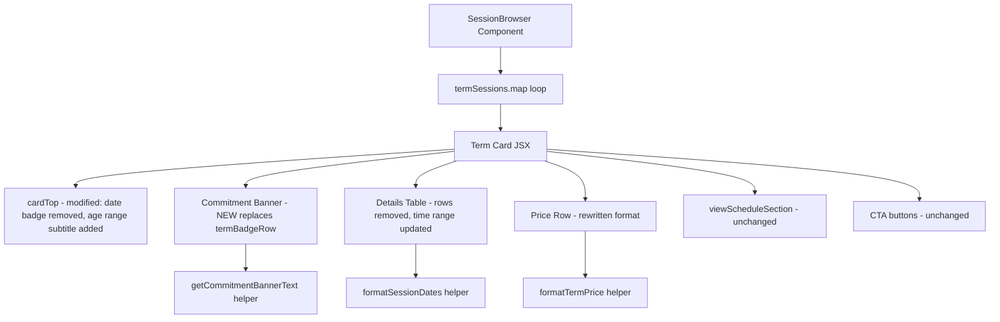

# Design Document

## Overview

This design details the implementation changes to the term session card within `SessionBrowser.tsx` (lines 314–433). The goal is to make the card communicate clearly to parents that they are paying upfront for a full block of sessions, while presenting a cleaner, more scannable layout. The redesign removes the date badge from the header, relocates the age range to the heading as a subtitle, strips redundant detail rows (Dates, Day, Category), adds a from–to time range, and introduces no new CSS classes, no changes to booking logic, and no modifications to single-session cards.

All changes are confined to the term card rendering block inside the `termSessions.map(...)` loop. Three new pure helper functions are extracted to keep rendering logic testable: one for banner text generation, one for session date formatting, and one for price display text.

## Architecture

The redesign follows a **presentational refactor** pattern — the component's data fetching, filtering, and state management remain untouched. Only the JSX template for term cards changes.



### Design Decisions

1. **Extract pure helper functions** rather than inline the logic in JSX. This makes the banner text, date formatting, and price formatting independently testable without rendering the full component.

2. **Keep helpers in the same file** (or a co-located utils file) since they are tightly coupled to this component and not reused elsewhere. If they grow, they can be extracted to `@/lib/term-schedule-utils.ts`.

3. **Reuse existing CSS classes** — the commitment banner uses `styles.termBadgeRow` (repurposed with the same full-width flex layout) and `styles.termSessionCount` for text sizing. No new classes are introduced per Requirement 7.2.

4. **Determine "same weekday" at render time** by examining `ts.schedule` dates. This is a cheap O(n) pass over typically 4–8 entries. No memoisation needed.

## Components and Interfaces

### Helper Functions

#### `getCommitmentBannerText(schedule: ScheduleEntry[], termStartDate: string): string`

Computes the commitment banner sentence based on the schedule pattern.

**Input:**
- `schedule` — array of `ScheduleEntry` objects from the session
- `termStartDate` — YYYY-MM-DD string for the term start

**Output:** A string like:
- `"Book all 4 Saturday sessions for the full September term — one upfront payment."`
- `"Book all 5 sessions for the full September term — one upfront payment."`

**Logic:**
1. Filter schedule to active entries only (`status === 'active'`)
2. For each active entry, compute the weekday from its `date` field
3. If all weekdays are identical → use the "all {n} {dayName} sessions" variant
4. If weekdays differ → use the "all {n} sessions" variant
5. Extract month name from `termStartDate`

#### `formatSessionDates(schedule: ScheduleEntry[]): string`

Formats active session dates into a comma-separated display string with truncation.

**Input:**
- `schedule` — array of `ScheduleEntry` objects

**Output:** A string like:
- `"5 Sept, 12 Sept, 19 Sept, 26 Sept"`
- `"5 Sept, 12 Sept, 19 Sept… +3 more"` (if exceeds 60 chars)

**Logic:**
1. Filter to active entries, sort chronologically by date
2. Format each date as `"{day} {month}"` using `en-GB` locale with `day: 'numeric'`, `month: 'short'`
3. Join with `", "`
4. If total string length > 60 chars, find the last complete date that fits within 60 chars and append `"… +{n} more"`

#### `formatTermPrice(activeCount: number, priceInPence: number): string`

Formats the price row display text.

**Input:**
- `activeCount` — number of active sessions (0 if schedule is null/undefined)
- `priceInPence` — total price in pence

**Output:**
- `"All 4 sessions · £60.00"` (when activeCount > 0)
- `"£60.00"` (when activeCount === 0)

### Inline Time Range Computation

The time range display is computed inline in the `termSessions.map` callback (not extracted as a helper function since it is simple concatenation):

```typescript
// Start time (existing)
const [sh, sm] = ts.startTime.split(':').map(Number);
const startPeriod = sh >= 12 ? 'PM' : 'AM';
const startHour = sh % 12 || 12;
const timeDisplay = `${startHour}:${sm.toString().padStart(2, '0')} ${startPeriod}`;

// End time (new)
const [eh, em] = ts.endTime.split(':').map(Number);
const endPeriod = eh >= 12 ? 'PM' : 'AM';
const endHour = eh % 12 || 12;
const endTimeDisplay = `${endHour}:${em.toString().padStart(2, '0')} ${endPeriod}`;

// Combined range
const timeRangeDisplay = `${timeDisplay} – ${endTimeDisplay}`;
```

The `timeRangeDisplay` variable is used in the Time detail row: `<dd>{timeRangeDisplay}</dd>`.

### Modified JSX Sections

| Section | Before | After |
|---------|--------|-------|
| Date badge | `dateBadge` div with day/month spans | Removed from DOM |
| Card subtitle | `<p className={styles.sessionSchedule}>{dateRangeStr}</p>` | Replaced with `<p className={styles.sessionSchedule}>{ts.ageMin}–{ts.ageMax} yrs</p>` (age range subtitle) |
| Term badge area | `termBadgeRow` div with badge + count | Commitment banner with "Term" badge + contextual text |
| Details: Dates row | `<dt>Dates</dt><dd>{dateRangeStr}</dd>` | Removed from DOM |
| Details: Sessions row | — | `<dt>Sessions</dt><dd>{formatted dates}</dd>` (first row in table) |
| Details: Day row | `<dt>Day</dt><dd>{ts.dayOfWeek}</dd>` | Removed from DOM |
| Details: Time row | `<dd>{timeDisplay} {period.toUpperCase()}</dd>` | `<dd>{timeRangeDisplay}</dd>` (from–to range, e.g. "11:00 AM – 12:30 PM") |
| Details: Category row | `<dt>Category</dt><dd>{badge.displayName}</dd>` | Removed from DOM |
| Details: age row | `<dt>Age Range</dt>` in table | Removed from table; moved to card heading subtitle |
| Price row | `<span>Term price</span> <span>£X.XX</span>` | Single `<span>` with `formatTermPrice()` output |

## Data Models

No new data models or Firestore schema changes are required. The design relies entirely on existing fields on the `Session` interface:

| Field | Type | Usage |
|-------|------|-------|
| `ts.schedule` | `ScheduleEntry[] \| undefined` | Source of active session dates, weekday detection |
| `ts.schedule[].date` | `string` (YYYY-MM-DD) | Individual session date for formatting |
| `ts.schedule[].status` | `'active' \| 'skipped'` | Filter criterion for active sessions |
| `ts.termStartDate` | `string \| undefined` | Month extraction for banner, conditional display |
| `ts.termEndDate` | `string \| undefined` | Date range computation (no longer rendered) |
| `ts.startTime` | `string` (HH:MM) | Start time for time range display |
| `ts.endTime` | `string` (HH:MM) | End time for time range display |
| `ts.price` | `number` (pence) | Total term price |
| `ts.ageMin` / `ts.ageMax` | `number \| null` | Age range display in card heading subtitle |

## Correctness Properties

*A property is a characteristic or behavior that should hold true across all valid executions of a system — essentially, a formal statement about what the system should do. Properties serve as the bridge between human-readable specifications and machine-verifiable correctness guarantees.*

### Property 1: Banner text adapts to schedule weekday pattern

*For any* non-empty schedule of active sessions, if all active session dates fall on the same weekday, the commitment banner text SHALL contain that weekday name (e.g. "Saturday"); if active session dates span multiple weekdays, the banner text SHALL NOT contain any weekday name and SHALL use the generic "{n} sessions" phrasing.

**Validates: Requirements 1.3**

### Property 2: Price row format reflects active count

*For any* activeCount greater than zero and any valid price in pence, the price display text SHALL match the pattern `"All {activeCount} sessions · £{(price/100).toFixed(2)}"`. For activeCount equal to zero, the text SHALL match `"£{(price/100).toFixed(2)}"` with no session count prefix.

**Validates: Requirements 2.1, 2.4, 2.5**

### Property 3: Session dates contain only active entries in chronological order

*For any* schedule array containing a mix of active and skipped entries, the formatted session dates string SHALL contain only dates from entries with `status === 'active'`, and those dates SHALL appear in ascending chronological order.

**Validates: Requirements 5.2, 5.3**

### Property 4: Session dates truncation respects 60-character limit

*For any* list of active session dates where the full comma-separated string exceeds 60 characters, the displayed string SHALL be at most 60 characters (excluding the "… +{n} more" suffix), SHALL end with "… +{n} more" where n equals the count of undisplayed active sessions, and the visible portion SHALL end at a complete date (no partial dates).

**Validates: Requirements 5.5**

## Error Handling

| Scenario | Handling |
|----------|----------|
| `ts.schedule` is `undefined` or `null` | Treat `activeCount` as 0. Do not render Commitment Banner. Do not render Session Dates row. Price row shows `"£X.XX"` only. |
| `ts.schedule` is an empty array | Same as undefined — `activeCount` resolves to 0 via `getActiveSessionCount`. |
| All schedule entries have `status === 'skipped'` | `activeCount` is 0. No banner, no sessions row. Price shows total only. |
| `ts.termStartDate` is `undefined` | Do not render Commitment Banner (per Req 1.5). |
| `ts.ageMin` or `ts.ageMax` is `null` | Do not render the age range subtitle in the card heading (existing behaviour preserved). |
| `ts.price` is 0 | Display "£0.00" — no special handling needed. |
| `ts.endTime` is missing or unparseable | Gracefully degrade — show start time only or "Invalid Date" since data is admin-controlled. |
| Schedule entry has an unparseable date string | `new Date(invalidStr)` returns Invalid Date. `toLocaleDateString` will produce "Invalid Date" — acceptable degradation since data is admin-controlled. |

## Testing Strategy

### Unit Tests (Vitest + Testing Library)

Example-based tests for the component rendering:

1. **Banner presence/absence** — render with various `activeCount`/`termStartDate` combinations, assert DOM structure
2. **Label changes** — verify "Dates" row removed, "Day" row removed, "Category" row removed, "Age Range" row removed from table
3. **Age range in heading** — verify age range appears as subtitle in `cardTitleBlock`
4. **Date badge removal** — assert no `dateBadge` element in the card header
5. **Time range** — verify time row shows from–to format (e.g. "11:00 AM – 12:30 PM")
6. **Price row text** — verify old "Term price" label is gone, new format is present
7. **Sessions row conditional rendering** — verify row appears/disappears based on schedule
8. **Unchanged elements** — Book Now button, TermScheduleView, guest link, low-spots warning all still render

### Property-Based Tests (Vitest + fast-check)

Property tests for the three pure helper functions:

| Property | Function Under Test | Iterations |
|----------|-------------------|------------|
| Property 1: Banner text weekday adaptation | `getCommitmentBannerText` | 100+ |
| Property 2: Price format correctness | `formatTermPrice` | 100+ |
| Property 3: Session dates filtering + ordering | `formatSessionDates` | 100+ |
| Property 4: Truncation at 60 chars | `formatSessionDates` | 100+ |

Each property test will be tagged with a comment:
```
// Feature: term-card-redesign, Property {n}: {property text}
```

**Library choice:** `fast-check` — the standard PBT library for TypeScript/JavaScript projects, already compatible with Vitest.

**Generator strategy:**
- Generate random `ScheduleEntry[]` arrays with 1–12 entries, random YYYY-MM-DD dates within a plausible range, random `'active'`/`'skipped'` statuses
- Generate random prices as positive integers (pence)
- For weekday testing: generate schedules where all dates share a weekday, and schedules where dates span multiple weekdays

### Integration / Smoke Tests

- Verify the full `SessionBrowser` component renders without errors when given term session data
- Verify single-session cards remain unchanged (regression guard)
