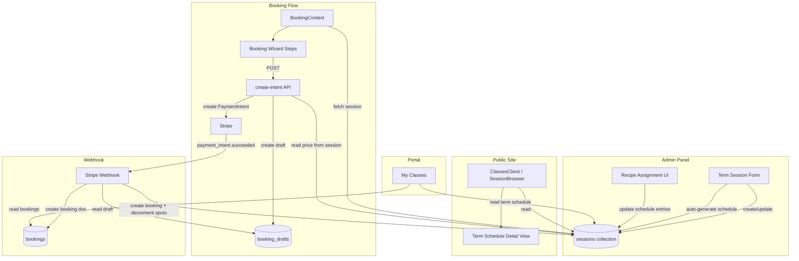

# Design Document: Term Session Management

## Overview

This design introduces a **term session** model to Blooming Tastebuds, enabling admin to create a single document that represents an entire term of recurring classes (e.g. a 12-week After School Club). Each term session embeds an ordered schedule of date-recipe pairs (`Schedule_Entry`), allowing parents to see the full term plan before booking.

The existing per-session model (`sessionType: 'single'` or absent) remains unchanged. Term sessions live in the same `sessions` collection, distinguished by `sessionType: 'term'`. This approach preserves backward compatibility while reusing existing infrastructure (Stripe webhook, booking wizard URL pattern, portal).

### Key Design Decisions

1. **Single collection, discriminated union** — Term sessions are stored in the existing `sessions` collection with a `sessionType: 'term'` discriminator rather than a separate collection. This avoids duplicating Firestore security rules and index definitions.
2. **Embedded schedule (denormalized)** — The term schedule is stored as an array within the session document rather than a subcollection. This ensures a single read fetches all schedule data and simplifies atomic updates.
3. **Capacity is per-term, not per-date** — `spotsAvailable` decrements once per booking (not per date in the schedule). This matches the business model: parents book the whole term.
4. **Admin writes via client SDK (existing pattern)** — All admin CRUD uses the client SDK consistent with other admin pages (which are `'use client'`). The webhook and create-intent route use Admin SDK for server-authoritative operations.
5. **Booking wizard reuse** — The same `/book/[sessionId]/*` URL structure serves both single and term bookings. The wizard detects `sessionType` from the fetched session document and adapts its display (showing term date range and total price instead of a single date).

## Architecture



### Data Flow Summary

1. Admin creates a term session → document written to `sessions/{id}` with embedded `schedule` array
2. Admin assigns recipes per date → individual `schedule[i]` entries updated in-place
3. Parent views public listing → client reads `sessions` where `status == 'open'`
4. Parent clicks "Book" → navigates to `/book/{sessionId}/student`
5. BookingContext fetches the session, detects `sessionType: 'term'`, adapts wizard display
6. Payment step → `create-intent` reads `session.price` server-side, creates PaymentIntent
7. Webhook → creates booking with `bookingType: 'term'`, decrements `spotsAvailable` on the term session

## Components and Interfaces

### Admin Panel Components

| Component | Path | Purpose |
|-----------|------|---------|
| `AdminSessions` (extended) | `src/app/admin/sessions/page.tsx` | Extended to support term session CRUD with a type toggle |
| `TermScheduleEditor` | `src/app/admin/sessions/TermScheduleEditor.tsx` | Inline editor for schedule entries: recipe assignment, skip/add dates |
| `TermSessionFormModal` | Part of `AdminSessions` modal | Extended form with conditional fields for term-specific inputs |

### Public Components

| Component | Path | Purpose |
|-----------|------|---------|
| `SessionBrowser` (extended) | `src/components/sessions/SessionBrowser.tsx` | Displays term sessions with date range, price, spots |
| `TermScheduleView` | `src/components/sessions/TermScheduleView.tsx` | Renders the full schedule (dates + recipes) for public/portal use |

### Booking Flow Components

| Component | Path | Purpose |
|-----------|------|---------|
| `BookingContext` (extended) | `src/context/BookingContext.tsx` | Detects `sessionType: 'term'` and adapts wizard state/display |
| Payment step (extended) | `src/app/book/[sessionId]/payment/page.tsx` | Shows term date range + total price summary |

### Portal Components

| Component | Path | Purpose |
|-----------|------|---------|
| `MyClasses` (extended) | `src/app/portal/my-classes/page.tsx` | Displays term bookings with "Term" badge, "View Schedule" action |
| `TermScheduleView` (reused) | `src/components/sessions/TermScheduleView.tsx` | Same component used in portal to show the schedule |

### API Routes

| Route | Changes |
|-------|---------|
| `api/payments/create-intent` | Add term session code path: read `session.price` for term sessions (already partially implemented for class-based terms; extend to session-based terms) |
| `api/webhooks/stripe` | Add handler for session-based term bookings: create booking with `bookingType: 'term'`, decrement `spotsAvailable` on session, auto-set status to `'full'` when spots reach 0 |

## Data Models

### Extended `Session` Interface

```typescript
// New fields added to existing Session interface in src/types/index.ts

export interface ScheduleEntry {
  date: string;                  // YYYY-MM-DD
  recipeId: string;              // Empty string if unassigned
  recipeName: string;            // Empty string if unassigned
  recipePhotoUrl: string;        // Empty string if unassigned
  status: 'active' | 'skipped'; // Default: 'active'
}

// Extended Session type (additions only):
export interface Session {
  // ... existing fields ...

  // Term session discriminator
  sessionType?: 'single' | 'term';  // Absent/undefined = 'single' (backward compat)

  // Term-specific fields (present only when sessionType === 'term')
  termStartDate?: string;           // YYYY-MM-DD
  termEndDate?: string;             // YYYY-MM-DD
  dayOfWeek?: string;               // e.g. 'Monday'
  schedule?: ScheduleEntry[];       // Ordered array of date-recipe pairs
}
```

### Extended `Booking` Interface

```typescript
// Additional fields on Booking for term bookings:
export interface Booking {
  // ... existing fields ...

  bookingType?: 'term';             // Absent = per-session (backward compat)
  // sessionId references the Term_Session document ID
  // sessionDate is set to termStartDate for display purposes
}
```

### Firestore Document Examples

**Term Session Document** (`sessions/{termSessionId}`):
```json
{
  "id": "term_abc123",
  "sessionType": "term",
  "classId": "cls_afterschool",
  "className": "After School Club",
  "classType": "kidsAfterSchool",
  "termStartDate": "2025-09-08",
  "termEndDate": "2025-12-15",
  "dayOfWeek": "Monday",
  "venueId": "ven_001",
  "venueName": "Bloomsbury Kitchen",
  "instructorId": "inst_001",
  "instructorName": "Chef Amy",
  "startTime": "15:30",
  "endTime": "16:30",
  "ageMin": 5,
  "ageMax": 12,
  "price": 18000,
  "spotsAvailable": 12,
  "spotsTotal": 15,
  "status": "open",
  "schedule": [
    { "date": "2025-09-08", "recipeId": "rec_001", "recipeName": "Pasta Shapes", "recipePhotoUrl": "https://...", "status": "active" },
    { "date": "2025-09-15", "recipeId": "", "recipeName": "", "recipePhotoUrl": "", "status": "active" },
    { "date": "2025-09-22", "recipeId": "", "recipeName": "", "recipePhotoUrl": "", "status": "skipped" },
    { "date": "2025-09-29", "recipeId": "rec_003", "recipeName": "Mini Pizzas", "recipePhotoUrl": "https://...", "status": "active" }
  ],
  "date": "2025-09-08",
  "recipeId": "",
  "recipeName": "",
  "createdAt": "..."
}
```

> Note: The `date` field is set to `termStartDate` for backward-compatible sorting/queries. The `recipeId`/`recipeName` fields remain empty at the session level (recipes are per-schedule-entry).

**Term Booking Document** (`bookings/{paymentIntentId}`):
```json
{
  "id": "pi_xyz789",
  "bookingType": "term",
  "sessionId": "term_abc123",
  "sessionDate": "2025-09-08",
  "className": "After School Club",
  "venueName": "Bloomsbury Kitchen",
  "bookedByUid": "uid_parent01",
  "bookedByName": "Sarah Jones",
  "studentId": "stu_001",
  "studentName": "Oliver Jones",
  "status": "confirmed",
  "medicalInfo": { "..." },
  "emergencyContact": { "..." },
  "termsAccepted": true,
  "termsAcceptedAt": "...",
  "payment": {
    "stripePaymentIntentId": "pi_xyz789",
    "amount": 18000,
    "currency": "gbp",
    "status": "paid"
  },
  "createdAt": "..."
}
```

### Schedule Generation Algorithm

When admin creates a term session:

```
Input: startDate, endDate, dayOfWeek
Output: ScheduleEntry[]

1. Parse startDate and endDate as Date objects
2. Find the first occurrence of dayOfWeek on or after startDate
3. Iterate weekly from that first occurrence until <= endDate
4. For each date, create: { date: YYYY-MM-DD, recipeId: '', recipeName: '', recipePhotoUrl: '', status: 'active' }
5. Return sorted array
```

## Correctness Properties

*A property is a characteristic or behavior that should hold true across all valid executions of a system — essentially, a formal statement about what the system should do. Properties serve as the bridge between human-readable specifications and machine-verifiable correctness guarantees.*

### Property 1: Schedule generation produces valid date occurrences

*For any* valid start date, end date, and day of week where end date > start date and the day occurs at least once in the range: the generated schedule array SHALL contain exactly one entry for each occurrence of that day of week between start and end dates (inclusive), all entries SHALL be chronologically sorted, each entry SHALL have the `date` field populated with a valid YYYY-MM-DD string that falls on the specified day of week, and all recipe fields SHALL be empty strings with status `'active'`.

**Validates: Requirements 1.3, 1.4**

### Property 2: Invalid date range validation rejects bad inputs

*For any* (startDate, endDate, dayOfWeek) triple where either (a) endDate <= startDate, or (b) the specified dayOfWeek does not occur between startDate and endDate inclusive: the validation function SHALL return an error and prevent form submission.

**Validates: Requirements 1.5, 1.6**

### Property 3: Recipe assignment round-trip preserves data

*For any* Schedule_Entry and any Recipe document, assigning the recipe to the entry SHALL set recipeId, recipeName, and recipePhotoUrl to match the Recipe document's id, name, and photoUrl fields respectively. Subsequently clearing the assignment SHALL reset all three fields to empty strings.

**Validates: Requirements 2.2, 2.4**

### Property 4: Active session count excludes skipped entries

*For any* term schedule array containing a mix of entries with status `'active'` and `'skipped'`, the computed active count SHALL equal the number of entries where `status === 'active'`, and this count SHALL always be less than or equal to the total array length.

**Validates: Requirements 3.1, 3.4, 4.3**

### Property 5: Make-up date insertion maintains chronological order

*For any* chronologically sorted schedule array and any new date, inserting the new date into the schedule SHALL produce an array that remains sorted in ascending chronological order by the `date` field, with the new entry at the correct position.

**Validates: Requirements 3.2**

### Property 6: Public schedule display shows only active entries with correct recipe text

*For any* term schedule array, the displayed schedule SHALL include only entries with `status === 'active'`, SHALL show recipe name and photo for entries with non-empty recipeId, and SHALL display "Recipe to be announced" for entries with empty recipeId.

**Validates: Requirements 4.2, 4.3, 4.4**

### Property 7: Booking decrements capacity and auto-transitions to full

*For any* term session with `spotsAvailable > 0`, processing a successful payment SHALL decrement `spotsAvailable` by exactly 1. When the resulting `spotsAvailable` equals 0, the session status SHALL be updated to `'full'`.

**Validates: Requirements 5.4, 6.3**

### Property 8: Next upcoming date is the earliest active date in the future

*For any* term schedule array and any reference date (today), the "next upcoming session" SHALL be the entry with the smallest `date` value that is greater than or equal to the reference date AND has `status === 'active'`. If no such entry exists, the result SHALL be null/undefined.

**Validates: Requirements 7.4**

### Property 9: Webhook idempotency prevents duplicate bookings

*For any* PaymentIntent ID, processing the `payment_intent.succeeded` webhook event multiple times SHALL result in exactly one booking document with that ID. Subsequent processing of the same event SHALL be a no-op.

**Validates: Requirements 8.3**

### Property 10: Absent sessionType defaults to single-date behavior

*For any* session document where the `sessionType` field is absent or undefined, all system components (public display, booking wizard, webhook) SHALL treat the session identically to one with `sessionType: 'single'` — no schedule array is expected, no term-specific UI is rendered, and the standard per-date booking flow is used.

**Validates: Requirements 9.4**


## Error Handling

### Admin Panel Errors

| Scenario | Handling |
|----------|----------|
| Term session form validation fails (endDate <= startDate, day not in range) | Display inline error message via React Hook Form + Zod resolver. Prevent submission. Form state preserved. |
| Schedule generation produces 0 entries | Display error: "No occurrences of {day} found between {start} and {end}". This is caught by validation rule 1.6 before submission. |
| Firestore write fails during session creation | Display alert with retry option. No partial state — the entire write is atomic. |
| Firestore write fails during recipe assignment | Display toast notification with error. Previous state is preserved (optimistic update is rolled back). |
| Recipe document not found during assignment | Skip assignment, display error. Should not occur in normal flow since recipe picker only shows existing recipes. |

### Booking Flow Errors

| Scenario | Handling |
|----------|----------|
| Term session not found (deleted between page load and booking) | `create-intent` returns 400 "Session not found". Wizard displays error and suggests refreshing. |
| Term session status not 'open' at booking time | `create-intent` returns 400 "This session is no longer accepting bookings." Wizard blocks payment. |
| Term session has no price (data corruption) | `create-intent` returns 500 "Session pricing is unavailable. Please contact support." |
| Spots available <= 0 at create-intent time | `create-intent` returns 400 "Sorry, this session is now full." |
| Spots available <= 0 at webhook time (race) | Booking created with `overbooking: true` flag. Admin notified for manual review. Payment is not reversed automatically. |
| Booking draft not found at webhook time | Webhook logs error, returns 200 (no retry). Manual intervention required. |
| Duplicate webhook delivery | Idempotency check: booking doc with same ID already exists → skip silently, return 200. |
| Firestore transaction conflict during capacity decrement | Firestore automatically retries the transaction (up to 5 times). If all retries fail, webhook returns 500 and Stripe retries the event. |

### Public Display Errors

| Scenario | Handling |
|----------|----------|
| Session document missing schedule array | Display empty state: "Schedule coming soon". Do not crash. |
| Schedule entry has invalid date format | Skip that entry in display. Log warning to console. |
| Recipe photo URL is broken (404) | Display fallback placeholder icon (ChefHat from lucide-react). |

### Portal Errors

| Scenario | Handling |
|----------|----------|
| Term session document not found when viewing schedule | Display message: "Schedule unavailable. The term session may have been removed." |
| No active entries in schedule | Display: "No upcoming sessions scheduled." |

## Testing Strategy

### Dual Testing Approach

This feature uses both **unit/example tests** and **property-based tests** for comprehensive coverage:

- **Property-based tests** verify universal correctness properties (schedule generation, validation, filtering, capacity management)
- **Unit tests** verify specific UI interactions, edge cases, and integration points
- **Integration tests** verify Firestore operations, webhook processing, and create-intent API behavior

### Property-Based Testing Configuration

- **Library**: `fast-check` (already available in the project via existing property tests)
- **Runner**: Vitest
- **Minimum iterations**: 100 per property test
- **Tag format**: `Feature: term-session-management, Property {N}: {property_text}`

Each correctness property maps to a single property-based test file in `src/__tests__/properties/`.

### Test File Structure

```
src/__tests__/
├── properties/
│   ├── term-schedule-generation.property.test.ts      # Property 1
│   ├── term-date-validation.property.test.ts          # Property 2
│   ├── term-recipe-assignment.property.test.ts        # Property 3
│   ├── term-active-count.property.test.ts             # Property 4
│   ├── term-date-insertion.property.test.ts           # Property 5
│   ├── term-public-display.property.test.ts           # Property 6
│   ├── term-capacity-decrement.property.test.ts       # Property 7
│   ├── term-next-upcoming.property.test.ts            # Property 8
│   ├── term-webhook-idempotency.property.test.ts      # Property 9
│   └── term-session-type-default.property.test.ts     # Property 10
├── admin/
│   └── term-session-form.test.ts                      # Unit: form rendering, validation UI
├── components/
│   ├── TermScheduleEditor.test.ts                     # Unit: recipe assignment UI, skip/add
│   └── TermScheduleView.test.ts                       # Unit: public/portal schedule display
├── integration/
│   └── term-booking-flow.test.ts                      # Integration: create-intent + webhook
└── portal/
    └── term-my-classes.test.ts                        # Unit: term booking display in portal
```

### Key Testing Patterns

1. **Pure function extraction** — Schedule generation, validation, active count computation, date insertion, and "next upcoming" logic are implemented as pure utility functions in `src/lib/term-schedule-utils.ts`. These are directly testable without mocking.

2. **Webhook testing with mocks** — Property tests for capacity decrement and idempotency use mocked Firestore transactions (same pattern as existing webhook tests).

3. **Component testing** — UI tests use `@testing-library/react` with mocked Firebase contexts. CSS module stubs apply automatically via `vitest.config.ts`.

4. **Generator strategy for schedule data** — Custom `fast-check` arbitraries generate:
   - Valid date ranges (start < end, reasonable span of 1–52 weeks)
   - Days of week (from `['Monday', 'Tuesday', ..., 'Sunday']`)
   - Schedule entries with mixed statuses and recipe assignments
   - Recipe documents with random names and photo URLs
